[Strategic Navigation or Stochastic Search? How Agents and Humans Reason Over Document Collections](https://icml.cc/virtual/2026/oral/71033)  

它提出 MADQA，一个面向“**多 PDF 文档集合**”的多模态 agent **benchmark**，用来判断 agent 到底是在有策略地查文档，还是靠暴力随机搜索凑答案。

benchmark的文档来自真实世界 PDF，而不是从旧 benchmark 或 synthetic docs 里拼出来

者定义了六个关键属性：

Extractive：答案 token 必须真的出现在证据页里。
Multi-hop：证据可能跨页或跨文档。
Closed-world：只能从给定 corpus 得答案，不能靠外部知识。
Grounded：答案必须由最小证据集支持。
Agentic：不存在一个简单单次 retrieval query 就能拿到所有证据。
Visual：可能需要理解布局、表格、图像等非纯文本信息。

**evaluation**
第一，答案准确率。
比如 exact / verbose correct 等。

第二，evidence attribution。
用 Page F1 和 Doc F1 看 agent 找到的证据页/证据文档是否对。

第三，effort calibration。
这是这篇的亮点之一：它用 Kuiper statistic 衡量 agent 的 effort 是否校准。简单说，好的 agent 应该在简单题上少查，难题上多查；差的 agent 会无论题目难不难都一通乱搜。表 3 也说明 Kuiper 越低越好，用来衡量 effort calibration

论文的答案偏悲观：

当前强 agent 能达到不错 accuracy，但更像是用大量搜索补偿策略规划不足。

他们发现，人类在第一步 query 上就有很强的 strategic calibration，大概第一步就能达到约 50% accuracy；而 Gemini 3 Pro 第一轮只有约 12%，后面靠更多 compute/reformulation 追上来。论文称这是 “cold start disparity”。

这非常关键。它说明：

模型不是不会找，而是一开始不知道怎么找；它靠试错恢复。

这对 agent 研究很有启发：未来不是简单加更多 tool calls，而是要训练/设计 query planning、search policy、evidence-seeking strategy、metacognitive calibration。

图 8 的结论是：强系统基本能取到相关内容，但还会在理解、抽取和综合上出错；弱系统则常常连正确文档或页面都找不到

---
[VenusBench-Mobile: A Challenging and User-Centric Benchmark for Mobile GUI Agents with Capability Diagnostics](https://huggingface.co/papers/2604.06182) 

作者认为，现有 benchmark 太关注单 app 功能完成，缺少真实使用中的 跨 app、模糊意图、环境变化、长期状态跟踪，所以会高估 mobile GUI agent 的可靠性。论文明确说，现有 online mobile GUI benchmarks 主要有两个问题：一是任务和真实用户需求不对齐，二是只给总体成功率，缺少失败原因诊断。

从用户真实意图出发，再让 app 成为完成意图的工具。benchmark 覆盖 10 个用户意图类别、149 个主任务、27 个 apps，并额外设计 80 个环境变化样本 来测鲁棒性

这篇最有价值的不是“成功率低”，而是它诊断出了失败结构。

作者说，失败主要由 perception 和 memory 缺陷主导。尤其是 memory，被论文称为 absolute bottleneck：高级任务里，agent 需要跨页面、跨 app、跨多步操作保留任务目标和中间信息，但当前模型会严重掉点。

mobile agent 不是只要在标准设置下能跑通就行；真实部署里，语言、主题、布局、设备形态的小变化都会导致失败。

---
[CausalGame: Benchmarking Causal Thinking of LLM Agents in Games](https://icml.cc/virtual/2026/oral/71152)  

CausalGame 让 LLM agent 扮演“无人机设计师”，在有限实验预算内反复设计无人机、观察哪些能存活，最后推断隐藏的因果机制；它测的是 agent 能不能从带选择偏差、隐藏混杂和噪声的数据里恢复真正因果关系，而不是拟合表面相关。

2-stage

Exploration Stage:
    200 drones, ≤10 deployments
    agent 可以试验、收集数据、推断机制

Evaluation Stage:
    one-shot 1000-drone fleet
    根据最终设计是否超过场景阈值判断成功

**交互式因果推理 benchmark**

最重要结论比较悲观：
16 个 frontier LLM agents 在这些游戏里都持续失败，难以恢复真正的隐藏因果关系。

让Agent 靠因果理解
---
[$\tau^2$-Bench: Evaluating Conversational Agents in a Dual-Control Environment](https://icml.cc/virtual/2026/oral/71171)

τ²-Bench 测的是：对话 agent 不仅要自己会用工具，还要能**指导用户执行动作**，在双方共同控制同一个环境的情况下完成任务
它实现了一个 双控对话 agent benchmark / simulator。

agent 不能直接替用户按手机设置；它必须通过自然语言指导用户做。

**result**
从 no-user / single-control 切到 dual-control 后，agent 性能显著下降。
也就是说，当 agent 自己拥有全部工具权限时，任务相对容易；但一旦它必须通过对话指导用户完成一部分动作，成功率会明显掉。

有些任务必须依赖用户动作才能完成。

agent 和 user 都是部分可观测的，各自有不同工具和可见状态

---
[Benchmarking at the Edge of Comprehension](https://icml.cc/virtual/2026/oral/71031) 

bench : 刷爆 区分度 验证
benchmark 不再能依赖可信标准答案时，还能不能比较模型能力？

提出 **Critique-Resilient Benchmarking，CRB**
不再问“这个答案是否等于标准答案”，而是问有没有被证伪
一个答案如果没有被其他模型提出可验证的局部错误证据，就暂时认为它是正确的

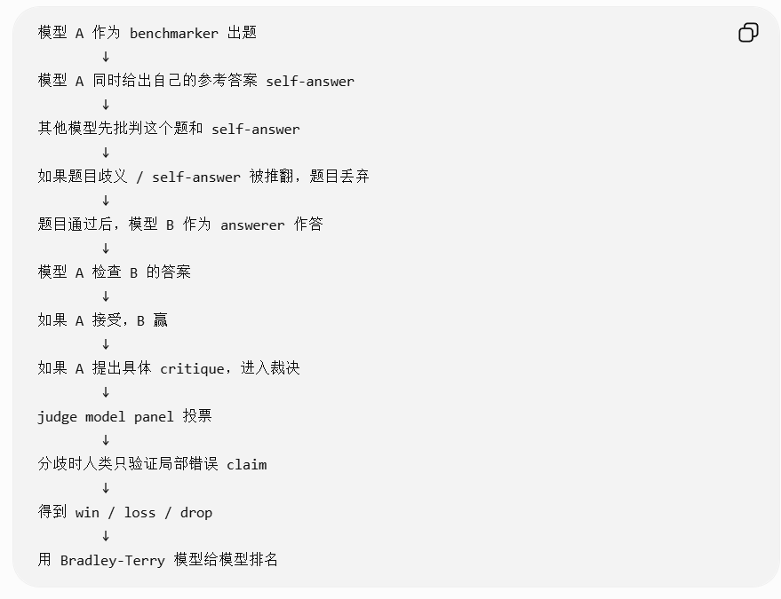

---
> 以上 benchmark
---
- [daVinci-Dev: Agent-native Mid-training for Software Engineering](https://arxiv.org/abs/2601.18418)  

**agent 能力不应该只在 post-training 学，而应该在 mid-training 阶段就让 base model 接触“完整 agent 工作流”。**

构造 “保留上下文” “真实环境交互” 的数据

第一步：从 GitHub PR 构造 agent-native 数据。
不是只拿最终 diff，而是把 issue、base files、commit sequence、相关文件、测试信息等拼成接近真实开发流程的轨迹。论文图 2 明确对比了四种范式：静态代码语料、factorized subtask training、contextually-native、environmentally-native；作者认为前两者都不够 agent-native。

第二步：对 Qwen2.5 Base 做 mid-training。
关键点是他们从 Qwen2.5-Base 起步，不是从 coder-specialized base 起步。摘要里强调，即使如此，32B/72B 结果仍然很强。

第三步：再做 agentic SFT，并在 SWE-Bench Verified 上测。
评价 scaffold 主要用 SWE-Agent。论文结果显示，32B daVinci-Dev 达到 56.1%，72B 达到 58.5% SWE-Bench Verified resolution rate。
---
[PhotoAgent: Exploratory Visual Aesthetic Planning with Large Vision Models](https://icml.cc/virtual/2026/oral/71050)  

真正完成这个目标，需要很多隐含步骤：调曝光、调色温、增强主体、改善构图、去杂物、局部提亮、控制不要过度编辑等。传统指令式编辑把这些分解和排序负担都丢给用户。PhotoAgent 要解决的就是这个问题：从 step-by-step prompt engineering 转成 autonomous photo editing agent。

闭环 agent：
感知 → 规划 → 执行 → 评估 → 再规划

它把修图过程看成一个搜索问题：

当前图像是一个 state；
每个编辑指令/工具调用是一个 action；
编辑后的图像是 next state；
审美评分、图像质量、指令遵循度等是 reward；
目标是找到一串 action，让最终图像更符合用户意图。

1. UGC-Edit Dataset：作者自己整理的数据集
项目页说它大约有 7,000 张真实用户生成照片，来源包括 LAION Aesthetic 和 RealQA，然后先用 Qwen3-VL 做分类/筛选，再经过人工验证，保留真正像用户随手拍、社交媒体照片那类 UGC 图像；审美分数统一归一到 1–5 分。

1. UGC Reward Model：作者自己训练的审美打分模型
它不是简单用 CLIP/BRISQUE 之类通用指标，而是从 Qwen2.5-VL 初始化，然后用 GRPO 优化，让模型学习同一组图片里相对审美排序，最后用来给 PhotoAgent 每一步编辑结果打分。
---
[TG-RAG: A Retrieval-Augmented Framework for Reasoning Guidance in Specialized Domains](https://icml.cc/virtual/2026/oral/71061) 

普通 RAG 的问题是：
模型可能检索到了正确资料，但 reasoning 过程中仍然会漂移。

论文把这个问题叫做 Cognitive Drift：模型在复杂工作流里容易偏离领域 SOP，只靠一次性 context engineering 不够稳定。

在模型推理的每个关键阶段，检索并注入当前步骤最相关的“推理指导”。
所以它更像一个 reasoning-time control framework，而不是传统知识补充型 RAG。

**Expert Procedure Graph, EPG**
EPG 可以理解成把专业 SOP 从自然语言文档变成一个图结构：

节点 = 专家流程中的步骤 / 判断点 / 操作要求
边 = 步骤之间的顺序、依赖、条件跳转

问题
→ 检索初始流程指导
→ 模型开始推理
→ 到关键节点时中断
→ 根据当前状态从 EPG 里检索下一步 SOP
→ 注入 step-specific directive
→ 模型继续推理

专业领域最大的问题不是知识少，而是 规则多、流程强、出错代价高。

framework： 

---
[Understanding Reasoning Collapse in LLM Agent Reinforcement Learning](https://icml.cc/virtual/2026/oral/71062)  

它发现多轮 agent RL 训练中，模型的 reasoning 可能表面上还很多样、reward 也没明显崩，但实际已经变成“输入无关的模板化废话”；论文提出用 mutual information 诊断这种 collapse，并用 reward-variance-aware filtering 缓解

论文项目页直接说：即使 entropy 仍然高，agent 也可能悄悄停止“听输入”，生成流畅但输入无关的 boilerplate；作者把这叫 template collapse。

template collapse 的特点是：

同一个输入下：输出仍然可以有很多变化  → H(Z|X) 高
不同输入之间：输出却越来越像模板      → I(X;Z) 低

论文提出一个很聪明的 **MI-style retrieval diagnostic**。
如果 reasoning 真的依赖输入，那么看到一段 reasoning，应该能反推出它对应的是哪个输入。

机制解释是 **SNR**, signal-to-noise ratio。
agent RL 里 reward 信号太弱 / 太糊
于是学到“通用套话”这种低风险策略

提出 **Reward-Variance-Aware Filtering，RV-aware filtering**
优先用那些 reward variance 更高的训练样本 / trajectory 更新模型
同一个输入下，不同 reasoning/action 会导致明显不同 reward

1. 给定一个环境和任务输入 X
2. 当前 agent 与环境多轮交互
3. 每轮生成 reasoning tokens Z 和 action
4. 环境返回 observation / reward
5. 对一个 batch 的 X-Z 计算 MI-style retrieval score
6. 如果 Z 不能检索回对应 X，说明 reasoning 正在模板化
7. 计算同一输入下不同 rollout 的 reward variance
8. 优先保留高 reward variance 的样本做 RL 更新
9. 更新 policy
10. 继续监控 MI、performance、entropy

---
[Agent0-VL: Exploring Self-Evolving Agent for Tool-Integrated Vision-Language Reasoning](https://icml.cc/virtual/2026/oral/71164)  

Agent0-VL VLM agent 训练框架

它让一个视觉语言模型同时扮演 Solver 和 Verifier：先用工具做多轮视觉推理，再用工具验证自己的推理、给自己反馈和奖励，最后通过 RL 在没有人工标注或外部 reward model 的情况下自我进化(RL agent Loop)

---
- [Characterizing, Evaluating, and Optimizing Complex Reasoning](https://icml.cc/virtual/2026/oral/71153)  

提出的核心概念：ME² principle
Macro / Micro
Efficiency / Effectiveness

Macro-Efficiency： 整体结构是否简洁、有纪律。比如有没有不必要的分支、重复重启、反复检查同一个东西。

Macro-Effectiveness： 整体推理结构是否围绕目标展开，逻辑路线是否连贯。比如有没有突然偏题、分支目标不清、跳步。

Micro-Efficiency： 单个步骤是否简洁有效。比如有没有废话、重复表述、无意义 hedge。

Micro-Effectiveness： 单个步骤是否局部正确。比如计算是否对、符号是否一致、有没有矛盾、幻觉或 unsupported claim。

评价复杂推理：把 **reasoning trace 建成 DAG**

论文的 DAG 构造是增量式的：按生成顺序遍历 step，对每个新 step，从之前的节点里选择语义上相关的 parent nodes。为了避免上下文太长，它不是把所有前序节点都给 LLM，而是构造一个 attachment pool，包括当前主分支和少量代表性分支端点

训练：Thinking Reward Model, TRM

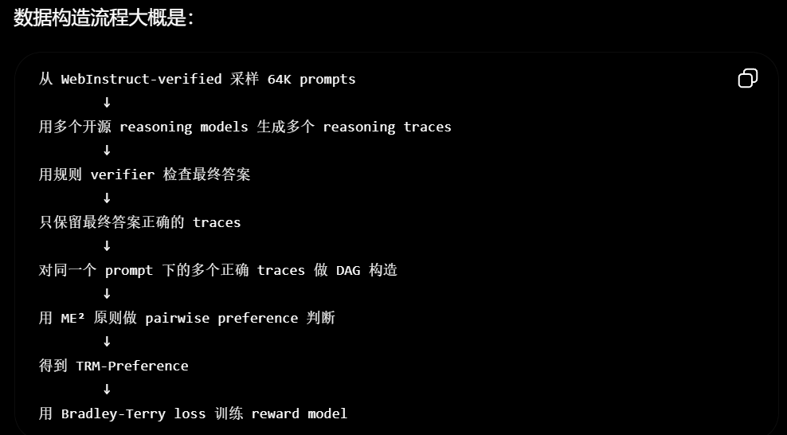

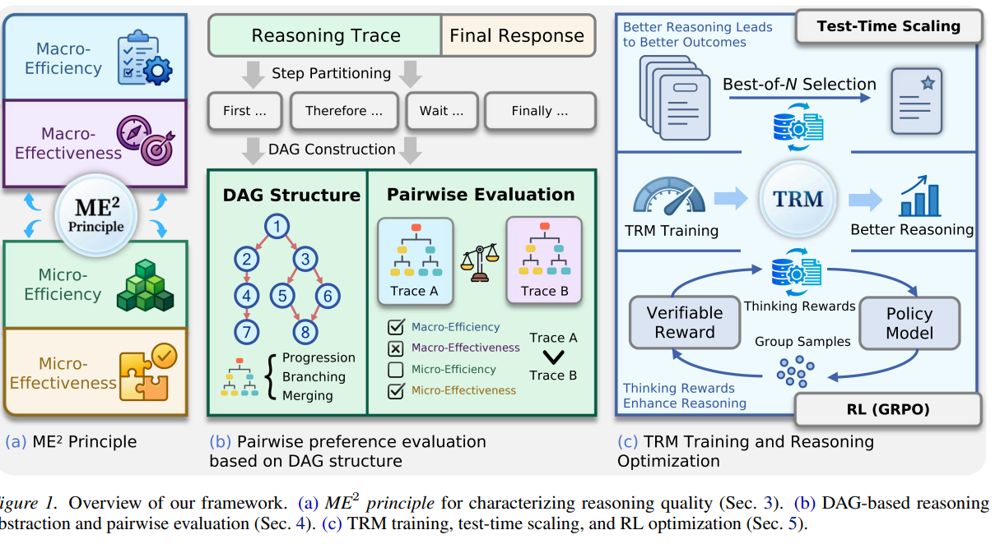

TRM 不直接看最终答案对不对，它只看 reasoning trace 质量。结果发现，选更符合 ME² 的 reasoning trace，最终答案准确率也会提高
更好的 thinking process 往往对应更好的 final outcome，即使 reward model 本身没有直接训练 answer correctness。

Best-of-N selection / reward 0/1 -> 结合trace
---
- [Procedural Pretraining: Warming Up Language Models with Abstract Data](https://arxiv.org/abs/2601.21725) 

提出procedural pretraining （预训练）
能不能先让模型学一些没有语义、但有明确结构规则的抽象数据，再去学自然语言、代码和数学？
这样会不会像“先学搭积木/括号匹配/简单规则”，再去学复杂语义知识一样，让后续学习更容易？

所谓 procedural data，就是由形式语言、元胞自动机、简单算法等生成的数据，不是网页文本，也不是 LLM 合成答案，而是规则明确的抽象序列。

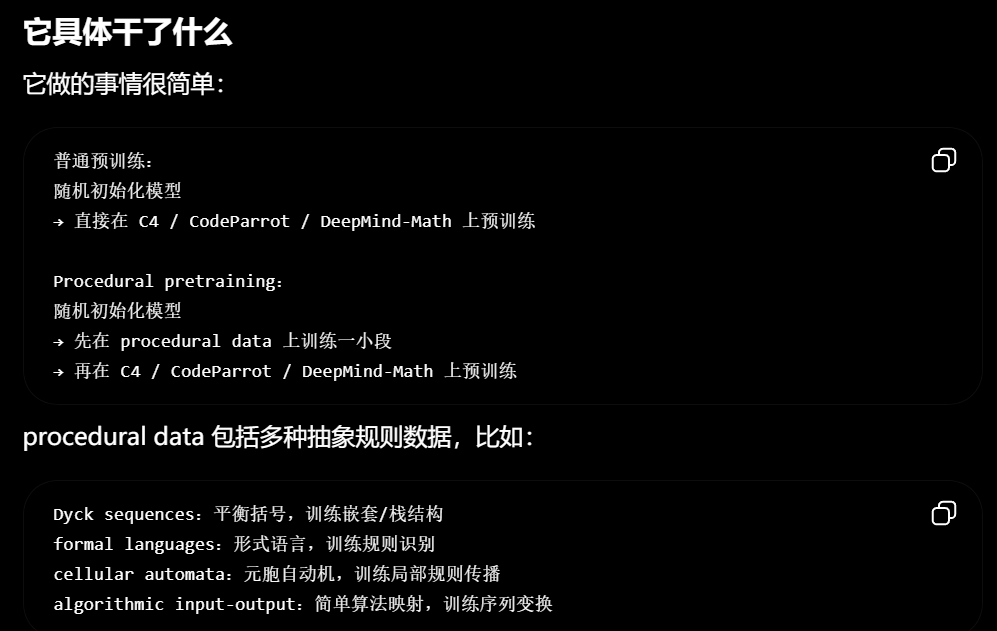

front-loading 只有 0.1% procedural data，就能显著超过直接标准预训练
结论 1：抽象数据不是“没用的玩具数据”
结论 2：procedural data 是标准预训练的补充，不是替代
结论 3：不同 procedural data 教不同能力

实验显示，极少量 procedural data 可以显著增强上下文召回等算法能力，并加速自然语言、代码和数学预训练；它说明模型能力形成可以先通过抽象结构脚手架被塑造，而不完全依赖语义语料。
---
- [What Preferences Can—and Cannot—Predict in Multi-Agent Online Learning](https://github.com/jiaxianyan/icml-2026-agent-papers/blob/main/README.zh-CN.md)
[再看]

多智能体在线学习理论

preference graph 只保留：
谁比谁更好
哪个方向是有利偏离

“单个玩家改变动作后更好”的关系画成一个图，叫 preference graph。图上的点是纯策略组合，箭头表示某个玩家单边偏离后收益不下降。

---

> 以上 agent / 方法 框架 / 训练框架 
---

[Characterizing Agents in Production][Measuring Agents in Production]

真实生产环境里，大家最关心的不是“agent 能不能无限自主”，而是：
它能不能稳定、可控、可审计、出了错能不能兜底

它基于 20 个深度案例访谈，以及对 86 个已部署系统从业者的调查，覆盖 26 个领域。

1. 部署 agent 的主要动机是提升生产力，也就是减少人工重复劳动、提高处理效率，而不是追求“完全自主替代人”
2. 生产 agent 普遍采用的是简单、可控的方法。一个被强约束的 LLM，在固定流程里调用少量工具，关键节点由人审核。
3. 不追求完全自主
4. 要用 prompting，而不是 SFT / RL
5. 最大挑战是 reliability，也就是长期、持续、稳定地产生正确行为。
---
> 以上 调研工作
---
- [Do We Need Adam? Surprisingly Strong and Sparse Reinforcement Learning with SGD in LLMs](https://icml.cc/virtual/2026/oral/71027)  
  topic: LLM RL / RLVR / Optimizer

GRPO PPO   SGD 更明显地超过 AdamW  省显存 
如果某些参数历史梯度很小，AdamW 反而会放大它们的有效步长。这样很多原本很小、可能不会真正改变参数值的梯度，也会被放大到足以改变参数。

在 RLVR 阶段，SGD 可能足够强；但在 SFT / 预训练里，SGD 仍然通常不如 AdamW。
---
- [DPO Unchained: Your Training Algorithm is Secretly Disentangled in Human Choice Theory](https://icml.cc/virtual/2026/oral/71131)  
  topic: Preference Optimization / DPO Theory / RLHF

几乎都是公式和文字

**理论统一框架**
DPO 为什么成立？
DPO 里的 loss、reward、human choice model 之间到底是什么关系？
DPO 后续变体是否一定要绑定某个具体的人类偏好模型？

PO 的经典推导依赖一个具体的人类选择模型：Bradley-Terry-Luce, BTL。BTL 的直觉是：如果答案 A 的 reward 比答案 B 高，那么人类选择 A 的概率就更大。

BTL 只是一个很具体的选择模型。很多 DPO 变体想改 margin、改 length normalization、改 reward/link function、改 loss，但一旦改了 经验？ 人类？

推广 human choice model
得到更一般的 DPO-style loss

展示这个理论框架可以设计出和传统 DPO 不太一样的 preference optimization 算法。
---
- [Prescriptive Scaling Reveals the Evolution of Language Model Capabilities](https://arxiv.org/abs/2602.15327)  

给我一个预训练算力预算，我最终通过当前主流 post-training 能把下游 benchmark 做到什么水平？

它收集了大规模模型评测数据，然后对每个 benchmark 拟合一个 capability boundary。

这里的 boundary 不是平均分，而是高分位边界，比如 0.98 quantile。意思是：

在某个 pretraining compute 下，当前生态里比较强的 post-training recipe 大概能把模型推到什么上限附近。

他们发现“算力变大 → 能力提高”的曲线，很多时候像一个 S 型曲线。
数学是例外
---
- [Optimal and Scalable MAPF via Multi-Marginal Optimal Transport and Schrödinger Bridges](https://icml.cc/virtual/2026/oral/71076)  

给定一批机器人和一批目标点，如何让所有机器人在图上移动到目标，同时避免在时间和空间上碰撞，并且总代价最小？

它提出两层方法。

第一层是 MAPF-MMOT LP：

把多机器人路径规划
转成多边际最优传输问题
再利用 Markov 结构
压缩成多项式规模线性规划

第二层是 Schrödinger Bridge / entropic regularization：

为了处理更大规模问题
把 MAPF-MMOT 放进概率框架
加熵正则
用 Sinkhorn-style 迭代高效求近似
再用这个 fractional shadow transport 缩小 LP
恢复 near-optimal integral paths
---
- [DiScoFormer: Plug-In Density and Score Estimation with Transformers](https://icml.cc/virtual/2026/oral/71039)  
[用机器学习/llm的东西解决传统领域？]

给你一堆从未知分布采样出来的点，能不能估计这个分布的密度，以及这个密度的 score？

提出 DiScoFormer，大概意思是：

用一个 Transformer 学会从一组样本中直接估计 density 和 score，作为 KDE 的可学习替代。

DiScoFormer 用具有置换/仿射等变性的 Transformer，从样本集中估计概率密度和 score，目标是替代传统 KDE，服务于生成建模、贝叶斯推断和科学计算中的 plug-in density/score estimation。
---
- [On Minimum Depth and Width of Floating-Point Neural Networks for Representing Floating-Point Functions](https://icml.cc/virtual/2026/oral/71081)  
经典神经网络表达能力理论通常假设：

参数是实数
计算是精确的
没有舍入误差

但真实计算机里不是这样。真实模型用 float16、bfloat16、float32、FP8 等浮点数，参数是有限精度，运算有舍入误差、溢出、NaN 等。

在真实浮点运算下，ReLU 网络要表示任意浮点函数，最少需要多少层、多少宽

核心结果 1：最小深度是 3
核心结果 2：最小宽度在 2d 到 2d+4 之间
---
- [Incentivizing Truthfulness and Collaborative Fairness in Bayesian Learning](https://icml.cc/virtual/2026/oral/71101)  

协作机器学习中的数据贡献奖励机制。

更接近传统机器学习 + 机制设计
---
> 以上 偏理论
---
- [Position: Don’t Just “Fix it in Post”: A Science of AI Must Study Learning Dynamics](https://icml.cc/virtual/2026/oral/71043)  

post-hoc fix 可能能暂时压住问题，但不能保证问题在新规模、新数据、新语言、新场景下不会重新出现。

框架目标
Predict：预测训练结果
Intervene：训练中干预
Design：设计可靠训练过程

几乎纯文本

---

- [Position: Stop Automating Peer Review Without Rigorous Evaluation](https://icml.cc/virtual/2026/oral/71099)  

不要急着让 AI 自动写审稿意见，因为当前 AI reviewer 有明显风险：评审意见过度趋同，而且容易被“语言润色/论文洗稿”操纵。

这篇的立场比较谨慎，甚至偏反对自动化 peer review。作者认为，顶会论文接收与否会影响研究者职业发展，所以自动化审稿是高风险应用，不能随便上。论文基于 ICLR 2026 人类评审和 AI 评审的比较，指出两个问题：第一，AI reviewer 有 hivemind effect，也就是不同 AI 评审之间过度一致，降低了评审多样性；第二，AI 评审容易被 paper laundering 操纵，即通过 LLM 改写论文风格，就能显著提高 AI reviewer 给分，而科学贡献并没有改变。
---

- [Position: AI Should Facilitate Democratic Deliberation at Scale](https://icml.cc/virtual/2026/oral/71183)  
  
AI 不应该替人做民主决策，但可以帮助大规模公众讨论变得更可参与、更包容、更有信息量。

AI 应作为民主协商的基础设施，帮助整理信息、降低表达门槛、促进包容性讨论，但不能替代人的政治判断和集体决策。
---

- [Position: The AI Imperative: Scaling High-Quality Peer Review in Machine Learning](https://icml.cc/virtual/2026/oral/71100)  

机器学习投稿量爆炸，同行评审压力太大，因此必须把 AI-assisted peer review 当成重要研究基础设施来建设

建立 AI 辅助审稿生态，把 AI 用作协作工具，帮助扩展高质量同行评审能力。

---
- [Position: There are futures that benchmark-driven AI cannot see](https://icml.cc/virtual/2026/oral/71151)  
  
它想批评的不是 benchmark 本身，而是 benchmark-driven AI：如果所有研究都围绕固定榜单和指标优化，模型会越来越擅长当前可测任务，但可能牺牲开放性、可迁移性、创造性和未来适应能力。

---
> 以上 提出研究主张/position（立场）

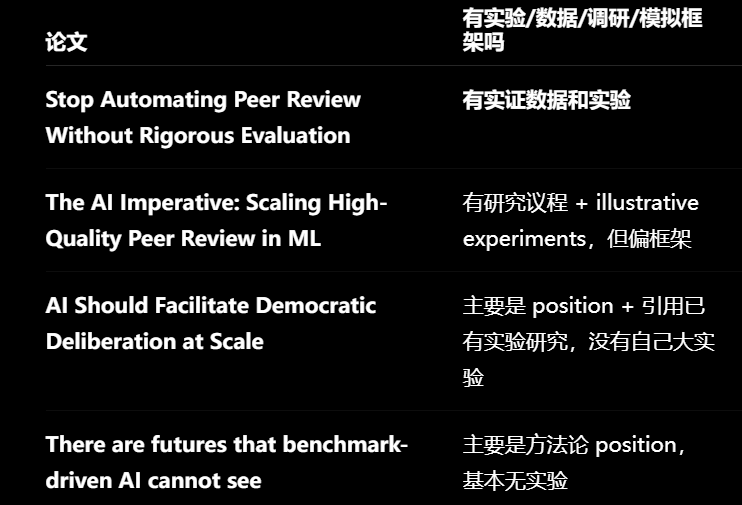
---
- [AI Engram: In Search of Memory Traces in Artificial Intelligence](https://icml.cc/virtual/2026/oral/71045)  

神经网络里的“记忆”有没有类似生物大脑 engram 的物理痕迹？
如果有，能不能把某个概念对应的参数子成分找出来，然后单独擦除或注入？

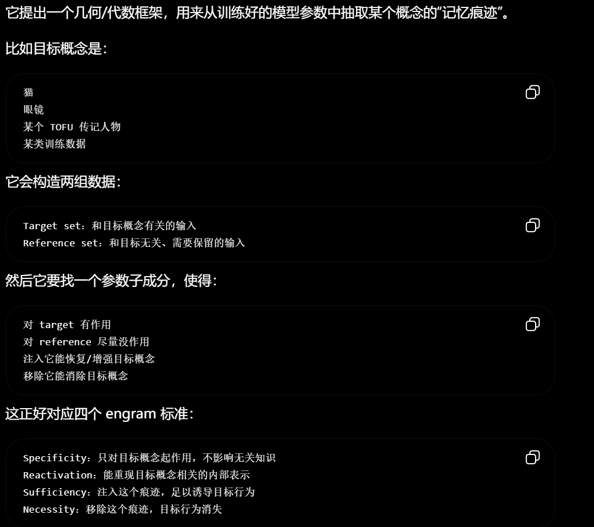

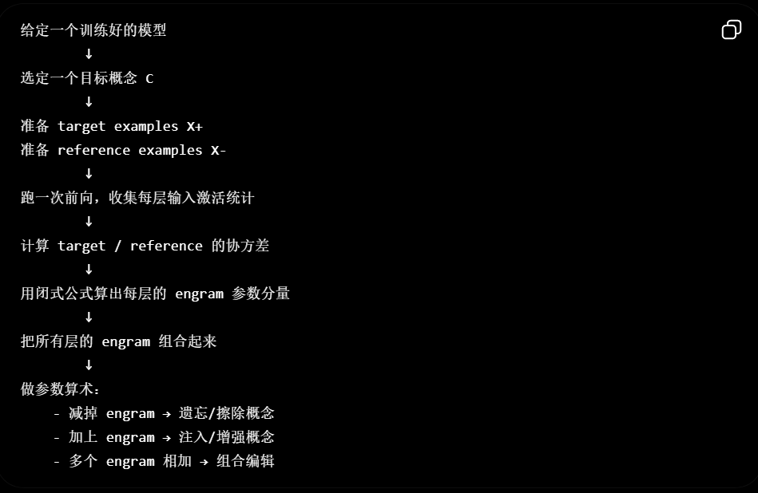

模型参数中可以抽取出概念级“记忆痕迹”。
这个痕迹不是单个神经元，而是分布在多层权重中的功能性子成分。

这些记忆痕迹可以被线性操作。
减掉可以遗忘，加入可以增强，多个可以组合。

它比传统模型编辑/遗忘更高效。
因为不需要迭代优化，只需要前向统计和闭式解。

图像分类 图像生成 LLM
---
> 以上偏高维度 分析
---
- [Rare Event Analysis of Large Language Models](https://icml.cc/virtual/2026/oral/71154) 

基于概率-某些输出非常罕见，开发测试阶段几乎看不到
大规模部署会让这些尾部事件重新变得重要

提出一个面向 LLM 的 Rare Event Analysis, REA 框架。
实验 ： 
 ARI, Automated Readability Index
也就是文本可读性/阅读难度指标。TinyStories 模型本来应该生成儿童故事，所以高 ARI 的复杂/异常文本可以看作一种不希望出现的行为。
Log-Prob
也就是 completion 在模型下的联合 log probability，用来研究模型生成特别高概率或特别低概率文本的尾部分布。

这篇文章把统计物理中的 rare event analysis 引入 LLM：把 completion 看成随机轨迹，定义 ARI/Log-Prob 等 observable，用 exponential tilting + Transition Path Sampling 高效采样尾部输出，再用 MBAR 重构原始概率分布并做误差分析。它证明了直接采样看不到的 rare completions 可以被系统发现和量化，并展示了如何从这些稀有输出中提取 runtime proxy，用于未来的安全监控和 guardrail 设计。
---
[AI Engram: In Search of Memory Traces in Artificial Intelligence](https://icml.cc/virtual/2026/oral/71045)  

LLM 的偏见是不是只来自训练数据里的已有社会偏见？
还是说，当 LLM 作为 agent 在环境里多轮决策、接收反馈时，它会自己发展出新的偏见？

它把心理学里的一个 hiring game 搬到 LLM 上。

任务设定 ：
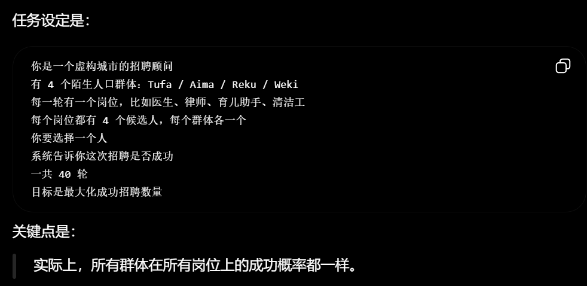

结论 1：LLM 会从随机反馈中形成新偏见，而且比人类更严重

论文发现，frontier LLM 会把不同虚构群体分配到不同岗位类别，分层程度甚至高于人类参与者。它报告所有 frontier LLM 的平均 SI 和 BGD 都高于人类；比如 Claude Sonnet 4 direct prompt 的 SI 很高，OpenAI o3 和 DeepSeek-R1 也表现出严重分层。

结论 2：更大、更新、更强的模型反而更容易分层

结论 3：CoT 和提高 temperature 不够 （减少分层）

结论 5：给更多有意义的个体信息可以缓解，但不能完全解决

结论 6：显式鼓励 exploration / diversity 最有效

论文测试了多种 prompt steering，比如强调公平、共享价值、社区规范等。最稳健有效的是：

明确把 diversity / exploration 放进目标函数里。
---
- [LASER: Learning Active Sensing for Continuum Field Reconstruction](https://icml.cc/virtual/2026/oral/71040)  

如果我们想重建一个连续物理场，比如流体速度场、水波场、温度场，但只能放少量传感器，那么传感器应该放在哪里？
更进一步，传感器能不能根据当前观测，动态移动到更有信息量的位置？

它提出 LASER，一个闭环主动感知框架。
LASER 的世界模型

主动传感的难点是：你不知道“如果把传感器移动过去，会不会更有用”。
LASER 的解决办法是用 latent world model 做内部模拟
---
- [From Feasible to Practical: Pareto-Optimal Synthesis Planning](https://icml.cc/virtual/2026/oral/71067)  {和llm关系不大}

它研究的是 computer-aided synthesis planning, CASP，也就是给定一个目标分子，自动规划如何从可购买原料一步步合成它。
[结合 成本 毒性 产率 安全等]
给化学家一组 Pareto-optimal routes，让他们看到不同目标之间的权衡。

它提出 MORetro*，一个多目标 retrosynthesis search 算法。
---
> 以上 领域混合  [含规划搜索]
---
- [Monitoring Monitorability](https://icml.cc/virtual/2026/oral/71064)  

我们想通过看模型的 Chain-of-Thought 来监督 agent，但 CoT 本身到底还能不能被监控？
如果模型变强、训练方式变化、推理更长，CoT 还会不会把坏意图暴露出来？

提出一套衡量 CoT monitorability 的评估框架；
构造一组 broad evaluation suite，测试 monitor 是否能通过 CoT 发现坏行为；
分析 monitorability 如何随模型、推理长度、RL 优化、模型规模、monitor test-time compute 变化。

CoT 是否包含足够信息，让监督者发现危险行为。

当前多数 frontier models 还算 monitorable，但不完美（CoT 是一个有用但脆弱的监督通道）
小模型高 reasoning effort 可能比大模型低 effort 更 monitorable

...
---
[Jailbreak Foundry: From Papers to Runnable Attacks for Reproducible Benchmarking](https://icml.cc/virtual/2026/oral/71103) 

越狱攻击论文越来越多，但每篇论文的代码、数据、评测 harness、judge、模型版本都不一样，导致不同论文里的 attack success rate 很难比较。那能不能把这些论文里的攻击方法自动转成统一框架下可运行的攻击模块？

而是提出一个 jailbreak attack 复现与统一评测系统：Jailbreak Foundry, JBF。
[有点像ADP？]

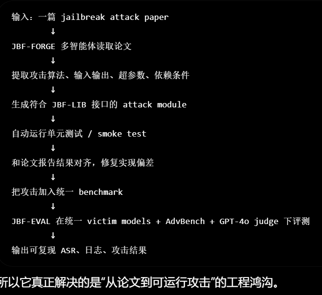

复现保真度 + 标准化横评

jailbreak benchmark 最大问题之一不是缺攻击，而是复现和比较不可靠
多智能体 paper-to-code 工作流可以高保真复现 jailbreak attacks
安全 benchmark 应该是 living benchmark

---
- [Quantifying Frontier LLM Capabilities for Container Sandbox Escape](https://icml.cc/virtual/2026/oral/71104) 

我们经常把 agent 放进 Docker/OCI 容器里执行代码，以为 sandbox 能隔离风险。但如果模型足够强，它能不能自己找到并利用容器配置或系统漏洞，从沙箱里逃出来？
[神秘]

构造了一个 CTF 风格的沙箱逃逸评测

一个有动机的 adversarial agent，已经在容器内部获得 shell access，尝试突破容器隔离。

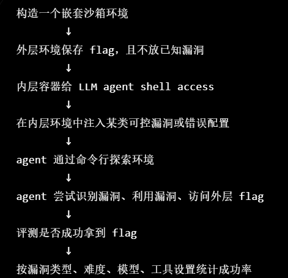

公开摘要中的核心结论是：

当 benchmark 中加入漏洞时，LLM 能够识别并利用这些漏洞。
---
- [When the Prompt Becomes Visual: Vision-Centric Jailbreak Attacks for Large Image Editing Models](https://icml.cc/virtual/2026/oral/71106)  

如果 prompt 本身变成了视觉输入，那么恶意意图是不是也可以藏在图像里，从而绕过传统文本安全机制？

为了系统评估这种风险，作者构建了 IESBench，一个面向图像编辑安全的 **benchmark**。

论文报告，VJA 能有效攻击当前商业图像编辑模型

提出一个 training-free defense，基于 introspective multimodal reasoning

在真正执行图像编辑前
        ↓
先让模型/系统对图像输入和编辑意图做多模态反思
        ↓
把隐含在视觉提示里的意图转成可审查的语义描述
---
> 以上 safty  (做了 bench / framework)
---
- [Unsupervised Partner Design Enables Robust Ad-hoc Teamwork](https://icml.cc/virtual/2026/oral/71078)  

一个 agent 训练完之后，能不能和从没见过的队友合作？
传统做法通常需要先训练一大批不同 partner，然后让 ego agent 和这些 partner 一起训练

它提出 UPD: Unsupervised Partner Design。
{不维护一个固定 partner population，而是在训练过程中动态生成 partner，并根据 learnability 选择最适合当前 ego agent 学习的 partner。}

训练 ego agent 的过程中，临时“造”一些假队友出来，让 ego 和它们练习。
这些假队友不是完整训练出来的强 agent，而是用简单方式生成的：
假队友 = 一部分模仿 ego 当前策略 + 一部分随机行为

用表现中等+波动的 队友 训练 
---
> 以上 多agent
---
- [From Text to Forecasts: Bridging Modality Gap with Temporal Evolution Semantic Space](https://icml.cc/virtual/2026/oral/71136)  

如何把文本信息用于时间序列预测。

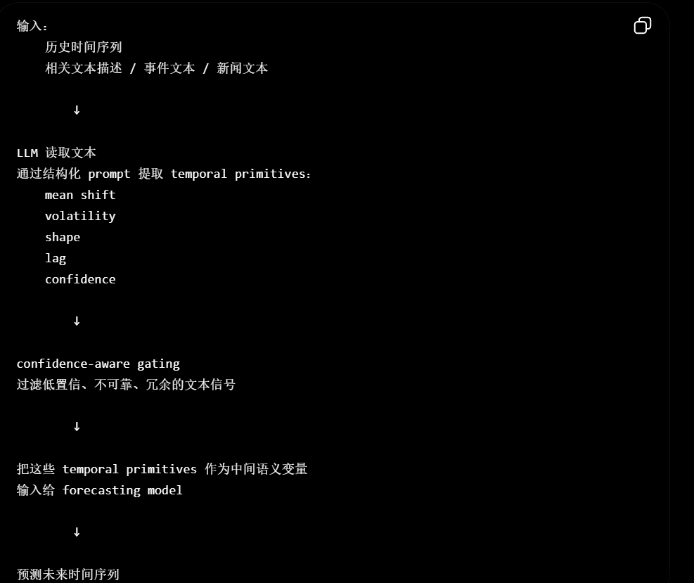

第一，文本对时间序列预测确实有用，但不能粗暴融合。
直接把文本 embedding 和时间序列 embedding 拼接，容易被冗余 token 干扰。

第二，中间语义空间比端到端 embedding fusion 更可靠。
TESS 让文本先变成 mean shift、volatility、shape、lag 这些和时间序列变化直接相关的变量，降低了模态差距。

第三，LLM 的作用是“语义解析器”，不是最终预测器。
它用 LLM 做 structured extraction，把自然语言事件转成可解释的时间演化描述，再交给 forecasting model。
---
- [Mind Your Margin and Boundary: Are Your Distilled Datasets Truly Robust?](https://icml.cc/virtual/2026/oral/71143) 
[我不太了解]
数据集蒸馏 Dataset Distillation, DD 的鲁棒性问题。

DD 把一个大训练集压缩成一个很小的合成数据集，让模型只用这个小数据集训练，也能接近原始大数据集训练效果。

它提出 C²R: Contrastive Curriculum for Robust Dataset Distillation。

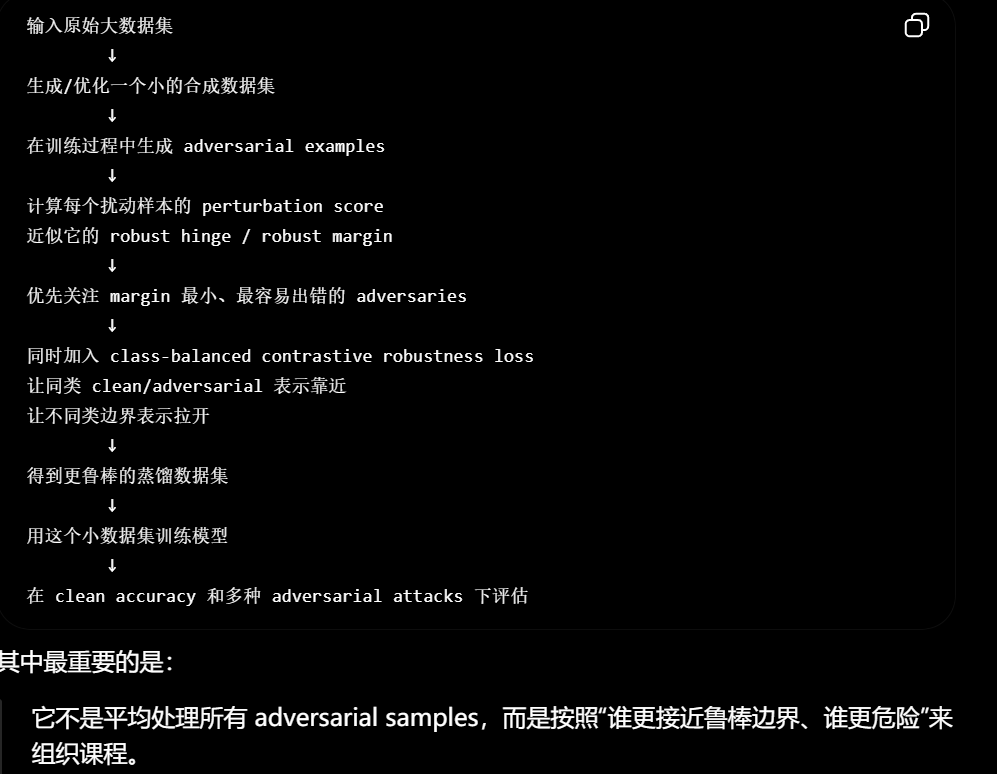

第一，数据集蒸馏不能只看 clean accuracy。
第二，鲁棒性主要被边界附近的小 margin 样本控制。
第三，鲁棒蒸馏需要同时管 margin 和 boundary。
{margin 关心的是：某个样本离错误分类有多远。 boundary 关心的是：类别之间的分界线在哪里，是否把不同类别分得足够开。}

---
- [Don’t Force the Fit: Bounded Log-Likelihood Loss for Enhanced Reasoning in Large Language Models](https://icml.cc/virtual/2026/oral/71059)  

它批评标准 SFT 的 token-level NLL / cross entropy：SFT 会强迫模型拟合专家示范里的每一个 token，但 reasoning 任务的正确性通常取决于逻辑有效性或最终答案，而不是某条 CoT 的逐字形式。

他们提出 Bounded Log-Likelihood Loss, BLL-Loss。

BLL 不是简单降低学习率，也不是 gradient clipping，而是根据 token 置信度自动决定这个 token 该不该强行学。

主结果很强：BLL 在所有列出的模型规模上都超过 SFT/NEFT/GEM
---
> 以上 others
---
> 构造一整套 / topic / 讲故事 圆故事 可实现  / 故事 框架 结论 都重要?