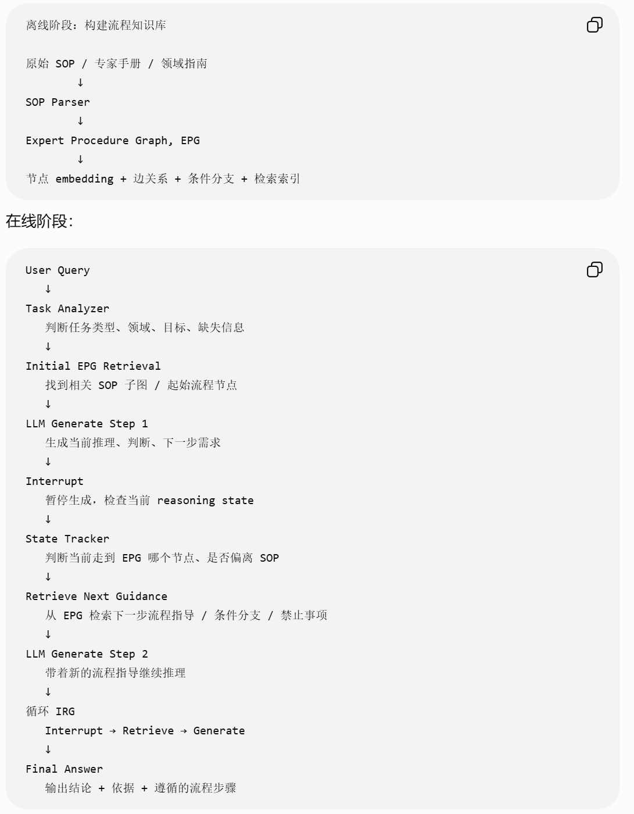
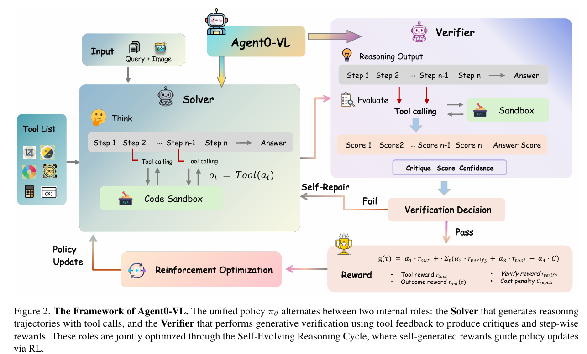

[Strategic Navigation or Stochastic Search? How Agents and Humans Reason Over Document Collections](https://icml.cc/virtual/2026/oral/71033)  

它提出 MADQA，一个面向“**多 PDF 文档集合**”的多模态 agent **benchmark**，用来判断 agent 到底是在有策略地查文档，还是靠暴力随机搜索凑答案。

benchmark的文档来自真实世界 PDF，而不是从旧 benchmark 或 synthetic docs 里拼出来

者定义了六个关键属性：

Extractive：答案 token 必须真的出现在证据页里。
Multi-hop：证据可能跨页或跨文档。
Closed-world：只能从给定 corpus 得答案，不能靠外部知识。
Grounded：答案必须由最小证据集支持。
Agentic：不存在一个简单单次 retrieval query 就能拿到所有证据。
Visual：可能需要理解布局、表格、图像等非纯文本信息。

**evaluation**
第一，答案准确率。
比如 exact / verbose correct 等。

第二，evidence attribution。
用 Page F1 和 Doc F1 看 agent 找到的证据页/证据文档是否对。

第三，effort calibration。
这是这篇的亮点之一：它用 Kuiper statistic 衡量 agent 的 effort 是否校准。简单说，好的 agent 应该在简单题上少查，难题上多查；差的 agent 会无论题目难不难都一通乱搜。表 3 也说明 Kuiper 越低越好，用来衡量 effort calibration

论文的答案偏悲观：

当前强 agent 能达到不错 accuracy，但更像是用大量搜索补偿策略规划不足。

他们发现，人类在第一步 query 上就有很强的 strategic calibration，大概第一步就能达到约 50% accuracy；而 Gemini 3 Pro 第一轮只有约 12%，后面靠更多 compute/reformulation 追上来。论文称这是 “cold start disparity”。

这非常关键。它说明：

模型不是不会找，而是一开始不知道怎么找；它靠试错恢复。

这对 agent 研究很有启发：未来不是简单加更多 tool calls，而是要训练/设计 query planning、search policy、evidence-seeking strategy、metacognitive calibration。

图 8 的结论是：强系统基本能取到相关内容，但还会在理解、抽取和综合上出错；弱系统则常常连正确文档或页面都找不到

---
[VenusBench-Mobile: A Challenging and User-Centric Benchmark for Mobile GUI Agents with Capability Diagnostics](https://huggingface.co/papers/2604.06182) 

作者认为，现有 benchmark 太关注单 app 功能完成，缺少真实使用中的 跨 app、模糊意图、环境变化、长期状态跟踪，所以会高估 mobile GUI agent 的可靠性。论文明确说，现有 online mobile GUI benchmarks 主要有两个问题：一是任务和真实用户需求不对齐，二是只给总体成功率，缺少失败原因诊断。

从用户真实意图出发，再让 app 成为完成意图的工具。benchmark 覆盖 10 个用户意图类别、149 个主任务、27 个 apps，并额外设计 80 个环境变化样本 来测鲁棒性

这篇最有价值的不是“成功率低”，而是它诊断出了失败结构。

作者说，失败主要由 perception 和 memory 缺陷主导。尤其是 memory，被论文称为 absolute bottleneck：高级任务里，agent 需要跨页面、跨 app、跨多步操作保留任务目标和中间信息，但当前模型会严重掉点。

mobile agent 不是只要在标准设置下能跑通就行；真实部署里，语言、主题、布局、设备形态的小变化都会导致失败。

---
[CausalGame: Benchmarking Causal Thinking of LLM Agents in Games](https://icml.cc/virtual/2026/oral/71152)  

CausalGame 让 LLM agent 扮演“无人机设计师”，在有限实验预算内反复设计无人机、观察哪些能存活，最后推断隐藏的因果机制；它测的是 agent 能不能从带选择偏差、隐藏混杂和噪声的数据里恢复真正因果关系，而不是拟合表面相关。

2-stage

Exploration Stage:
    200 drones, ≤10 deployments
    agent 可以试验、收集数据、推断机制

Evaluation Stage:
    one-shot 1000-drone fleet
    根据最终设计是否超过场景阈值判断成功

**交互式因果推理 benchmark**

最重要结论比较悲观：
16 个 frontier LLM agents 在这些游戏里都持续失败，难以恢复真正的隐藏因果关系。

让Agent 靠因果理解
---
[$\tau^2$-Bench: Evaluating Conversational Agents in a Dual-Control Environment](https://icml.cc/virtual/2026/oral/71171)

τ²-Bench 测的是：对话 agent 不仅要自己会用工具，还要能**指导用户执行动作**，在双方共同控制同一个环境的情况下完成任务
它实现了一个 双控对话 agent benchmark / simulator。

agent 不能直接替用户按手机设置；它必须通过自然语言指导用户做。

**result**
从 no-user / single-control 切到 dual-control 后，agent 性能显著下降。
也就是说，当 agent 自己拥有全部工具权限时，任务相对容易；但一旦它必须通过对话指导用户完成一部分动作，成功率会明显掉。

有些任务必须依赖用户动作才能完成。

agent 和 user 都是部分可观测的，各自有不同工具和可见状态

---
> 以上 benchmark
---
- [daVinci-Dev: Agent-native Mid-training for Software Engineering](https://arxiv.org/abs/2601.18418)  

**agent 能力不应该只在 post-training 学，而应该在 mid-training 阶段就让 base model 接触“完整 agent 工作流”。**

构造 “保留上下文” “真实环境交互” 的数据

第一步：从 GitHub PR 构造 agent-native 数据。
不是只拿最终 diff，而是把 issue、base files、commit sequence、相关文件、测试信息等拼成接近真实开发流程的轨迹。论文图 2 明确对比了四种范式：静态代码语料、factorized subtask training、contextually-native、environmentally-native；作者认为前两者都不够 agent-native。

第二步：对 Qwen2.5 Base 做 mid-training。
关键点是他们从 Qwen2.5-Base 起步，不是从 coder-specialized base 起步。摘要里强调，即使如此，32B/72B 结果仍然很强。

第三步：再做 agentic SFT，并在 SWE-Bench Verified 上测。
评价 scaffold 主要用 SWE-Agent。论文结果显示，32B daVinci-Dev 达到 56.1%，72B 达到 58.5% SWE-Bench Verified resolution rate。
---
[PhotoAgent: Exploratory Visual Aesthetic Planning with Large Vision Models](https://icml.cc/virtual/2026/oral/71050)  

真正完成这个目标，需要很多隐含步骤：调曝光、调色温、增强主体、改善构图、去杂物、局部提亮、控制不要过度编辑等。传统指令式编辑把这些分解和排序负担都丢给用户。PhotoAgent 要解决的就是这个问题：从 step-by-step prompt engineering 转成 autonomous photo editing agent。

闭环 agent：
感知 → 规划 → 执行 → 评估 → 再规划

它把修图过程看成一个搜索问题：

当前图像是一个 state；
每个编辑指令/工具调用是一个 action；
编辑后的图像是 next state；
审美评分、图像质量、指令遵循度等是 reward；
目标是找到一串 action，让最终图像更符合用户意图。

1. UGC-Edit Dataset：作者自己整理的数据集
项目页说它大约有 7,000 张真实用户生成照片，来源包括 LAION Aesthetic 和 RealQA，然后先用 Qwen3-VL 做分类/筛选，再经过人工验证，保留真正像用户随手拍、社交媒体照片那类 UGC 图像；审美分数统一归一到 1–5 分。

1. UGC Reward Model：作者自己训练的审美打分模型
它不是简单用 CLIP/BRISQUE 之类通用指标，而是从 Qwen2.5-VL 初始化，然后用 GRPO 优化，让模型学习同一组图片里相对审美排序，最后用来给 PhotoAgent 每一步编辑结果打分。
---
[TG-RAG: A Retrieval-Augmented Framework for Reasoning Guidance in Specialized Domains](https://icml.cc/virtual/2026/oral/71061) 

普通 RAG 的问题是：
模型可能检索到了正确资料，但 reasoning 过程中仍然会漂移。

论文把这个问题叫做 Cognitive Drift：模型在复杂工作流里容易偏离领域 SOP，只靠一次性 context engineering 不够稳定。

在模型推理的每个关键阶段，检索并注入当前步骤最相关的“推理指导”。
所以它更像一个 reasoning-time control framework，而不是传统知识补充型 RAG。

**Expert Procedure Graph, EPG**
EPG 可以理解成把专业 SOP 从自然语言文档变成一个图结构：

节点 = 专家流程中的步骤 / 判断点 / 操作要求
边 = 步骤之间的顺序、依赖、条件跳转

问题
→ 检索初始流程指导
→ 模型开始推理
→ 到关键节点时中断
→ 根据当前状态从 EPG 里检索下一步 SOP
→ 注入 step-specific directive
→ 模型继续推理

专业领域最大的问题不是知识少，而是 规则多、流程强、出错代价高。

framework： 

---
[Understanding Reasoning Collapse in LLM Agent Reinforcement Learning](https://icml.cc/virtual/2026/oral/71062)  

它发现多轮 agent RL 训练中，模型的 reasoning 可能表面上还很多样、reward 也没明显崩，但实际已经变成“输入无关的模板化废话”；论文提出用 mutual information 诊断这种 collapse，并用 reward-variance-aware filtering 缓解

论文项目页直接说：即使 entropy 仍然高，agent 也可能悄悄停止“听输入”，生成流畅但输入无关的 boilerplate；作者把这叫 template collapse。

template collapse 的特点是：

同一个输入下：输出仍然可以有很多变化  → H(Z|X) 高
不同输入之间：输出却越来越像模板      → I(X;Z) 低

论文提出一个很聪明的 **MI-style retrieval diagnostic**。
如果 reasoning 真的依赖输入，那么看到一段 reasoning，应该能反推出它对应的是哪个输入。

机制解释是 **SNR**, signal-to-noise ratio。
agent RL 里 reward 信号太弱 / 太糊
于是学到“通用套话”这种低风险策略

提出 **Reward-Variance-Aware Filtering，RV-aware filtering**
优先用那些 reward variance 更高的训练样本 / trajectory 更新模型
同一个输入下，不同 reasoning/action 会导致明显不同 reward

1. 给定一个环境和任务输入 X
2. 当前 agent 与环境多轮交互
3. 每轮生成 reasoning tokens Z 和 action
4. 环境返回 observation / reward
5. 对一个 batch 的 X-Z 计算 MI-style retrieval score
6. 如果 Z 不能检索回对应 X，说明 reasoning 正在模板化
7. 计算同一输入下不同 rollout 的 reward variance
8. 优先保留高 reward variance 的样本做 RL 更新
9. 更新 policy
10. 继续监控 MI、performance、entropy

---
[Agent0-VL: Exploring Self-Evolving Agent for Tool-Integrated Vision-Language Reasoning](https://icml.cc/virtual/2026/oral/71164)  

Agent0-VL VLM agent 训练框架

它让一个视觉语言模型同时扮演 Solver 和 Verifier：先用工具做多轮视觉推理，再用工具验证自己的推理、给自己反馈和奖励，最后通过 RL 在没有人工标注或外部 reward model 的情况下自我进化(RL agent Loop)

---
> 以上 agent / 方法 框架 / 训练框架
---

[Characterizing Agents in Production][Measuring Agents in Production]

真实生产环境里，大家最关心的不是“agent 能不能无限自主”，而是：
它能不能稳定、可控、可审计、出了错能不能兜底

它基于 20 个深度案例访谈，以及对 86 个已部署系统从业者的调查，覆盖 26 个领域。

1. 部署 agent 的主要动机是提升生产力，也就是减少人工重复劳动、提高处理效率，而不是追求“完全自主替代人”
2. 生产 agent 普遍采用的是简单、可控的方法。一个被强约束的 LLM，在固定流程里调用少量工具，关键节点由人审核。
3. 不追求完全自主
4. 要用 prompting，而不是 SFT / RL
5. 最大挑战是 reliability，也就是长期、持续、稳定地产生正确行为。
---
> 以上 调研工作
---
- [Do We Need Adam? Surprisingly Strong and Sparse Reinforcement Learning with SGD in LLMs](https://icml.cc/virtual/2026/oral/71027)  
  topic: LLM RL / RLVR / Optimizer

GRPO PPO   SGD 更明显地超过 AdamW  省显存 
如果某些参数历史梯度很小，AdamW 反而会放大它们的有效步长。这样很多原本很小、可能不会真正改变参数值的梯度，也会被放大到足以改变参数。

在 RLVR 阶段，SGD 可能足够强；但在 SFT / 预训练里，SGD 仍然通常不如 AdamW。

---
> 以上 偏理论
---

---

---

---

---

---

---
---
---
---
---
---
---
---
---
---
---
---
---
---
---
---
---
---
---
---
---
---
---
---
---
---
---
---
---
---
---
---
---
---
---
---
---
---
---
---
---
