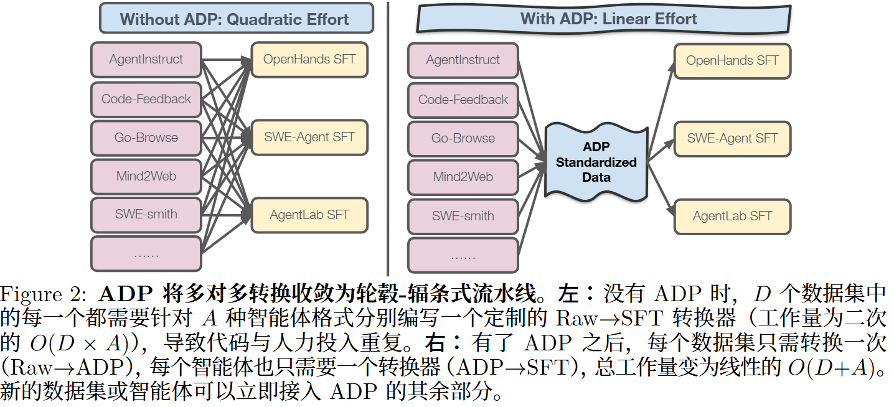

<!-- 如何把各种格式混乱的 Agent 训练数据统一成一种标准格式，从而更方便地对 LLM Agent 做大规模监督微调。 -->
<!-- Carnegie Mellon ICLR 26 -->
# AGENT DATA PROTOCOL: UNIFYING DATASETS FOR
DIVERSE, EFFECTIVE FINE-TUNING OF LLM AGENTS
提出 Agent Data Protocol（ADP）
agent训练数据集高度碎片化，格式与表示方式不一致，导致它们难以被有效地组合、共享和利用

实现了从 13 个现有数据集到 ADP 的转换器，以及从ADP 到 3 种不同智能体架构的转换器

## 现有方法
人工构造 
合成生成（利用现有 LLM 通过提示或结构化生成构造智能体轨迹） 
记录智能体 rollout（捕获现有智能体系统在执行任务过程中的轨迹）
## ADP 原则
简洁性 标准化 表达能力
以Pydantic schema实现
## 架构
Trajectory : id轨迹标识 content动作与观察交替组成 details灵活的元数据字典，用于存储数据集特定
信息
actions:API Actions  Code Actions  Message Actions
Observation：Text Observations  Web Observations

## 跨数据集分析
高推理覆盖率出现在所有任务类别中，说明函数 thought 更像是记录完
善数据集的一种普遍特征，而非某个特定领域的专有行为。

# 附录 
OpenHands/SWE-Agent 使用约 30K，AgentLab 使用约 20K。

# Noun explanation && Extensive knowledge 
## Pydantic schema
用 Python 写出来的一套“数据结构规范”，用来规定一条数据应该长什么样、有哪些字段、字段类型是什么，并且自动检查数据是否合法。

# 思考？
所以实际上训的时候用的ADP数据非常庞大，混合的 那成本他就不提吗，训练速度，相当于延长了训练时间

问题：
认知增量：
方法：
gap：
