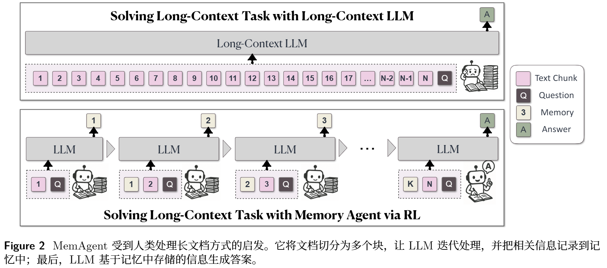
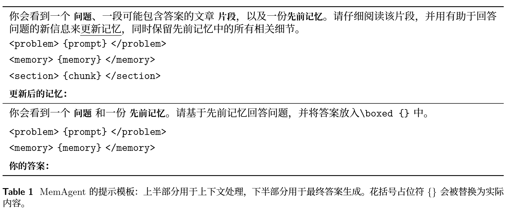
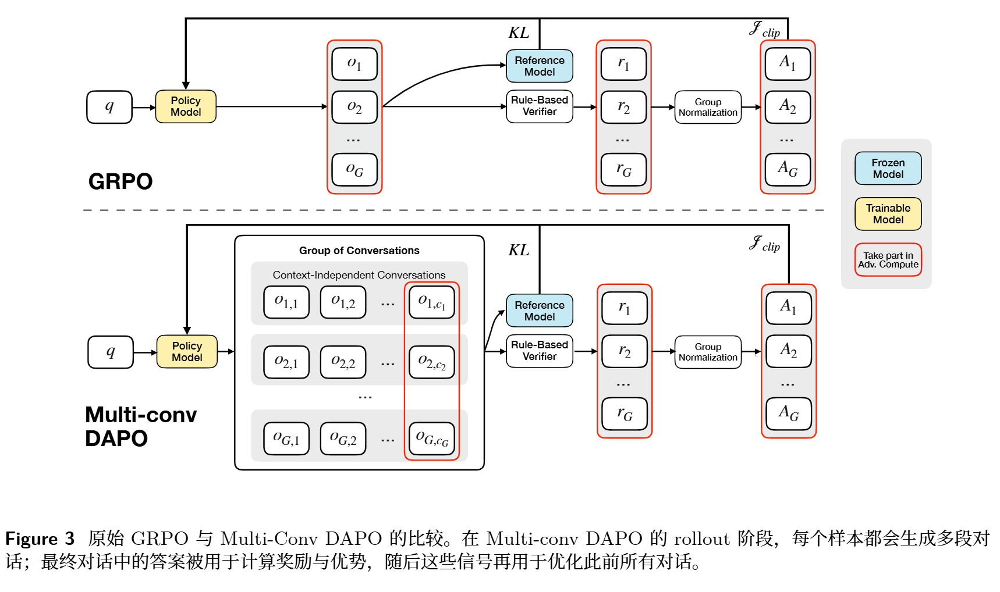
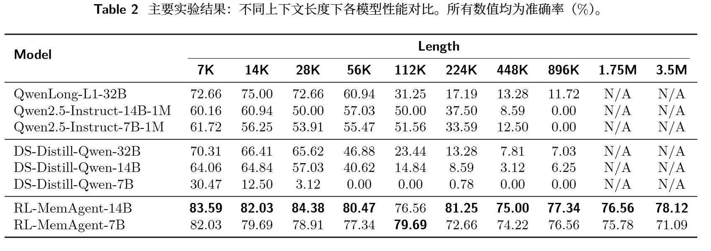
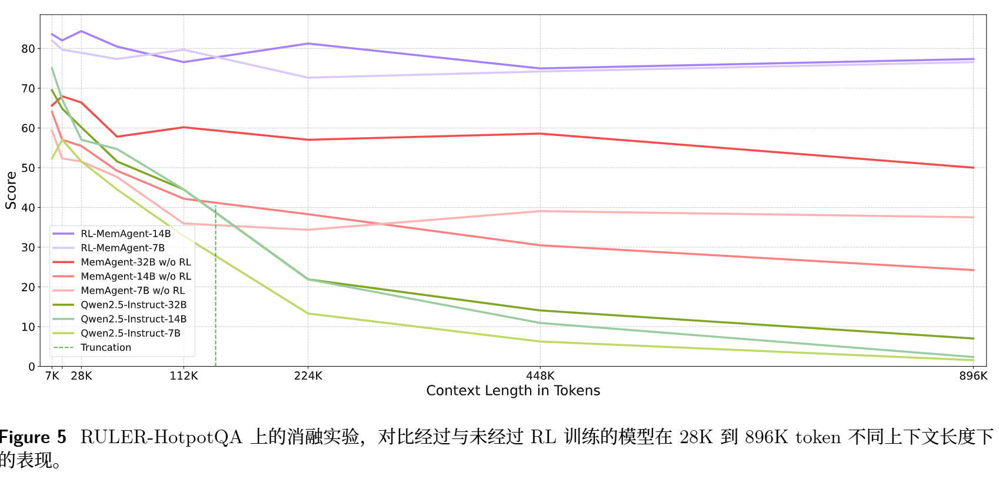
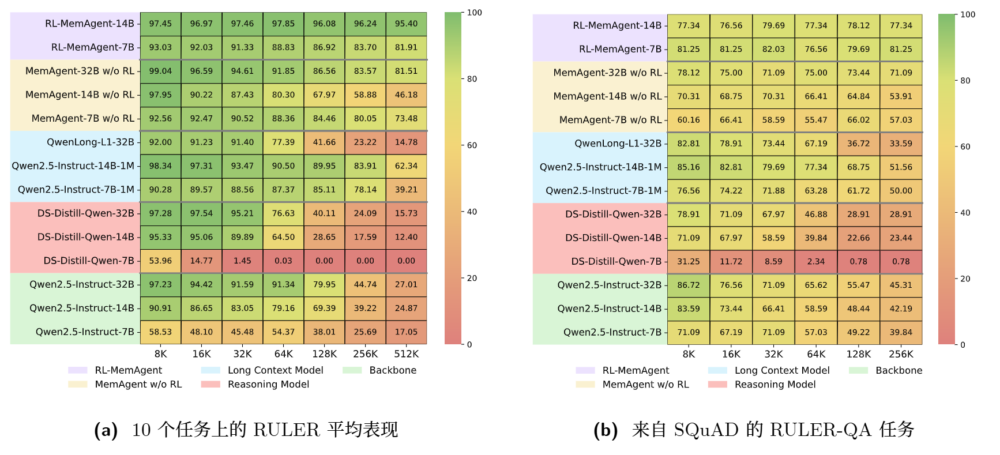

<!-- 提出了一个用强化学习训练出来的“记忆型长文本 Agent”，让 LLM 不必一次性把几百万 token 全塞进上下文窗口，而是像人读长文档一样，一段一段读、边读边更新记忆，最后只根据压缩后的记忆回答问题。 -->
<!-- ByteDance ICLR 2026 Oral-->
# MemAgent: Reshaping Long-Context LLM with Multi-Conv RL-based Memory Agent
线性复杂度处理无限长文档，并在外推时不发生性能退化
长文本处理中的终极挑战

提出一种新的代理工作流

传统长上下文：
1. 扩展位置编码 / 长上下文继续训练
2. 稀疏注意力 / 线性注意力
3. 上下文压缩 / 外部记忆模块  [类似啊]

第一类：让模型“看得更长”。
第二类：让模型“看长文本更便宜”。
第三类：让模型“不必全看，只记关键内容”。

很难做到
无限长输入
长度外推时性能不掉
线性计算复杂度

本文：
通过强化学习（RL）让 LLM自身获得记忆能力
具体干的事情：
1. 提出一种新方法
2. 设计了一套代理工作流来实现这一机制，提出基于多轮对话 DAPO 算法的端到端训练方法
3. 实验证明，外推能力

## 方法

下一个文本块，以及一个紧凑、固定长度的 memory
这个 memory 本质上仍是上下文窗口中的普通 token 序列

读完一个新文本块后，模型会用更新后的记忆覆盖旧记忆 **记忆长度永不增长**
答案生成：只参考题目与记忆来生成带框的答案

RL问题：奖励：保留有用 舍弃无用
优化： DAPO

Context-Processing 模块 + Answer-Generation 模块

**训练**

一个样本会生成很多段“独立对话”
Multi-Conv DAPO：如果某条轨迹最后答对了，前面这些“写 memory”的动作整体都被认为更值得鼓励

**奖励**
exp:
只要模型答案和任意一个标准答案等价，reward = 1；
模型输出里包含了几个 全部答案
按比例给reward

RL essential:
没有中间过程的范例可学习
## 实验和结论
main ： 多跳长文本问答（QA）任务

**benchmark**
RULER 风格
用 HotpotQA 合成训练样本 + 清洗（base模型100%成功，则去除）

**实验设置**
Qwen2.5-7B-Instruct 
Qwen2.5-14B-Instruct
>训练时
>1024 tokens：query / problem
>5000 tokens：context chunk
>1024 tokens：memory
>1024 tokens：output
>剩余留给 chat template
>5-7轮
超参数 配置见文

**结果**

框架本身有用 + 外推更长上下文 + RL真正掌握能力 + 跨任务泛化

**case study**
看到可能相关信息时，先保存；
遇到无关信息时，不乱改 memory；
遇到关键证据时，立刻更新 memory 并形成答案链。

# 附录 
Appendix A：Computation Complexity
Appendix B：Complete Out-of-Distribution Task Results

# Noun explanation && Extensive knowledge 
## DAPO
GRPO：同一个问题采样多个回答，用组内相对奖励算 advantage。
DAPO：在 GRPO 基础上，把裁剪、采样、loss 粒度、超长惩罚做得更适合长推理 RL。

扩展成 Multi-Conv DAPO。原因是 MemAgent 一个样本不是只生成一次回答，而是会生成多段 memory update conversation

* Dynamic Sampling 会过滤掉准确率等于 1 和 0 的 prompt group
## RLVR
依赖可以自动验证的奖励

# 思考？
人类：总体认知 细节看到想起来/再说？
有点像AgentFold 2025 10.29
难道奖励计算就这两种case吗
到底是token好还是feature好

问题：高效处理长上下文 维护记忆
认知增量：通过RL让 LLM自身获得记忆能力
方法：框架 + 配套RL
gap：真实开放长上下文场景的 RL ？
动态memory？
