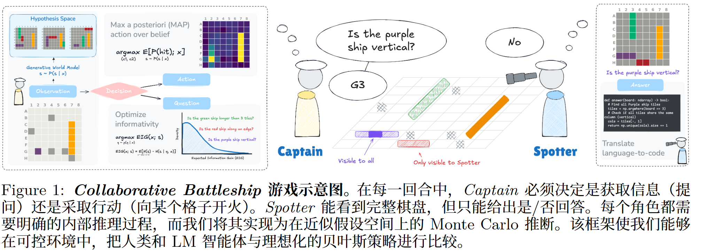
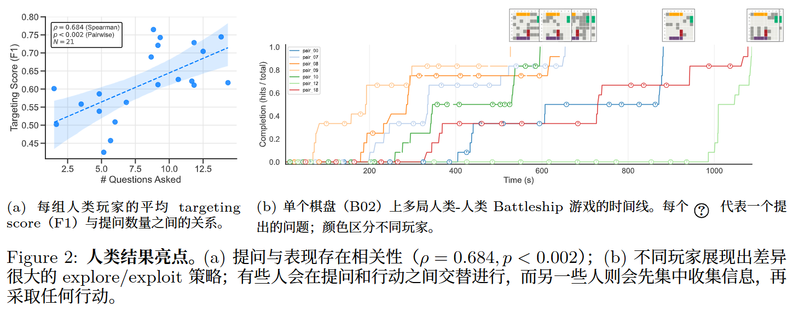
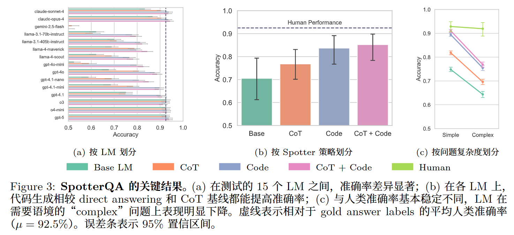
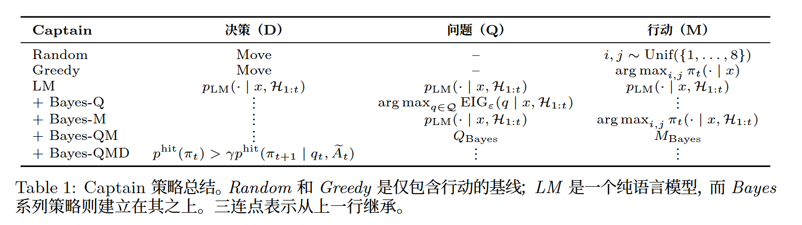
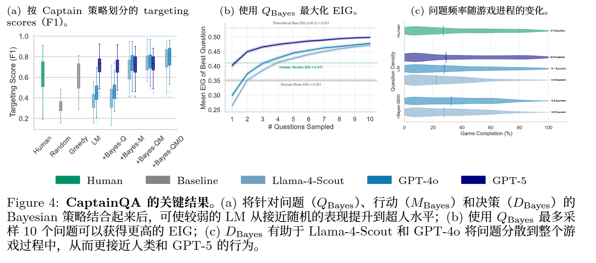
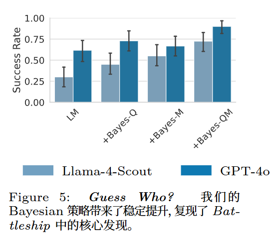

<!-- 语言模型 Agent 会不会像人一样，在不确定环境里“先问好问题，再做高价值行动”；如果不会，能不能用贝叶斯方法帮它变得更理性。 无训练 -->
<!--  ICLR 2026 MIT Oral-->
# SHOOT FIRST, ASK QUESTIONS LATER? BUILDING RATIONAL AGENTS THAT EXPLORE AND ACT LIKE PEOPLE
在资源有限的高风险环境中，语言模型（LM）是否会像理性智能体那样行动？

LM Agent 在提出高信息量问题、给出准确回答以及识别高效行动方面都存
在明显困难

提出受贝叶斯实验设计（BED）启发的全新 Monte Carlo 推断策略

传统的信息寻求理论：假定智能体能够进行多种理性，概率式推断
那么，当下通常被优化来回答用户问题的 LM 在多大程度上也能为自己提出好问题?

**本文的目标，是同时评估并提升前沿模型在动态环境中提出目标导向问题与采取行动的能力。**
改编自经典棋盘游戏 Battleship(提问，回答，行动，权衡)

做的几件事情：
1. 收集了 126 条完整的人类-人类游戏轨迹（N=42 名参与者），同时记录对话与行动。
2. 在回答侧，我们发现 Python 代码生成能显著提升 grounding 能力；在提问侧，我们提出一种简单的贝叶斯采样方法，显著提高了问题质量，并大幅减少了零信息增益的冗余问题
3. 提问（Bayes-Q）、行动选择（Bayes-M）和决策（Bayes-D）
4. 框架+benchmark  实践+理论
5. 泛化到 Guess Who

怎么做问题决定
怎么将问题转化为代码

## 战舰游戏的扩展
1. 以往工作通常只关注静态的游戏状态“快照”；而在本文中，我们模拟完整的游戏轨迹。
2. 引入 spotter 
3. 用 Python 程序表示问题。Python 更有表达力，也更容易由语言模型生成
4. 限制 Spotter 只能回答 “Yes” 或 “No”。
## 框架
1. 真实棋盘是什么？
2. 我现在可能认为哪些棋盘是真的？
3. 一个问题如何作用在棋盘上？
4. 问完问题后，我怎么更新自己的猜测？

S = 真正的完整棋盘
𝒮 = 所有可能的完整棋盘集合

真实棋盘 S 是所有可能棋盘 𝒮 中的一个，但 Captain 不知道是哪一个。
Captain 只能看到部分棋盘 x，所以先排除掉和 x 冲突的棋盘，剩下一个候选集合 𝒮_{⊢x}。
在游戏过程中，Captain 根据已经看到的棋盘 x 和问答历史 H，不断维护一个信念 π_t(s)，表示每个候选棋盘 s 是真实棋盘的概率。
每个 yes/no 问题 q 都可以看成一个函数 f_q，它输入一个完整棋盘，输出 yes/no。
如果把真实棋盘 S 代入这个函数，就得到这个问题的真实答案 A_q。

**噪声**
真实棋盘的概率：因为有不正确的回答噪声（ϵ 表示回答出错概率）
更新 : 符合 ： *(1-ϵ) 不符合: *ϵ
之后归一化
**期望信息增益 ~ 1/2 best**
EIGϵ​(qt​∣x,H1:t​):=I(S;A~t​∣x,H1:t​)
> S：真实棋盘
> \tilde{A}_t：Spotter 给出的有噪声回答
> I(S;\tilde{A}_t)：真实棋盘和回答之间的互信息

把所有会回答 Yes 的粒子的权重加起来，就是这个问题回答 Yes 的概率。

无噪声：问题的信息增益 = 这个问题答案本身的不确定性。
> $$EIG_0(q_t)=H_b(p_t)$$
有噪声时
> $$EIG_{\epsilon}(q_t\mid x,H_{1:t})=H_b\left(\epsilon+(1-2\epsilon)p_t\right)-H_b(\epsilon)$$
听到回答的不确定性-回答通道自己的噪声=这个回答真正能告诉你关于棋盘的信息

**序贯蒙特卡洛近似（SMC）**
𝒮太多了,没法都维护

用一组带权样本来近似后验分布；权重表示每个粒子相对更可能还是更不可能
(随机生成 N 个合法完整棋盘；
这些棋盘必须和 Captain 当前看到的部分棋盘不冲突。)

后续：周期性重采样,替换小概率的样本

**最大化三种概率**
1. 提出能够最大化期望信息增益的问题；
2. 选择能够最大化命中概率的行动；
3. 在每一轮决定是提出问题还是采取行动。

**QBayes**
一个简单策略是采样一组候选问题 Q，例如从语言模型中采样候选问题，然后选择其中 EIGϵ最高的问题

**MBayes​**
计算
在当前所有可能棋盘中，这个格子有多大概率是船？

$$
u_t^\star
\in
\arg\max_{u\ \text{unrevealed}}
p_t^{hit}(u\mid x,H_{1:t})
$$

**DBayes​**
第一步：先找一个最值得问的问题(QBayes)
第二步: 用 M-Bayes 找当前最可能命中的格子
第三步：计算问完这个问题后，下一轮预计能达到的命中概率(yes/no的概率分布加权计算)

$$
\gamma\widehat{p}^{hit}_{t+1}(q_t^\star\mid x,H_{1:t})
>
p_t^{hit}(u_t^\star\mid x,H_{1:t})
$$

这里的 γ 是折扣因子。论文实验中设置为0.95（降低未来收益）

## 实验
### 人类实验
42 个人类参与者 一共收集了 126 局完整人类游戏轨迹

1. 得到人类行为基线 问多少问题、什么时候问、问什么类型的问题、打得准不准
2. 构建 BATTLESHIPQA 数据集
>Simple：只看完整棋盘就能回答
>Stateful：需要看当前已揭示状态
>Discourse：需要看前面对话
>Vague：问题本身有模糊词，比如 near / center
>Ambiguous：有多种合理解释
931 个 yes/no 问题，人类回答准确率基线是 92.5% (回答)

### SpotterQA
只测试模型回答问题的能力(Spotter)
>Base：直接回答
>CoT：先推理再回答
>Code：把问题翻译成 Python 函数，然后执行
>CoT + Code：先推理，再写代码执行

(qt, At, xt, H1:t)
一个问题、一个答案、观察到的棋盘，以及来自人类实验的历史

不同模型之间的问题回答能力差异很大 弱的很弱 强的超过人类准确率

代码生成会稳定提升回答准确率 cot+code 最好
对许多模型而言，代码生成显著缩小了 LM 与人类表现之间的差距

### CaptainQA
让模型扮演Captatin

Spotter 固定成 GPT-5 + CoT + Code  ε = 0.1
Captain 模型主要测了 Llama-4-Scout、GPT-4o、GPT-5

>F1 / Targeting Score：打船总体准不准
>Move Count：用了多少次射击
>Questions Asked：问了多少问题
>Win Rate：同棋盘下谁更快更准
>EIG：问题平均信息增益

ε= 0.1，这意味着 EIG 的理论最大值为 1 −Hb(0.1) = 0.531 bits

---
SpotterQA：来自人类实验轨迹中的问题和棋盘状态。
CaptainQA：用同一批 18 个预采样棋盘，每个棋盘跑 3 个随机种子(控制模型采样、候选问题生成、随机策略等随机过程)，共 54 局。

## 结果
1. 引入 Bayesian 策略可将较弱模型提升到超人水平(超过人类以及强模型)
GPT-5 本身并未从 Bayesian 提问或行动选择中获得显著收益

2. Inference scaling 会为所有模型带来更有信息量的问题

3. 提出高 EIG 问题并不足以保证强游戏表现(Llama-4-Scout 和 GPT-4o)

4. 熟练玩家会先问一些问题，但不会把问题全都先问完
人类、GPT-5总体上提出的问题更少
## 泛化
Guess Who
你不知道对方选的是哪个角色，你可以问 yes/no 问题

比 Battleship 更复杂
涉及对象属性、外貌、关系语义

最终猜测?
## 讨论
见正文

在更一般的场景中，作者可能需要学习一个世界状态生成模型

没有真正建模复杂语用
# 附录 
Appendix A：游戏规则、人类实验和标注细节
Appendix B：贝叶斯推断和 SMC 实现细节
Appendix C：Prompt 细节
Appendix D：完整实验结果
Appendix E：Guess Who? 泛化实验

# Noun explanation && Extensive knowledge 

# 思考？
其他问题是否能用信息论衡量
采样和重采样的具体细节
为什么泛化实验没有QMD？

问题：Agent 任务中提问 搜索、观察
认知增量：agent 提问的实验设计 不确定性减少
方法：SMC EIG Q/M/D 分解
gap：环境较理想 
