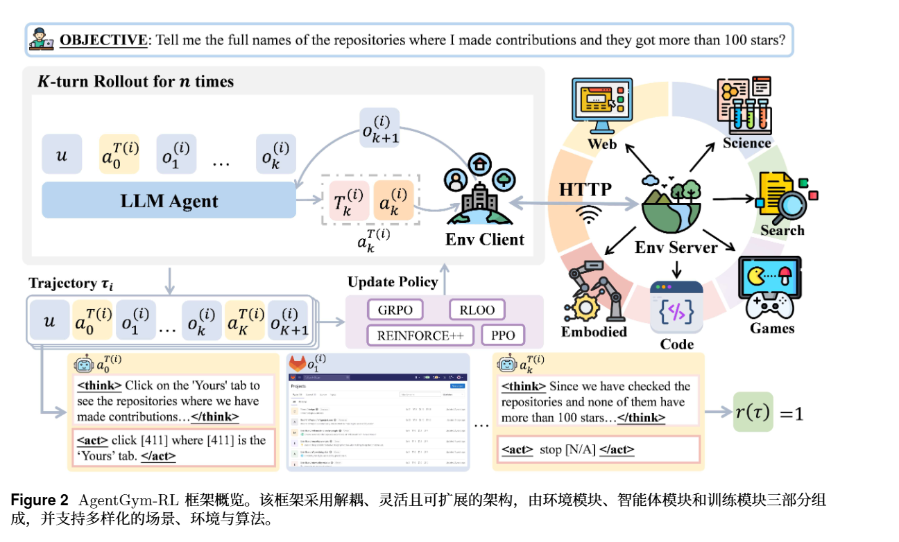
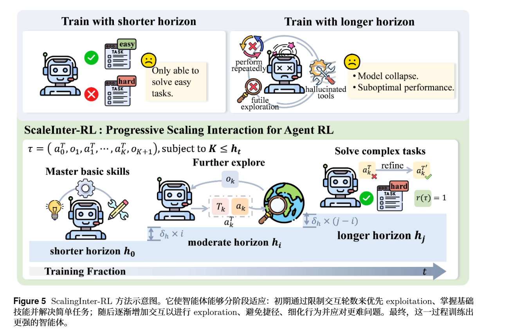
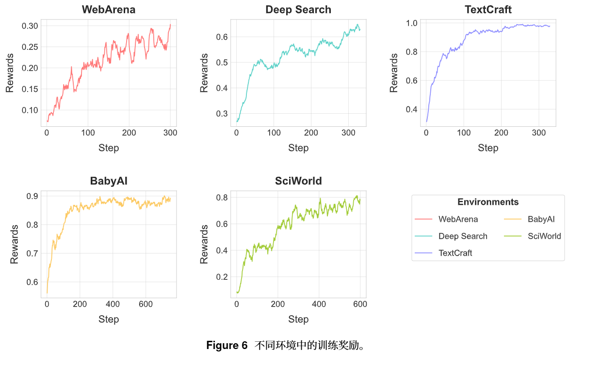
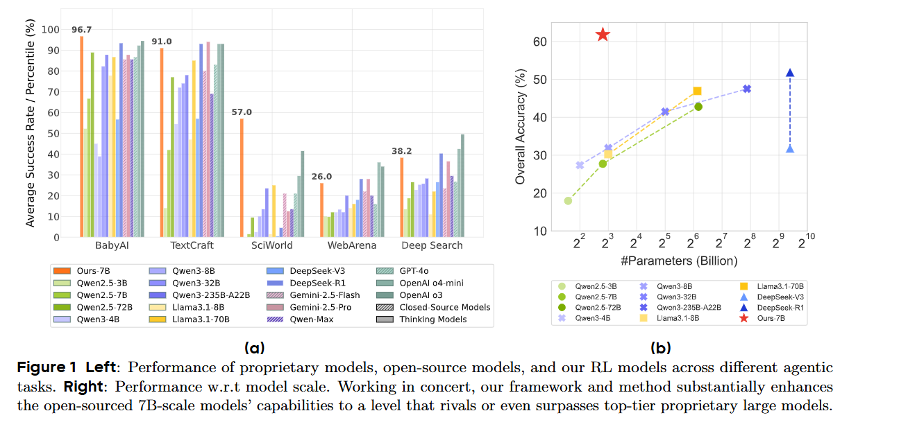
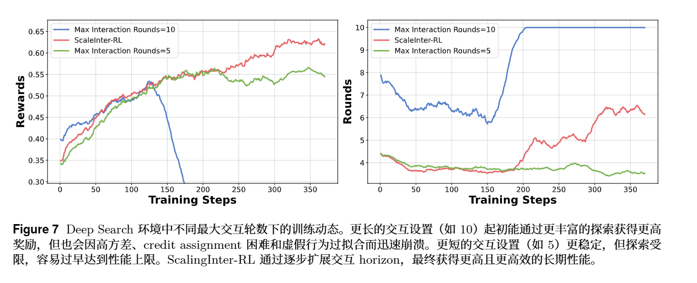

<!-- 提出了一个用于训练 LLM Agent 的多轮交互强化学习框架 AgentGym-RL，并提出一种逐步增加交互轮数的训练方法 ScalingInter-RL，让 7B 级开源模型在多种长程 Agent 任务上接近甚至超过闭源大模型 -->
<!-- seed ICLR 2026 poster -->
# AgentGym-RL:Training LLM Agents for Long-Horizon Decision Making through Multi-Turn Reinforcement Learning
* 长程
lack:
统一的、交互式的强化学习（RL）框架
不依赖 supervised fine-tuning (SFT) 作为前置步骤

AgentGym-RL 框架与 ScalingInter-RL

AgentGym-RL
模块化、解耦式设计，可清晰分离智能体、环境与学习算法

ScalingInter-RL
让智能体分阶段适应环境：先通过偏重 exploitation 来稳定掌握基础技能与简单任务；随后逐渐增加交互 horizon，促进 exploration、细化行为、克服捷径，并应对更复杂的挑战
## 框架设计
基于 AgentGym 
> 第一，扩展到更丰富、更贴近现实的环境与任务；
> 第二，纳入一组主流在线 RL 算法；
> 第三，在工程实现层面提升系统的并行性、稳定性与可维护性

>Environment module：环境模块
>Agent module：智能体模块
>Training module：训练模块

给一批任务 query 和初始环境状态；
初始化多个独立环境客户端；
每个环境客户端和一个 agent 独立交互；
agent 生成 action；
environment 执行动作并返回 observation / reward；
收集多条 trajectory；
把这些 trajectory 送入训练模块更新 policy。

* AgentGym-RL 覆盖了多种场景

>Web Navigation
>Deep Search
>Digital Games
>Embodied Tasks
>Scientific Tasks

把 online reinforcement learning 放在核心位置

* 支持多种 RL 算法
PPO、GRPO、REINFORCE++、RLOO 都能接；
也可以接 SFT、DPO、拒绝采样

* 可扩展性、可伸缩性、可靠性
Extensibility 
框架把 Environment、Agent、Training 三个核心组件解耦成 plug-and-play。研究者可以方便地加入新环境、新 agent 架构、新 reward 函数或新 RL objective。

Scalability
环境侧的并发、重置和长期稳定性。

Reliability
Agent RL 需要长期运行很多环境
修了几个环境里的 memory leak
重构递归消除冗余复制

* 基于已有开源框架，比如 veRL 和 AgentGym，同时提供完整开源实现、文档、可复现实验脚本和标准化 API。
+ 可视化用户界面(用于观察和分析 agent 的行为),便于分析失败原因等

## ScalingInter-RL
在 agent 场景中，test-time compute 不应只体现在内部推理长度上，还应体现在与环境的外部交互深度上

先短 horizon 学基础；
再慢慢加长 horizon 学探索。

方法仍以最大化终止奖励为目标

$$
h_1<h_2<\cdots<h_n
$$

每隔 \(\Delta\) 个 training steps，增加最大交互轮数：

$$
h_{t+1}=h_t+\delta_h
$$

直观理解：训练早期用短 horizon 让 agent 学会稳定的基础行为，偏向 exploitation；训练后期逐步增加 horizon，让 agent 探索更长路径，学习 planning、reflection 和 backtracking 等复杂行为，偏向 exploration。

## 实验
web navigation 使用 WebArena；deep search 使用基于 RAG 的检索推理环境；digital games 使用 TextCraft；embodied tasks 使用 BabyAI；scientific tasks 使用 SciWorld

主要以 Qwen-2.5-3B 和 Qwen-2.5-7B 作为 backbone，并与 Gemini 2.5 Pro、OpenAI o3、GPT-4o、DeepSeek-R1、Qwen-2.5-72B、Llama-3.1-8B/70B 等模型进行比较

[具体结果见原文]

main results
ScalingInter-RL 稳定且有效
* RL 能把开源 Agent 拉到接近闭源模型水平
* ScalingInter-RL 稳定且有效
* 短 horizon：训得稳，但不会复杂探索;长 horizon：探索空间大，但早期乱跑导致崩。
* 后训练和 test-time compute 的潜力可能大于单纯扩大模型尺寸
* 环境结构决定 RL 效率(规则清楚、因果反馈明确的环境中提升最大,在 WebArena 和 Deep Search 这种更开放的环境里，提升比较温和(复杂 噪声大))

## discussion

* Test-Time Scaling for Agents(随着交互轮数增加，所有模型性能都提升;增加采样数量能明显提高 Pass@K)    [Agent 的 test-time compute 不只是 CoT 长一点；还可以是和环境多交互几轮;Agent 可以通过并行尝试多条行动轨迹获得更高成功率]
* 在长程 Agent RL 里，算法稳定性比模型大小还重要
* case study [见原文]

# 附录 
Appendix A：AgentGym-RL 架构细节

Appendix B：各环境的实现细节和设置

Appendix C：轨迹案例和可视化

# Noun explanation && Extensive knowledge 
## exploration–exploitation 权衡
尝试未知动作来发现更好的策略，也要利用当前已知最有效的动作来拿到奖励

## 任务形式化
多轮交互决策任务
将其建模为一个Partially Observable Markov Decision Process (POMDP) 
$$
(\mathcal{U}, \mathcal{S}, \mathcal{A}, \mathcal{O}, \mathcal{T}, r)
$$
>U：instruction space，任务指令空间
>S：state space，状态空间
>A：action space，动作空间
>O：observation space，观察空间
>T: S × A → S，状态转移函数
>r: U × S → R，奖励函数
## 策略梯度
目标函数：
> $$J(\theta)=\mathbb{E}_{\tau\sim\pi_\theta}[r(\tau)]$$

求导：

$$
\nabla_\theta J(\theta)
=
\mathbb{E}_{\tau\sim\pi_\theta}
\left[
r(\tau)
\sum_{k=0}^{K}
\nabla_\theta \log \pi_\theta(a_k\mid s_k)
\right]
$$

>τ：一条完整交互轨迹
>a_k：第 k 步动作
>s_k：第 k 步状态
>r(τ)：整条轨迹的最终奖励
>πθ(a_k | s_k)：当前模型在状态 s_k 下选择动作 a_k 的概率

成功轨迹里的动作概率 ↑
失败轨迹里的动作概率 ↓

## AgentGym
1. 收集和统一多种 agent 环境；
2. 用统一 ReAct 格式组织 observation / thought / action；
3. 支持 agent 实时和环境交互；
4. 支持并发探索；
5. 提供 benchmark、轨迹数据和 AgentEvol 自进化方法。

AgentGym-RL = AgentGym 环境平台
            + 在线 RL 训练管线
            + 主流 RL 算法支持
            + ScalingInter-RL
            + 大规模 rollout 工程优化

## 五类任务
WebArena：会不会操作网页。
Deep Search：会不会查资料并综合答案。
TextCraft：会不会按规则规划和合成。
BabyAI：会不会在空间里行动和找目标。
SciWorld：会不会按科学实验流程做任务。

# 思考？
实验中 phase transition points 是根据原始 RL 总优化步数设置的  而不是根据学习情况的动态delta机制？
关于agent泛化能力，类似ADP，在不同任务能力要求领域上能否有较好的泛化?

问题： 长时程agent训练问题/
    agent 训练的基础设施 / 
认知增量：在线 RL 训练框架  动态动作交互轮次
方法：AgentGym-RL  ScalingInter-RL
gap：动态delta
