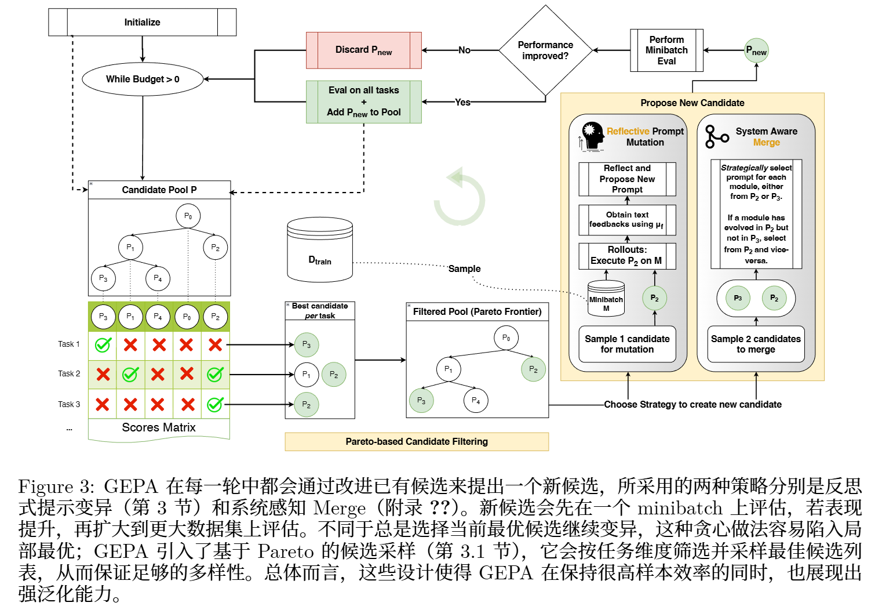

<!-- 很多 LLM 系统不一定非要用 RL 更新模型参数；如果系统的执行轨迹本来就是自然语言，那么可以让 LLM 直接“反思失败原因”，再进化 prompt。 -->
<!-- Berkeley ICLR 2026 Oral -->
# GEPA: REFLECTIVE PROMPT EVOLUTION CAN OUTPER-FORM REINFORCEMENT LEARNING
GRPO 成本高
语言本身的可解释性为LLM 提供了更丰富的学习媒介
Genetic-Pareto
充分利用自然语言反思、从试错过程中学习高层规则的提示优化器

只需极少量 rollout 就能带来显著的质量提升

>即便是非常复杂的 LLM 系统，其 rollout 也可以序列化为自然语言轨迹：其中包括各个LLM 模块的指令、由此产生的推理链、工具调用，以及奖励函数的内部过程（例如在被压缩成标量奖励之前的编译报错信息）。由于现代 LLM 很容易理解这种序列化轨迹，我们认为，相较于标准 RL 方法，那些通过反思这些轨迹、在自然语言中有意识地学习的算法，能够更有效地利用 LLM 已有的强大语言先验。

figure 2
把一个很短、很弱的 seed prompt，进化成了什么样的任务专用 prompt

## 形式化建模

$$
\Phi = (M, C, X, Y)
$$

>M：多个 language modules
>C：control flow，也就是模块调用逻辑
>X：全局输入 schema
>Y：全局输出 schema

$$
M_i = (\pi_i, \theta_i, X_i, Y_i)
$$

>π_i：这个模块的 prompt / instruction / few-shot demos
>θ_i：这个模块背后的 LLM 权重
>X_i：模块输入格式
>Y_i：模块输出格式

$$
\Pi_\Phi = \langle \pi_1, \ldots, \pi_{|M|} \rangle
$$

$$
\Theta_\Phi = \langle \theta_1, \ldots, \theta_{|M|} \rangle
$$

>prompt 参数集合
>model weight 参数集合

**GEPA 的关键是：它只动 prompt，不动模型权重。**

它的目标是在不超过 rollout 预算 B的前提下，找到能最大化留出性能的参数 〈Π∗,Θ∗〉

[让每一次rollout 更有价值]
## GEPA

reflection LM 生成一个新的 module prompt / 两个 candidates 要有共同祖先，而且优化的是互补的 prompt 集合(不同模块) 规则式

**遗传式优化循环**
(i) 选出有前景的候选；
(ii) 在一个任务 minibatch上提出并评估其变体；
(iii) 如果该变体优于其父候选，就将其连同祖先信息加入 P，并在用于选择的验证集 Dpareto 上进行评估。当预算耗尽后，GEPA 返回在Dpareto 上综合表现最好的候选。

**反思式提示变异**
LLM 可以通过反思利用这些轨迹，执行一种隐式的 credit assignment，将最终结果的责任归因
到相关模块上

得到完整轨迹 - 按照某种策略（如 round-robin）选择要更新的模块（在该语言程序包含的 |M| 个模块中） - 反思模型归因并提出修订后指令 - 用更新后的模块替换原模块 - 如果得分提高，新程序就会被加入候选池

>当前 prompt
>系统执行轨迹
>得分 score
>反馈 feedback

**评价轨迹也是诊断信号**
GEPA 不只使用模型自己生成的 execution trace，还利用 evaluation trace。

很多评价函数在给出最终分数前，其实会产生很丰富的中间信息

代码任务：编译错误、测试失败、性能 profiling
指令遵循：哪些约束满足了，哪些没满足
检索任务：哪些目标文档已经找到，哪些还缺失
隐私任务：质量分、隐私泄露分各是多少

**GEPA 的核心算法**
从完整系统候选中选一个 module，基于小批量 rollout 反馈反思并改写该 module 的 prompt；如果改写后整体表现提升，就保存为新的 candidate。

1. 将数据分成：
   - \(D_{feedback}\)：用于产生轨迹和文本反馈；
   - \(D_{pareto}\)：用于记录候选表现和选择候选。

2. 初始化候选池：
   - \(P = [\Phi]\)，即只包含原始系统；
   - 每个 candidate 是一整套 workflow prompt 组合。

3. 在 \(D_{pareto}\) 上记录初始 candidate 的分数。

4. 在 rollout budget 用完前循环：
   - 选择一个 candidate；
   - 选择一个 module；
   - 从 \(D_{feedback}\) 采样 minibatch；
   - 运行系统，收集 trace、score、feedback；
   - reflection LM 根据反馈改写该 module 的 prompt；
   - 用新 prompt 在 minibatch 上测试；
   - 如果新版本分数提升，则加入 candidate pool；
   - 在 \(D_{pareto}\) 上评估新 candidate。

5. 最后返回 \(D_{pareto}\) 平均分最高的 candidate。

**基于 Pareto 的候选选择**
不总是选择平均分最高的 candidate，而是保留在某些样本上表现最好的候选，让不同策略分支都有机会继续进化。

1. 对每个任务实例 \(i\)，找出当前所有 candidates 中得分最高的候选；
2. 形成 instance-wise Pareto set；
3. 删除被其他候选支配的 candidates；
4. 统计每个 candidate 在多少个实例上是 best；
5. 按照这个频次作为概率，随机采样一个 candidate；
6. 返回该 candidate，用于下一轮 prompt mutation。

## 实验
HotpotQA IFBench Hover PUPA AIME-2025 LiveBench-Math 6 个数据集

**Table 1: Qwen3-8B**
GEPA 比 GRPO 分数更高，但 rollout 更少。

**Table 2：GPT-4.1**
GEPA 在闭源模型上也能直接工作，而且超过 MIPROv2、TextGrad、Trace 等 prompt optimizer

学到的 prompt 规则有一定跨模型泛化能力。它不是只学到了某个模型的奇怪偏好，而更像学到了任务层面的高层策略

obs1:GEPA 比 GRPO 更样本高效

obs2:只优化 instruction 也能超过 instruction + few-shot 优化(GEPA 和 MIPROv2 对比)

obs 3：Pareto candidate selection 很关键

Observation 4：GEPA prompt 更短、更便宜、更容易部署(GEPA 生成的 instruction prompt 通常比 few-shot demonstration prompt 更短，最多比 MIPROv2 生成的 prompt 短 9.2 倍)

Observation 5：Merge 有用，但调度还不成熟(也就是 GEPA+Merge，有时能带来很大收益,但在 Qwen3-8B 上有时反而退化 他们把自适应调用 Merge 作为未来工作)

Observation 6：GEPA prompt 可以跨模型迁移(Qwen3-8B 优化出来的 GEPA prompt 直接放到 GPT-4.1 Mini 上测试)

## Extended Applications of GEPA
**推理时搜索**

把当前要解决的一组任务直接作为 GEPA 的训练集，让 Dtrain
和 Dpareto都包含这些任务。这样 GEPA 可以“overfit”这组任务，不断提出更好的解法。

错误信息可以动态注入领域知识。比如 kernel 编译失败后，根据 compiler error 去检索相关技术手册，把手册中的架构知识加入 prompt 进化过程

NPU Kernels 实验
[GEPA 能从编译错误、profiling 反馈、硬件手册等文本信号中总结优化策略，而不是只让 GPT-4o 盲目重写代码]

CUDA Kernels 实验
[随着 rollout budget 增加，GEPA 能把 GPT-4o 原本接近 0 的 fast1 分数提升到 20% 以上]

**自动搜索 让模型表现变差的prompt**
一个 GEPA 找到的通用对抗 prompt，把 GPT-5 Mini 在 AIME-2025 上的 pass@1 从 76% 打到了 10%

论文认为，性能大幅下降来自：无关细节 + 严格格式规则

# 附录 
LLM 使用说明
GEPA 反思 meta-prompt
算法细节
实验设置
更多结果分析
推理时搜索
对抗 prompt search
rollout 曲线
generalization gap
成本分析
search trees
中间 prompt 演化
每个 benchmark 的最佳 prompt
kernel prompt
reflection LM 调用次数

# Noun explanation && Extensive knowledge 
## compound AI system
复合 AI 系统
任何由一个或多个语言模型（LLM）调用组成、可能穿插外部工具调用、并由任意控制流编排的模块化系统。

智能体、多智能体系统以及 ReAct Archon 等

## Pareto
**Pareto（帕累托）**原本来自经济学/多目标优化，核心意思是：
>一个方案不能在“不让任何目标变差”的情况下继续改进，那它就是 Pareto optimal / 非支配解。

如果方案 A 在所有指标上都不比 B 差，并且至少一个指标比 B 好，
那 A 就支配 B。

如果一个方案没有被任何其他方案支配，
它就是 Pareto frontier 上的候选。

## MIPROv2
不是人手搓 prompt，而是让系统自动尝试很多种指令和示例组合，最后找出效果最好的那一套

MIPROv2 = DSPy 里的自动 prompt 优化器。

>自动生成多种候选 instruction；
>自动挑选或构造 few-shot examples；
>用验证集和评价指标测试不同组合；
>用贝叶斯优化之类的方法搜索更优组合。
## BeamSearch
每一步保留前 k 个最好的候选，而不是只保留 1 个，也不是保留全部。

## DSPy
是一个 Python 框架

不要手工反复调 prompt，而是把 LLM 任务写成更结构化的程序，然后让系统自动优化 prompt、示例和调用方式。

# 思考？
对比的RL提示词过于简单？

主 GRPO 用 LoRA，另外也探索了 full-parameter finetuning

问题：降低 RL成本 
认知增量：充分利用rollout
方法：对提示词的迭代
gap：
