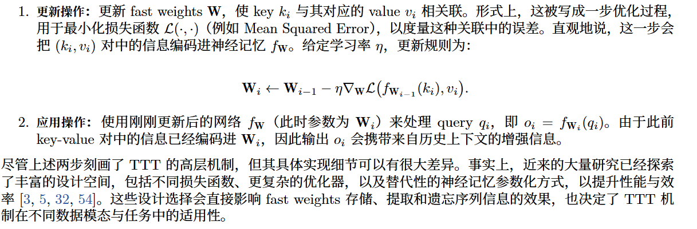
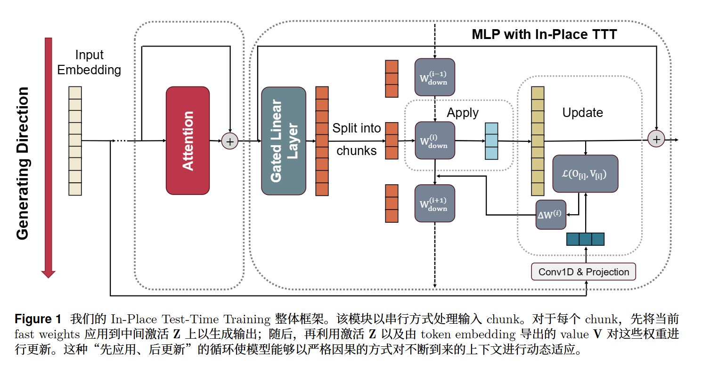

<!-- 如何让已经训练好的大语言模型，在推理时根据当前输入上下文动态更新一小部分参数，从而提升长上下文和持续适应能力，同时又不破坏原有模型结构。 -->
<!-- 字节 ICLR 2026 oral-->
# In-Place Test-Time Training
无缝赋予 LLMs Test-Time Training 能力的框架

传统TTT：推理时不完全冻结模型，而是让一小部分参数作为fast weights，随着输入上下文动态更新，相当于模型在测试时也能“临时学习”  本质上是串行的

计算低效和目标不匹配问题
     Next-TokenPrediction (NTP) 目标
## TTT
TTT 的核心是利用 fast weights [2, 43]，记为 W。这些权重构成一个小型神经网络 fW

本质还是在让k与v靠拢，而不是解决token预测问题 自监督目标是重建
TTT 的经典逐 token 更新规则本质上是串行的 试图替代attention

gap：架构兼容性 计算效率 面向语言建模定制的学习目标
    即插即用(不改架构)

既然 MLP 本来就存了模型预训练学到的知识，那就让它的一部分在推理时也充当“临时记忆”
## 原位测试时训练 In-place TTT
将一个无处不在的模块，即 Multi-Layer Perceptron (MLP) block，重新用作 fast weights

**架构**
gated MLP
O = (ϕ(HW_gate^T) ⊙ (HW_up^T)) W_down^T
Z = ϕ(HW_gate^T) ⊙ (HW_up^T)
输入投影 Wup 和 Wgate 被视为冻结的 slow weights
而最终投影矩阵 Wdown 则被重用为可适应的 fast weights。通过只对 Wdown 进行原位更新

chunk-wise update:

workflow:
1. 用当前版本的 W_down 处理当前 chunk 的中间表示 Z[i]
得到输出 O[i]
2. 对比 Z[i](W_down^(i))^T 和输出目标 V[i] 做一步梯度更新 W_down

让 W_down 学会：看到 Z，就能产生更接近 V 的输出

**目标函数**
Next-Token Prediction，NTP。

V_hat = Conv1D(X_0) W_target

X_0：token embedding
Conv1D(X_0)：从局部上下文中提取未来 token 相关信息
W_target：一个可训练的投影矩阵
V_hat：最终用来更新 fast weights 的 value 目标

Conv1D

文中采用的损失函数是相似度损失

为什么 LM-Aligned Objective 比 reconstruction objective 更好？

理论：k* 后面跟着 v*
(x_t*, x_{t*+1}) = (k*, v*)
传统重构目标：k* → k*
LM-Aligned 目标 ：k* → v*
假设 1：不同 token 的 embedding 近似正交
假设 2：Key-Query 对齐 模型能识别这两个位置都是同一个 key

LM 对齐目标在期望意义下能够保证正确下一个 token v∗的 logit 增大，同时使其他 token 的 logit 基本保持不变，因此可以直接帮助模型完成预测任务

**实现细节**
并行加速
一条很长的序列 切成若干chunks
第一步：每个 chunk 并行计算自己的更新量 ΔW
第二步：对 ΔW 做 prefix sum
chunk1 用原始 W_down
chunk2 用 W_down + ΔW1
chunk3 用 W_down + ΔW1 + ΔW2
chunk4 用 W_down + ΔW1 + ΔW2 + ΔW3
第三步：每个 chunk 用自己的有效 W_down 并行输出
每个 chunk 都拿到“它该看到的历史更新版本 W_down”
然后并行算自己的输出

生成 value 的时候对 1D convolution 使用 causal padding。
## 实验
1. In-P TTT能在多大程度上提升预训练 LLMs
2. 从零开始训练时，In-Place TTT 与以往 TTT 方法相比表现如何
3. In-Place TTT 框架中的关键设计选择分别带来哪些影响
---
1. 

# 附录 

# Noun explanation && Extensive knowledge 

# 思考？
问题：TTT背景 三个问题
认知增量：不用改架构也能ttt
方法：
gap：
