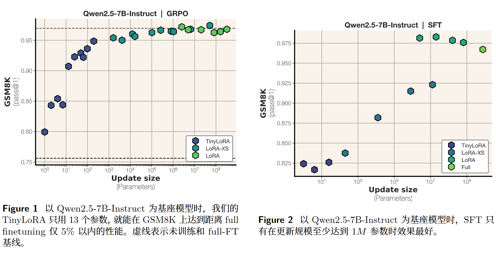
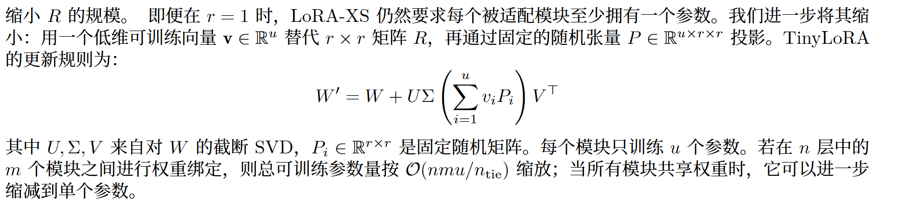
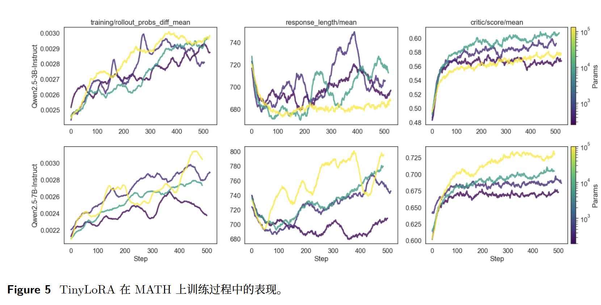
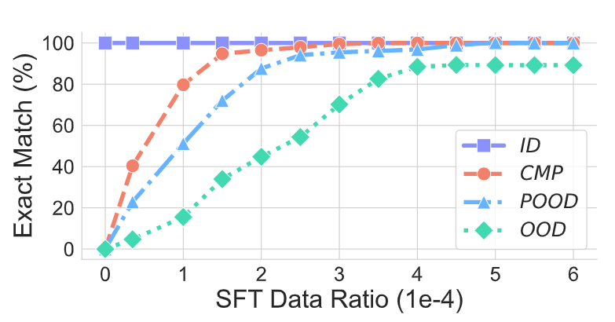

<!-- 它提出 TinyLoRA：一种比 LoRA / LoRA-XS 还极端的参数高效微调方法，声称可以只训练极少参数，甚至 13 个参数，就让大模型在数学推理任务上显著提升 -->
<!-- Meta FAIR  arXiv preprint -->
# Learning to Reason in 13 Parameters
传统 LoRA 无法缩放到低于模型宽度的规模

提出 TinyLoRA，这是一种能够将低秩 adapter 缩放到小至单个参数的方法

在 AIME、AMC 和 MATH500 等更难的 learning-to-reason benchmark 上，我们用少 1000×的参数量恢复了 90%的性能提升。值得注意的是，只有 RL 才能实现如此强的表现；使用 SFT 训练的模型需要大 100-1000×的更新规模，才能达到同等性能

LoRA 对于 Llama3-8B，LoRA 在最小设置（rank 1）下也至少需要微调 3M 参数

观察到RL比SL更加高效

当我们在GSM8K 上用 TinyLoRA 和 GRPO 训练 Qwen2.5-7B-Instruct 时，只微调总计 13 个参数，就达到了 91% 的准确率，总更新大小仅为 26 字节

这类超低容量的模型更新只有在 RL 场景下才会成功，而对 SFT 来说，其信息密度不足以支持良好训练效果

## 理论

在 SFT 中，训练信号只是一个不带奖励标注的示例 y。模型无法区分 y中哪些特征与任务真正相关。由于缺少将信号与噪声分离开的机制
[噪声？利用率？]

## 方法
### LoRA
W′= W+ AB

A∈Rd×r 和 B∈Rr×k

### LoRA-XS

W′= W+ UΣRV T

U∈Rd×r、Σ ∈Rr×r 和 V∈Rk×r

只有 R∈Rr×r 可训练

### TinyLoRA

**参数共享**
我们将权重绑定因子 ntie 定义为共享同一个 v 的模块数量
[不同层是如何共享参数？]

## 实验
使用 TinyLoRA 时，只训练单个参数就能带来 4% 的性能提升

MATH上

**消融**

# 附录 

# Noun explanation && Extensive knowledge 
## truncated importance sampling

# 思考？

问题：
认知增量：
方法：
gap：
