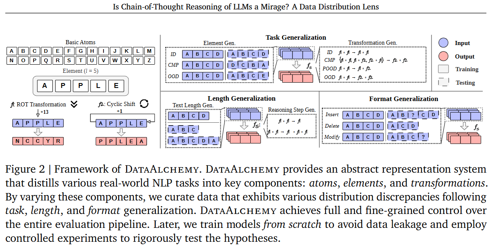
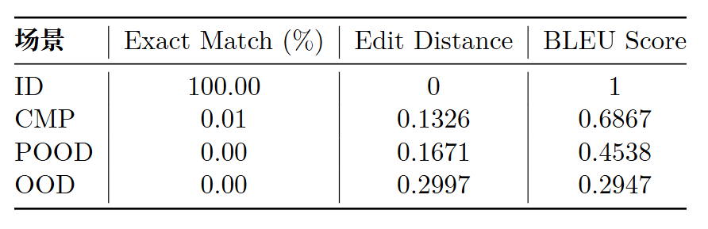
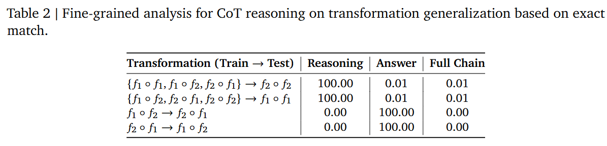
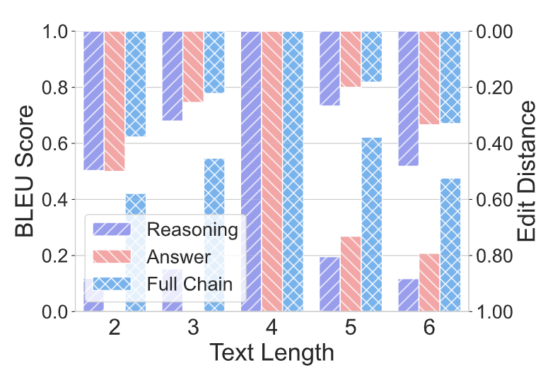
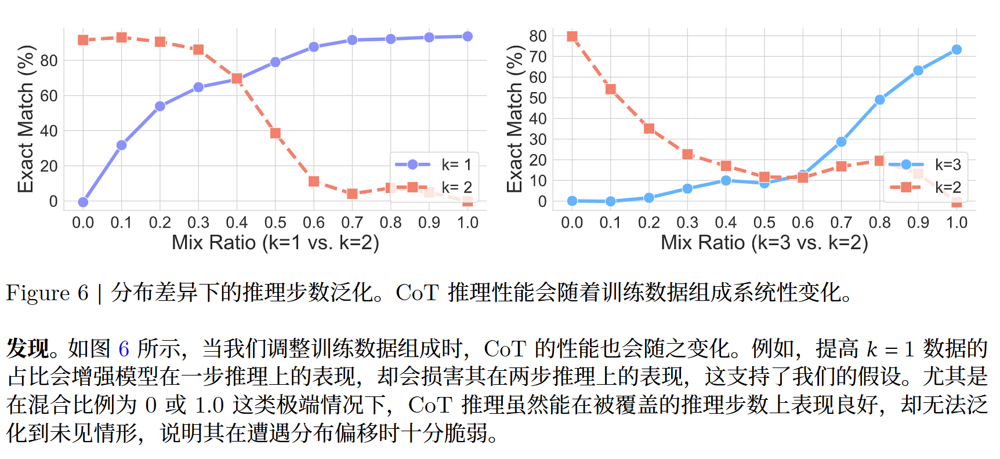
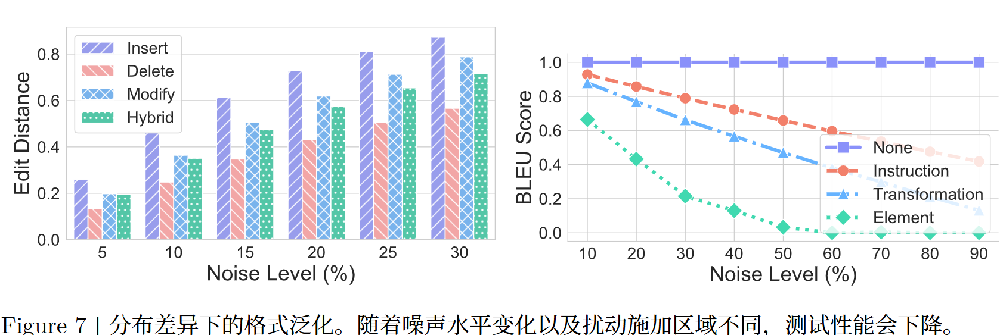
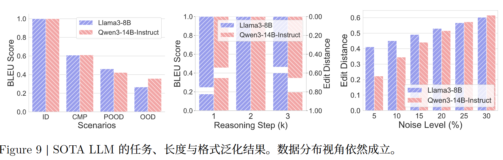

<!-- CoT 的成功很可能高度依赖训练分布；当任务、长度、格式偏离训练分布时，所谓“推理链”可能只是看起来合理的模式复现，而不是真正可泛化的逻辑推理。 -->
<!-- ACL 2026  -->
# Is Chain-of-Thought Reasoning of LLMs a Mirage? A Data Distribution Lens
假设，CoT 推理反映的是一种从分布内数据中学到的结构化归纳偏置
从三个维度剖析 CoT 推理：任务、长度和格式

从三个维度剖析 CoT 推理：任务、长度和格式。
提出了 **DataAlchemy**，这是一个抽象且完全可控的环境，可以从头训练 LLM，并在多种分布条件下系统性地探测模型

当 CoT 推理被推到训练分布之外时，它是一种脆弱的海市蜃楼
## 相关研究
CoT 提示
把长链条 CoT 直接嵌入推理过程
质疑这些收益的稳健性与忠实性
模型更偏好表层推理模式而非逻辑有效性
透明性幻觉（illusion of transparency）

OOD泛化
CoT 提示能够在一定程度上提升 OOD 泛化能力，尤其是在需要长链推理的任务
当不同分布之间共享共同的潜在结构时，LLM 才能实现可靠泛化
## 数据分布视角
用 TV distance，总变差距离 来衡量训练分布和测试分布有多不一样。
把两个分布曲线的差异面积加起来，再除以 2。

模型在测试分布上的风险，不会超过三部分之和。
Rtrain：理论上的训练分布风险
R^train：手头这批训练数据上算出来的训练风险

B：loss 的上界
含有n：经验风险

训练数据和测试数据越不一样，模型测试表现越可能变差

## DataAlchemy：一个可控环境

将真实世界NLP 任务中的token 抽象为**基本原子**，用26 个字母构成的字母表A ={A,B,C,...,Z}表示

进一步构造长度为 l的有序原子序列，作为**元素** e，以表征文本空间

e =(𝑎0, 𝑎1, . . . , 𝑎𝑙−1) where 𝑎𝑖 ∈ A, 𝑙 ∈ℤ+

我们把 LLM 在真实世界中对文本执行的操作（如摘要、改写和推理）抽象为作用于元素的**变换** F: e → ^e 

在本文中，我们主要实例化两种基本 transformation
ROT Transformation 和 Cyclic Position Shift
ROT 该操作会将每个原子沿字母表顺序向前循环移动n个位置
CP 该变换会将序列中原子的相对位置循环左移n个位置

序列 fs对应的组合变换定义为如下函数复合：
𝑓S =𝑓1 ◦ 𝑓2 ◦···◦ 𝑓𝑘

## 实验
DataAlchemy decoder only  GPT 和 LLaMA  62K 到 3B
CoT 不是自然语言解释，而是中间变换结果。

真实世界实验 LLaMA3-8B Qwen3-14B-Instruct

### 任务泛化
**变换泛化**
f1◦f1 -> f1◦f1  ID
f1◦f1 f2◦f2 f1◦f2 -> f2◦f2  CMP
f1◦f1 -> f1◦f2  POOD
f1◦f1 -> f2◦f2  OOD

我们发现 CoT 推理的成功来
自于对训练数据中模式的复现，这一点可以从推理过程与答案之间的不一致看出来

推理步骤对，但答案错
推理步骤错，但答案对（f1 ∘ f2  -  f2 ∘ f1）
[但是这个设计下的f本来就可交换吧？？这真的算推理错吗]

[???]

### 长度泛化
用文本长度 l=4 的数据集训练 LLM，并在多种长度（例如从 l=2 到 l=6）上评估其表现

换字符串长度

### 推理步数泛化
推理步数

### 格式泛化
insert 插入一个噪声 token
delete 删除一个原始 token
modify 用噪声 token 替换一个原始 token
hybird 将上述扰动方式组合使用

### 数据分布视角的普适性
**内部有效性**

当遇到任务、长度和格式泛化中的分布偏移时，不同规模和不同架构的 LLM 生成的 CoT 推理表现出类似行为，这突出了良好的内部有效性。

**外部有效性**
关键，在于识别训练数据与测试查询之间的分布差异

我们通过微调两个 SOTA LLM，即 LLaMA3-8B 和 Qwen3-14B-Instruct，来进行任务、长度和格式泛化实验

在任务、长度和格式泛化方面，SOTA LLM 的表现呈现出与 DataAlchemy 中从头训练模型相似的趋势，这说明数据分布视角具有外部有效性

# 附录 
B.2~B.4：任务、长度、格式的泛化模板，展示训练与测试数据的构造方式，以及如何引入分布差异

C部分（Theory and Proofs）
给出了理论定义、度量方法及证明：
任务复杂度、长度和格式差异的量化方法
CoT 泛化边界的理论证明，说明在分布差异下模型表现的退化规律

E部分（Additional Qualitative Analysis）
补充了定性分析：
各类泛化失败的典型示例，展示模型在任务、长度、格式变化下的错误模式

G部分（Discussion and Implication）
对实验结果及其对 CoT 推理可靠性的启示进行讨论

# Noun explanation && Extensive knowledge 
## 算法性偏置
算法系统在数据、模型设计、训练目标或部署过程中，因为某些系统性因素，导致输出结果对某些群体、样本类型或任务场景产生不公平、不准确或不一致的倾向
## bleu score
Bilingual Evaluation Understudy

看模型生成的文本，和标准答案文本之间有多少 n-gram 片段重合

# 思考？
这个设计下的f本来就可交换吧？
提示词和真实训练过程？
这玩意真能叫CoT吗 脑容量？
真实 LLM 在自然语言、数学问题、代码推理上的行为可能完全不同

DataAlchemy 环境是完全人工合成的，训练和测试数据都是符号化生成的，和真实自然语言推理差异巨大

缺少对比试验？
没有去掉 CoT 的对照组

没训练过
不一样，不一样在哪？人也做不到吧

问题：
认知增量：
方法：
gap：

