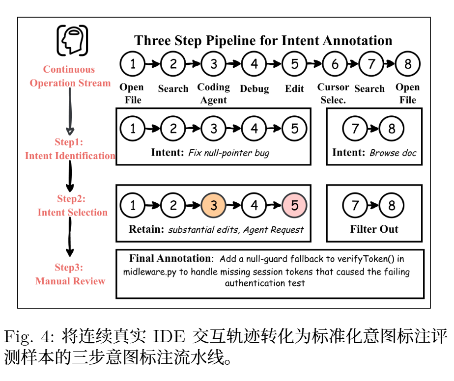
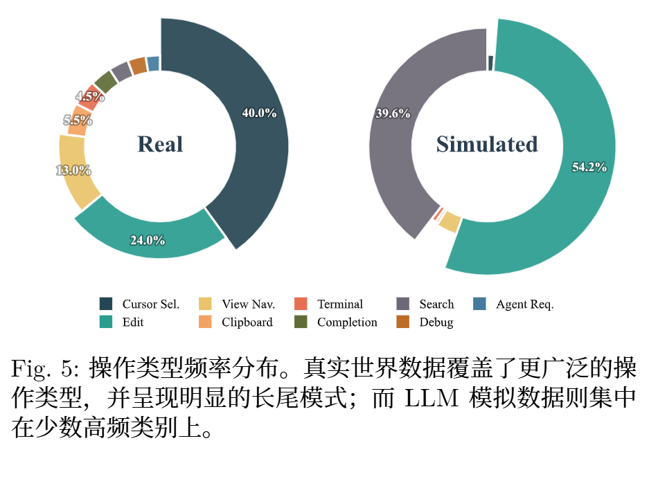
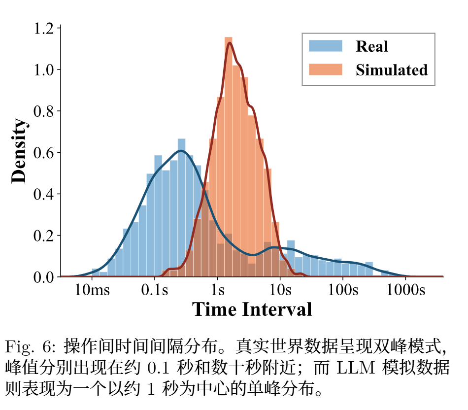
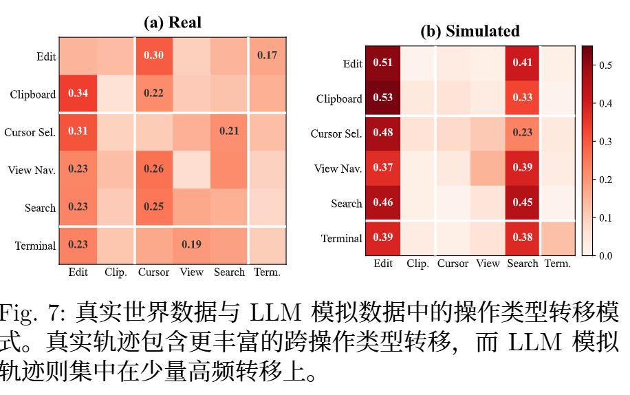
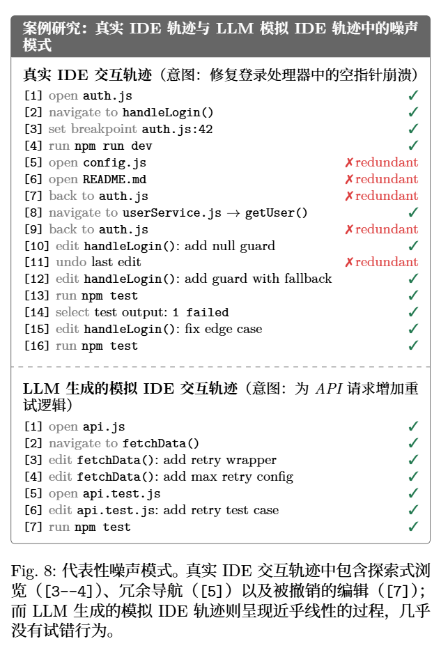
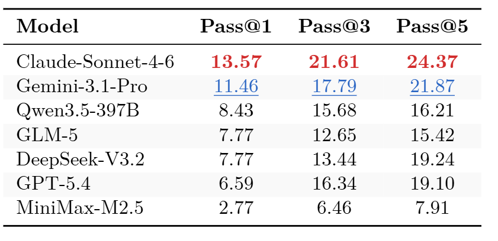
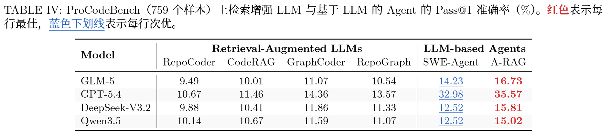
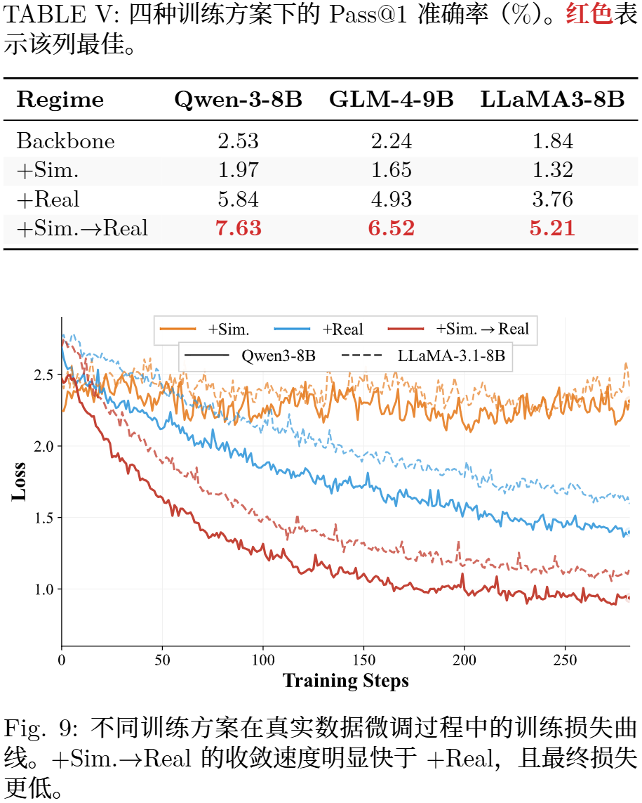
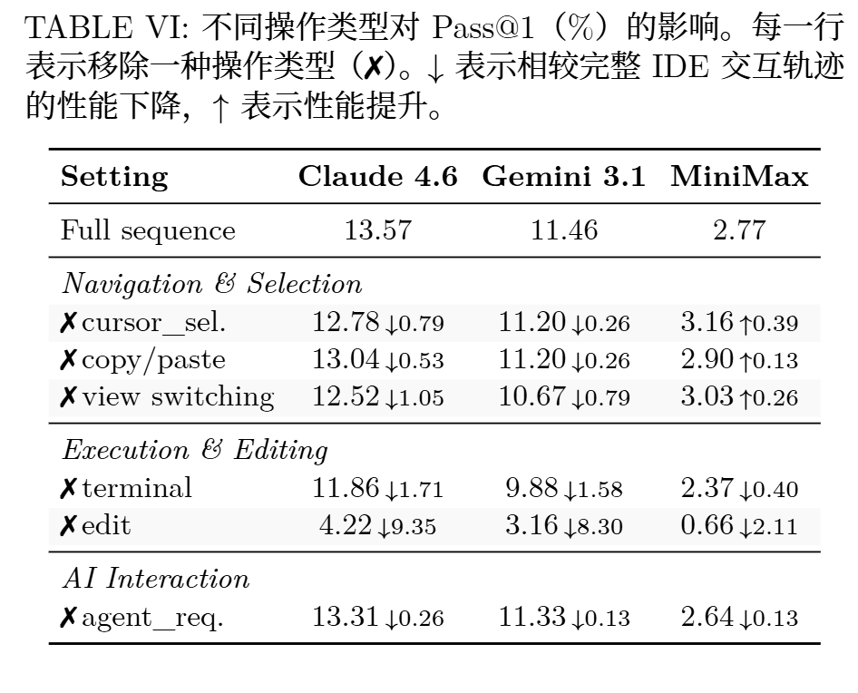

<!-- proactive coding assistant（主动式编程助手），也就是不是等你问“帮我修 bug”，而是它根据你在 IDE 里的行为轨迹，主动猜测你现在想干什么，然后提前给建议 做了一个bench 做了训练对比 -->
<!-- THU AI arXiv preprint -->
# An Empirical Study of Proactive Coding Assistants in Real-World Software Development
开发者在编码过程中必须持续构造细致的指令，这会带来额外的认知负担
开发者未必总能清晰表达自己的开发意图

近期研究提出了主动式编程助手

开发者的IDE 交互轨迹
数据采集成本高昂，并受到严格的隐私约束。

采集了超过 400 万条真实 IDE 交互轨迹。数据覆盖1,246 名志愿者连续三天的开发过程，涉及前端、后端、数据库和算法工程等代表性开发场景。对于每条真实轨迹，我们进一步合成一条配对的 LLM 模拟轨迹，从而实现真实数据与模拟数据之间的可控比较

第一，收集真实数据。

第二，构造一个 benchmark，叫 ProCodeBench。他们从真实 IDE 轨迹里抽取“开发者意图预测”样本。输入是 IDE 操作序列和 repo 上下文，输出是自然语言描述的开发者意图

第三，我们分析了真实数据、LLM 模拟数据以及混合训练方案对模型训练的作用。结果表明，仅使用 LLM 模拟数据无法很好泛化到真实开发场景；但若在真实数据微调前先用其进行初始化，则可以提升最终性能。

bench 评测 ： 核心挑战在于如何将连续 IDE 交互轨迹转换为可评测的样本

## 方法
三步标注流水线

**意图识别**. 为了从连续 IDE 交互轨迹中识别开发者意图，我们采用滑动窗口策略。每个窗口包含 N个连续操作，由 LLM 从中识别潜在意图、定位其起止操作，并为每个意图赋予初始的自然语言描述。我们将 N设为50，以在识别质量和 LLM 标注成本之间取得平衡。

**意图筛选**. 为了筛出值得评测的意图片段，我们对步骤 1 识别出的候选意图进一步筛选。由于开发者并不会显式指出哪些意图最值得获得辅助，我们使用可观察的行为信号作为代理。具体而言，我们采用两步筛选策略：启发式筛选保留那些包含显著代码编辑或显式 AI 助手请求的候选意图，因为它们通常对应可能受益于辅助的复杂开发任务；语义筛选则借助 LLM 判断每个保留片段是否连贯，并与其意图描述保持一致

**人工复核**

评测：LLM-as-a-Judge 的评测策略

LLMs
Retrieval-Augmented LLMs
LLM-based Agents

**训练分析**
Qwen-3-8B 、GLM-4-9B 和 LLaMA-3-8B

## 结果
**真实 IDE 轨迹与 LLM 模拟 IDE 轨迹之间的分布差异**

（噪声）

**现有主动式编程助手在真实世界数据上的表现**

检索增强 LLM 与基于 LLM 的 Agent 结果. 在所有骨干模型上，检索增强LLM 和基于LLM 的Agent 都优于对应的纯LLM

这种提升在基于 LLM 的 Agent 上尤为明显

**训练研究**

LLM 模拟数据不能替代真实数据，但两者能够相互补充，其组合带来的性能提升超过任一单独数据源

## 消融研究

移除 edit 会在三个模型上造成最大的性能下降

当前模型高度依赖编辑与执行信号，而真实IDE 轨迹中的许多其他行为信号仍未被充分利用 [后半句：？]

能力不同的模型对操作类型移除表现出不同敏感性
强模型充分利用信息 弱模型可能当作噪声

# 附录 

无

# Noun explanation && Extensive knowledge 
## Retrieval-Augmented LLMs
检索增强 llm

# 思考？
主动编程助手

问题：模拟是否写实
认知增量： 模拟 != 真实 trace
方法：真实数据采集 / 标注 / 训练
gap：
