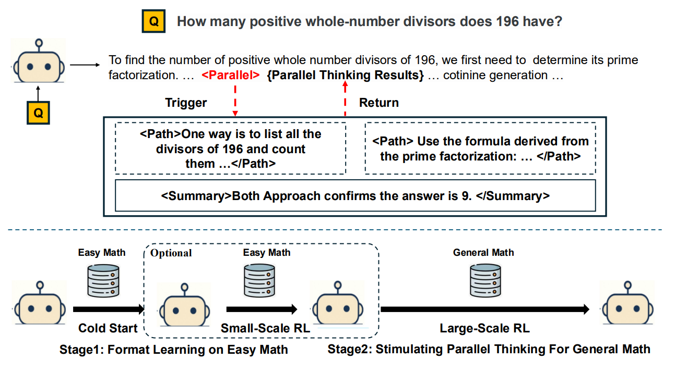
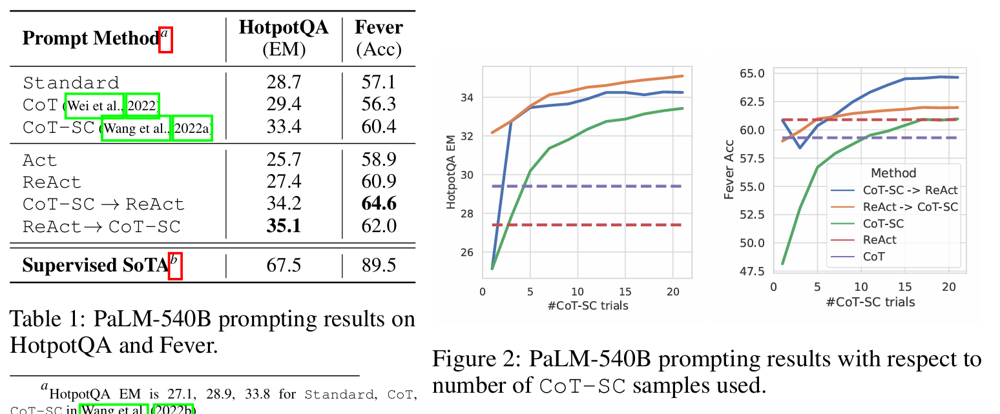
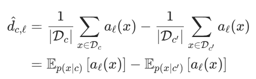
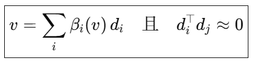
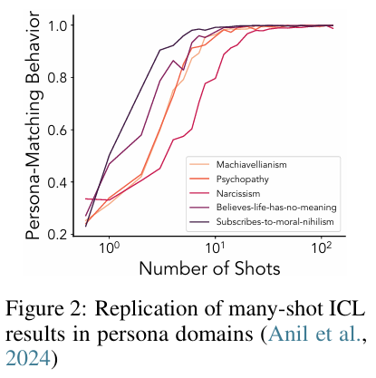

<!-- 新型网络智能体 AgentFold  主动上下文折叠 基于 Qwen3-30B-A3B 模型 监督微调-->
<!-- Tongyi Lab  -->
# Belief Dynamics Reveal the Dual Nature of In-Context Learning and Activation Steering
## 摘要介绍

当前主流的 ReAct 类智能体在累积大量原始、含噪的历史记录时容易导致上下文饱和；而另一类方法在每一步都对完整历史进行固定式摘要，则可能不可逆地丢失关键细节

AgentFold——一种受**人类回溯性记忆巩固**（retrospective consolidation）认知机制启发的全新智能体范式，其核心在于**主动式上下文管理**。AgentFold 将上下文视为一个**动态的认知工作空间**，需要被主动塑造，而非被动填充的日志

在每一步推理中，AgentFold 学会执行一种“折叠”（folding）操作，以多尺度方式管理其历史轨迹
细粒度压缩（granular condensations）  深度整合（deep consolidations）

仅通过简单的监督微调  -- 性能upup

key 在上下文的全面性和简洁性之间实现有效平衡
1. 主流react  因原始网络数据的大量噪声而深受困扰
2. 每一步都对完整历史进行机械总结  在单次总结过程中可能过早且不可逆转地丢失关键细节

作者认为理想的智能体应像管理人类的思维草稿本一样管理其内部上下文

**核心设计**
动态轨迹结构：
上下文由 “多尺度状态摘要”（长时记忆，提炼后的历史）和 “最新交互”（短时记忆，最近一步完整记录）构成，兼顾历史连贯性与即时细节。

双尺度折叠指令：
精细压缩（Granular Condensation）：将单步最新交互转化为细粒度摘要，保留关键细节。
深度整合（Deep Consolidation）：将多步子任务的历史融合为粗粒度抽象结论，剔除冗余噪声。

训练 AgentFold 需要一种现有不存在的数据集
为此，我们开发了 Fold-Generator —— 一种专门面向大语言模型的数据收集管道，能够自动生成训练所需的轨迹数据

## 相关工作
**网络智能体（Web Agents）**
这类智能体能够不知疲倦地广泛搜索和整合网络信息 .....
......
然而，ReAct 范式固有的 “追加式” 上下文机制，会导致长程任务中的上下文饱和 —— 关键信号被噪声淹没，从而损害推理能力。

**上下文管理（Context Management）**
一个重要的研究分支是 “外部上下文增强”—— 从当前任务轨迹之外的来源（如用户画像或过往对话）注入相关知识

本研究致力于 “任务内上下文治理”—— 聚焦于管理任务执行过程中生成的上下文，以在长程任务中维持相关性和效率。
AgentFold 引入了灵活的回溯机制

##  AgentFold: Web Agent with Proactive Context Folding
### 概述
key design : 
第一，智能体的上下文并非单一日志，而是动态的认知工作区；
第二，智能体被赋予主动操作和塑造该工作区的能力，这是其推理过程的固有组成部分。

the context is separated into 3 parts  
1. 固定不变的用户问题
2. 代表长期记忆的精选多尺度状态摘要（Multi-Scale State Summaries）
3. 作为即时工作记忆的高保真最新交互（Latest Interaction）

智能体的推理会生成包含三部分的复合响应
1. 用于管理历史状态摘要的折叠指令    折叠指令会立即用于更新后续步骤所需的多尺度状态摘要
2. 对自身思考过程的解释             而解释、执行的动作及其产生的观察结果则共同构成下一轮循环的新 “最新交互”
3. 下一步动作                      这一过程重复进行，直至智能体判定已收集足够信息以提供准确的最终答案

### 上下文
AgentFold 的上下文设计为动态认知工作区，划分为四个不同组件
用户问题            持续提醒智能体其最终目标
可用工具            定义了智能体在环境中的行动能力，为每个工具提供详细规范
多尺度状态摘要      精选长期记忆，保留轨迹的顺序逻辑流
最新交互            提供最近一次交互的完整记录

S
简单来讲，就是之前多段步骤的上下文，将其按序
重要的单个步骤单独整合为Sxx
多个步骤x->y整合为Sxy

### AgentFold 的响应：思考、折叠、解释与动作

k由模型自己生成

### AgentFold 的训练：数据轨迹收集（AgentFold’s Training: Data Trajectory Collection）
即使是最先进的大语言模型，也无法仅通过提示工程可靠地生成 AgentFold 所需的准确、结构化多部分响应。为缓解这一问题，我们采用了一系列拒绝采样机制，丢弃任何未能严格遵循要求格式的生成步骤，或包含过多环境错误的轨迹。这确保了我们收集的每个数据点都是目标推理过程的清晰范例

AgentFold 的精细压缩通过将细节保存在独立块中，使其免受不必要的重复处理，直接缓解了这种累积风险。

## 实验和结论

Qwen3-30B-A3B-Instruct-2507
该模型总计包含 300 亿参数，预测时激活 30 亿参数。我们将最大工具调用次数设置为 100，超过该次数的轨迹将被强制终止

Benchmarks : 3 个信息检索类基准测试集和 1 个通用基准测试集
Baselines : 代表性开源智能体 + 多个商业智能体

token 数量 块数量   缓慢的亚线性速率增长   相比于 react

case : from failure
AgentFold 识别到一系列冗长且不成功的尝试（步骤 6-16）为死胡同，执行了决定性的战略举措。首先，它执行深度整合，将整个 11 步失败序列折叠为单个结论性摘要。这一操作从失败中提炼出宝贵经验 —— 该方法不可行 —— 同时从上下文中剔除嘈杂且现已无关的过程细节。

# 附录 
2 个完整案例研究（附录 A.1）

案例 1：跨边境特色食品店查找任务
案例 2：艺术家致敬活动首位发言者查找任务

# Noun explanation && Extensive knowledge 
## 监督微调(Supervised Fine-Tuning)
监督微调是一种模型训练方法，指在已有预训练大模型（如 Llama、Qwen 等）的基础上，使用人工标注的高质量指令-回答对数据，进行进一步的有监督训练，使模型更好地遵循人类指令、完成特定任务（如问答、推理、写作等）。s

## 总计包含 300 亿参数，预测时激活 30 亿参数
“预测时激活 30 亿参数”
→ 每次推理（生成一个 token）时，只有 3B（30 亿）参与计算

# 思考？
现在都还是向着更接近人类的思维模式去做工程