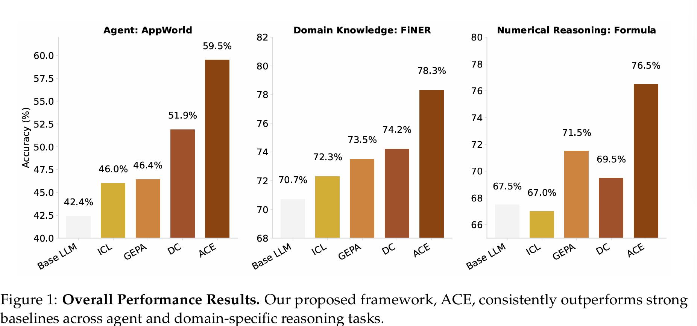
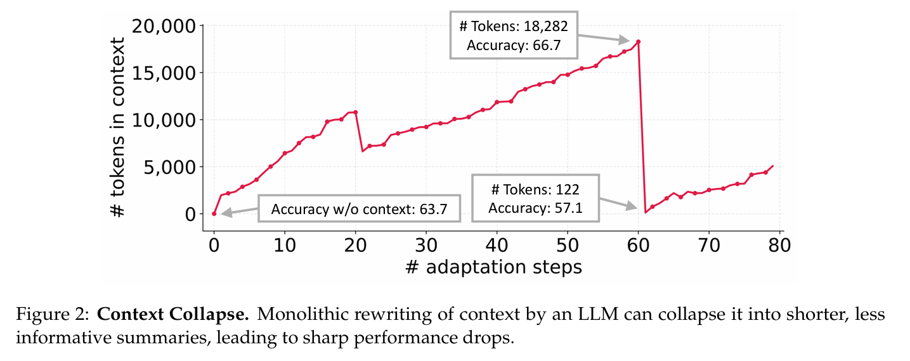
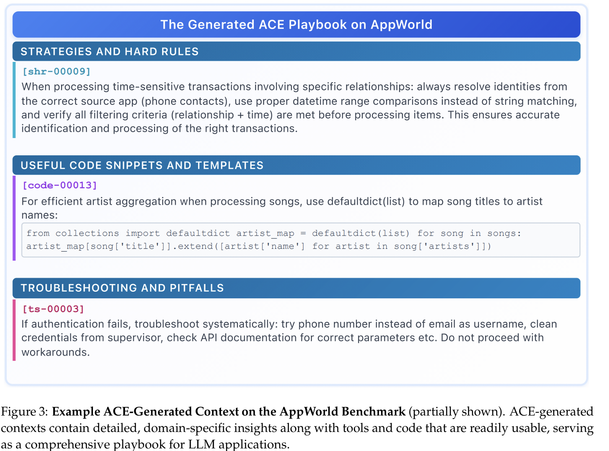
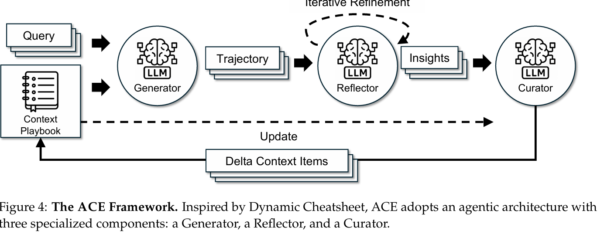
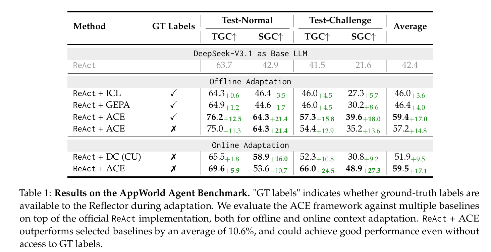
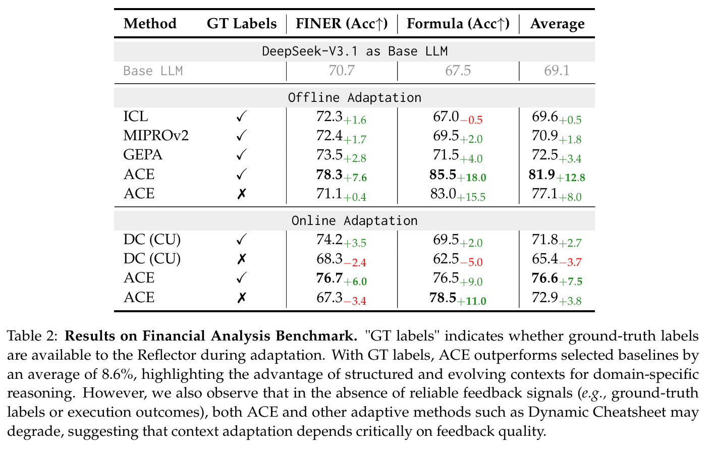
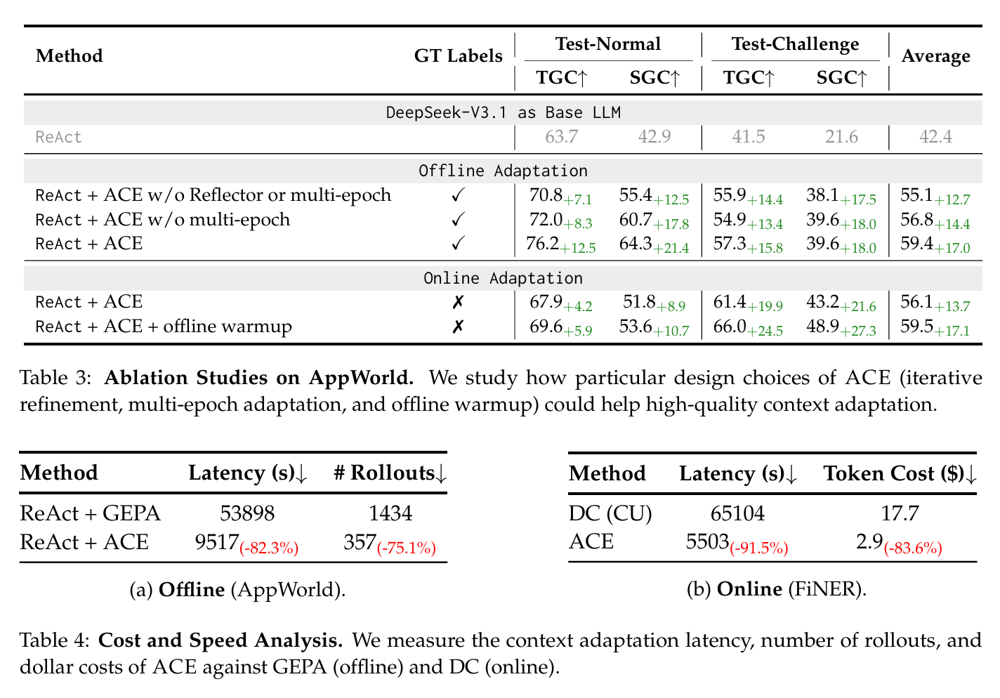

<!--  提出ACE框架，通过迭代反思和增量式结构化简单逻辑更新+增长&精炼，构建高效上下文  -->
<!-- Stanford Qizheng Zhang -->
# Agentic Context Engineering:Evolving Contexts for Self-Improving Language Models
## Abstract & Introduction
我们提出 ACE（Agentic Context Engineering，代理式上下文工程）——一个将上下文视为持续演进的操作手册（evolving playbook）的框架。该手册通过生成（generation）、反思（reflection）与整理（curation）的模块化流程，不断积累、优化并组织策略。
ACE 采用结构化、增量式更新，有效防止上下文坍塌，在保留细粒度知识的同时，适配长上下文模型的扩展能力。

以及列举具体数据的性能提升和对比
总体实验结果：

与修改模型权重不同，上下文适应在模型训练后，通过向输入中注入清晰的指令、结构化推理步骤或领域特定格式来提升性能。

然而，现有方法面临两大关键局限：
1. 简洁性偏见：许多提示优化器优先生成简短、泛化的指令，却忽略了领域特有启发式、工具使用指南或常见失败模式，而这恰恰是智能体与知识密集型任务所需的
2. 上下文坍塌：依赖 LLM 对整个上下文进行整体重写的方法，常导致上下文退化为更短、信息量更少的摘要，引发性能骤降

我们主张：上下文不应是简洁摘要，而应是全面、可演进的操作手册——详尽、包容且富含领域洞见。与人类不同，LLM 在面对长而详细的上下文时表现更佳，因其能自主提炼相关性信息。

ACE 引入了生成-反思-整理的模块化工作流，并采用**“增长-精炼”**（grow-and-refine）的结构化增量更新机制。该设计既保留了细粒度领域知识，又防止了上下文坍塌，使上下文在适应过程中始终保持全面性与可扩展性。

我们在两类最受益于全面演进上下文的 LLM 应用上评估 ACE：
(1) 智能体：需多轮推理、工具使用与环境交互，且策略可在任务间复用；
(2) 领域特定基准（聚焦金融分析）：需专业化策略与知识

## 背景和动机
### Context adaptation (or context engineering)**
改变 input 而不是 weights
当前最前沿的方法普遍利用自然语言反馈（natural language feedback）
:语言模型会检查当前的上下文 生成一段自然语言反馈 从而实现迭代式的上下文优化

### 现有上下文适应方法的局限性
**简洁性偏见（Brevity Bias）** 
优化过程倾向于收敛为简短、泛化的提示
这种收敛不仅缩小了搜索空间，还会在迭代中传播重复性错误，因为优化后的提示往往继承了初始提示（seed prompt）的缺陷。

**上下文坍塌（Context Collapse）**

当要求 LLM 在每次适应步骤中对整个已积累的上下文进行整体重写（monolithic rewriting）
随着上下文不断增长，模型倾向于将其压缩为更短、信息量更少的摘要，从而造成灾难性的信息丢失

使用 LLM 进行端到端上下文重写的一个**根本性风险——积累的知识可能被突然抹除，而非保留**

## 代理式上下文工程（Agentic Context Engineering, ACE）

：一个面向离线场景（例如系统提示优化）和在线场景（例如测试时记忆适应）的、可扩展且高效的上下文适应框架

ACE 并不将知识压缩为简短摘要或静态指令，而是将上下文视为持续演化的操作手册（evolving playbooks），能够随时间不断积累、提炼并组织策略。

该框架建立在 Dynamic Cheatsheet 的代理式设计之上，并引入了结构化的角色分工（如图4所示）

**生成器**（Generator）：生成针对新查询的推理轨迹；
**反思器**（Reflector）：从成功与失败中提炼出具体的洞见；
**整理器**（Curator）：将这些洞见整合为结构化的上下文更新

为解决第 2.2 节所述现有方法的局限性（尤其是简洁性偏见与上下文坍塌），ACE 引入了三项关键创新

**专用反思器**  **增量式 Delta 更新**   **“增长-精炼”机制**
1. 生成器 开始：它为新查询生成推理轨迹，从而暴露出有效的策略与反复出现的陷阱。
2. 随后，反思器对这些轨迹进行批判性分析，提炼出经验教训（可选地进行多轮迭代优化）。
3. 最后，整理器将这些经验转化为紧凑的 Delta 条目（delta entries），并通过轻量级、非 LLM 的逻辑将其确定性地合并到现有上下文中。

### 增量式 Delta 更新（Incremental Delta Updates）
ACE 将上下文表示为结构化的条目化要点
对于每个要点：
**元数据**：如唯一标识符、以及记录该条目被标记为“有帮助”或“有害”的计数器；
**内容**：捕获一个细粒度知识单元，例如可复用的策略、领域概念或常见失败模式。
三大关键特性
局部性 仅更新与当前任务相关的要点，避免全局扰动
细粒度检索 生成器（Generator）可精准选取最相关的知识子集
增量适应 支持在推理过程中高效地合并、剪枝、去重，适合在线学习
**Delta 上下文机制**
反思器（Reflector）从执行轨迹中提炼新洞见；
整理器（Curator）将这些洞见转化为紧凑的 Delta 条目；
通过轻量级、非 LLM 的逻辑（如规则匹配、计数器更新）将 Delta 确定性地合并到现有上下文中。

### 增长-精炼机制（Grow-and-Refine）
在持续扩展上下文的同时，控制冗余，保持上下文的紧凑性与相关性。
1. 增长（Grow）
新洞见 → 以新 ID 要点形式追加到上下文；
现有要点 → 就地更新（如递增 helpful 计数器）。
2. 精炼（Refine）{主动式 每次Delta跟新后立即精炼  惰性式 仅当上下文窗口即将超出限制才触发}
对所有要点进行语义嵌入（semantic embedding）；
比较相似度，自动去重（prune redundancy）。

## 结果 [合并了实验设计]
我们对 ACE 的评估表明
实现高性能、自改进智能体 在领域特定任务上取得显著增益 设计有效性验证 更低的成本与适应延迟
### 任务与数据集
我们在两类最受益于全面、可演进上下文的 LLM 应用上评估 ACE
智能体基准 ： AppWorld
领域特定基准（以金融分析为案例） ： FiNER   Formula 

AppWorld：采用官方协议，报告 任务目标完成率（TGC）和 场景目标完成率（SGC），分别在 test-normal 与 test-challenge 划分上评估。
FiNER/Formula：报告准确率（预测答案与真实答案完全匹配的比例）

### 基线和方法
1. 基础 LLM（Base LLM）：
在无任何上下文工程的情况下直接评估，使用数据集作者提供的默认提示。AppWorld 实验基于官方 **ReAct**  实现。
2. 上下文学习（ICL）：
在提示中提供任务示例（少样本或多示例），使模型推断任务格式。若训练样本总数超出上下文窗口，则填入尽可能多样例
3. MIPROv2 ：
通过贝叶斯优化联合优化系统指令与上下文示例的提示优化器。使用 DSPy 官方实现，设 auto="heavy" 以最大化性能
4. GEPA
5. DC
6. ACE（本文方法）
To ensure fairness, we use the same LLM for the Generator, Reflector, and Curator
 (non-thinking mode of DeepSeek-V3.1)
设批量大小为 1（每样本生成一个 Delta 上下文），离线适应中反思器最多迭代 5 轮，最多 5 轮训练 epoch。

### 智能体基准结果

"GTlabels"indicates whether ground-truth labels are available to the Reflect or during adaptation

如表 1 所示，ACE 在 AppWorld 上持续超越基线：
离线设置：ReAct + ACE 比 ReAct + ICL 和 ReAct + GEPA 分别高出 12.3% 与 11.9%
在线设置：ACE 比 Dynamic Cheatsheet 等自适应方法平均高出 7.6%

### 领域特定基准结果

离线设置：在提供训练集真实答案时，ACE 比 ICL、MIPROv2 和 GEPA 平均高出 10.9%
在线设置：ACE 比 DC 等方法平均高出 6.2%

key : 结构化可演进上下文

当缺乏可靠反馈（如无真实标签或执行信号）时，ACE 与 DC 均可能性能下降。此时构建的上下文易被虚假或误导性信号污染。这表明 ACE 的有效性依赖于反思器与整理器能基于可靠信号做出合理判断

### 消融实验

表 3 在 AppWorld 上的消融研究分析了 ACE 各设计组件的贡献：

反思器与迭代优化：在 Dynamic Cheatsheet 基础上新增的关键组件；
多轮适应（multi-epoch adaptation）：对训练样本多次优化上下文；
离线预热（offline warmup）：在线适应前先通过离线适应初始化上下文。

### 成本与速度分析 

得益支持增量式 Delta 上下文更新和非 LLM 的上下文合并/去重，ACE 在降低适应成本与延迟方面优势显著：

AppWorld 离线适应：相比 GEPA，适应延迟降低 82.3%，推理轮次减少 75.1%（表 4a）；
FiNER 在线适应：相比 DC，适应延迟降低 91.5%，Token 消耗成本降低 83.6%（表 4b）。

## 讨论
**更长的上下文 ≠ 更高的推理成本**
尽管 ACE 生成的上下文比 GEPA 等方法更长，但这并不意味着推理成本或 GPU 内存占用会线性增加。
现代推理基础设施正日益针对长上下文负载进行优化，例如通过以下技术

KV 缓存复用（reuse）
KV 缓存压缩（compression）
KV 缓存卸载（offload）

这些机制允许高频复用的上下文片段被本地或远程缓存，从而避免重复且昂贵的 prefill（预填充）操作。
随着机器学习系统技术的持续进步，处理长上下文的摊销成本将持续下降，这使得 ACE 这类富含上下文的方法在实际部署中将变得越来越可行。

# 附录
## Agent 记忆机制综述
AgentFly [59]：通过持续演化记忆支持强化学习；
AWM（Agent Workflow Memory）[46]：从历史轨迹提炼可复用工作流；
A-MEM [48]：受 Zettelkasten 启发，构建结构化、可链接的记忆条目；
Agentic Plan Caching [58]：缓存可复用计划模板以加速执行。

ACE 的独特性：不仅优化 Agent 内存，更涵盖系统提示、事实证据等全栈上下文，并首次系统性指出 “简洁性偏见” 与 “上下文坍塌” 两大根本缺陷
## limitations
对 Reflector 能力的依赖
并非所有任务都需要丰富上下文
适用场景明确：ACE 在需详细领域知识、复杂工具调用或环境特定策略的任务中优势显著

## 给出了完整的提示模板
[这部分可以在../papers/2510.04618v1.pdf附录D找到]

# Noun explanation && Extensive knowledge 
## AI Agent / Agentic AI
AI Agent : AI Agent 被定义为能够在特定数字环境中执行目标导向任务的自主软件实体
Agentic AI : 由多个 AI Agent 组成的，能够相互协作、动态协调、共同追求一个高层级复杂目标的系统。

| 维度 | 生成式 AI | AI Agent | Agentic AI |
|------|-----------|----------|------------|
| 核心能力 | 内容生成 | 任务执行 | 复杂目标达成 |
| 自主性 | 低（被动反应） | 中（任务内自主） | 高（系统级自主） |
| 架构 | 单模型 | 模型 + 工具链 | 多 Agent + 编排 + 共享记忆 |
| 工具使用 | 无（默认） | 工具使用是核心能力 | Agent 调用/协同工具 |
| 协作 | 无 | 无 | 协作是核心能力 |
| 记忆 | 无/短上下文 | 短/任务局部记忆 | 持久/共享记忆 |
| 任务复杂度 | 低（单步/单次） | 中（多步特定任务） | 高（动态/多领域复杂任务） |

## Dynamic Cheatsheet
一种测试时自适应（test-time adaptation）方法，通过构建外部记忆库（external memory），在推理过程中动态记录和复用从过去任务中学到的策略、代码片段或经验教训

核心机制：
每次执行任务后，将成功/失败轨迹中的关键信息以“记忆条目”形式存入记忆库；
后续任务可检索并复用这些记忆，实现跨任务知识迁移；
无需标注数据，仅依赖执行反馈（如 API 调用是否成功）进行自学习

## 模型权重更新
定义：通过微调（fine-tuning）或训练修改 LLM 内部参数（weights）以适应新任务或数据

## SOTA（State-of-the-Art）
含义：当前领域内性能最好的方法或最高水平的模型/系统

## ICL （In-Context Learning，上下文学习）
定义：通过在输入提示中提供示例（few-shot 或 many-shot），引导 LLM 在不更新权重的情况下完成任务。

## GEPA（Genetic-Pareto Prompt Adaptation）
定义：一种基于执行轨迹的提示优化方法，结合反射式推理（reflection）与遗传 Pareto 搜索，迭代改进提示。

##  adaptation latency （适应延迟）
从开始适应（如收集反馈）到生成新上下文/策略并可部署使用的时间延迟

## 离线context 在线context
offline
在部署前（pre-deployment）阶段，利用训练集或开发集数据对上下文（如系统提示、策略手册）进行批量优化与固化，形成一个固定但高质量的初始上下文，供推理时使用

online
在测试/推理阶段（test-time / deployment-time），模型逐样本（sample-by-sample）地与环境交互，并动态更新上下文，实现持续学习与自适应。
## MIPROv2
MIPROv2 是一个“自动调 prompt”的工具，但仍是静态、一次性优化，缺乏持续学习能力
# 思考？
context engineering 部分的文章难点不在 公式和复杂 的 理论推导
对于现有方法的问题**分析**和改良，对比**实验**数据，实验具体的**设计方案**比较重要，怎么把关注到的想法转化为可行的实验，以及对于当前领域的洞察尤为重要

上下文工程带来的模型提升，需要大量训练和算力去部署，而且不同方法之间不会一直有很好的结合性？