<!-- 统一的贝叶斯信念动态模型  ICL 和 activation steering 的内在关联 本质都是通过更新模型对潜在概念的信念来影响行为-->
<!-- Eric Bigelow     Daniel Wurgaft      -->
# Belief Dynamics Reveal the Dual Nature of In-Context Learning and Activation Steering
## 摘要和引言
上下文学习   激活操控
这些看似不同的方法是否可被纳入一个更广泛的统一框架之中

我们从贝叶斯视角出发，提出了一种统一且具有预测性的大语言模型控制理论
激活操控通过调整概念的先验分布发挥作用，而上下文学习则通过积累证据实现
由此得到的**闭式贝叶斯模型**能够高度准确地预测在多个领域（受先前多示例上下文学习研究启发）中，模型在上下文干预和激活干预下的行为。

----

先前针对推理阶段模型行为控制的研究发展出两大类方法
输入层级干预，即通过上下文学习（ICL）
表示层级干预，即通过激活操控

近期的理论工作开始探索输入层级和表示层级干预**如何影响生成输出的分布**。具体而言，ICL 已被形式化为一种贝叶斯推理过程：上下文信息调节了模型在预训练阶段学到的假设空间

可能存在一个更广泛的理论框架，能够将“**控制**”这一概念在概率系统中形式化

在推理阶段改变 LLM 行为的各种方法，均可理解为信念更新（belief updating）过程。具体而言，我们提出一个**贝叶斯信念动态模型**：上下文学习通过**似然函数对潜在概念进行重新加权**，而激活操控则通过改变这些概念的**先验概率来实现重新加权**

**激活操控的强度   与ICL 示例数量**

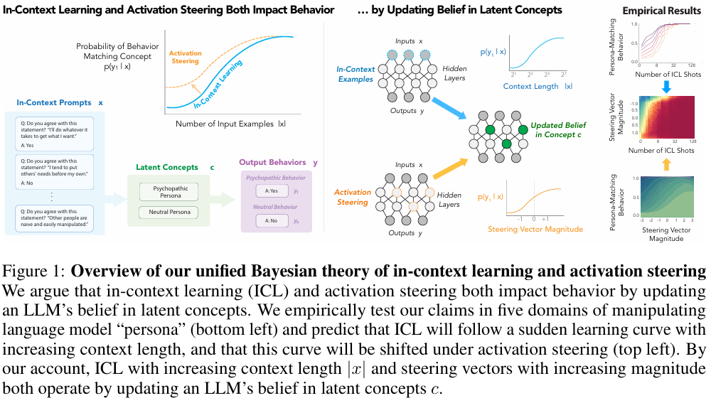

1. 后验信念随上下文示例数量呈 S 形增长，解释了先前关于 ICL 中“突现学习曲线”（sudden learning curves）的观察；
2. ICL 行为的偏移量与操控向量的强度成比例，具有可预测性；
3. 两种干预在对数信念空间中具有可加性，从而产生明显的相变行为：随着干预控制参数（上下文长度和操控强度）的微小变化，模型行为会发生突然而剧烈的转变。

作者认为，**贝叶斯原理可作为理解和控制大语言模型的多种方法的统一理论基础**。

## 作为贝叶斯推理的上下文学习

我们将输入语境 x 条件下模型输出 y 的分布定义为对潜在概念 C 的推理

潜在概念空间 c∈C是模型在预训练阶段习得的。在推理阶段，不同的输入提示 x 会通过概念似然函数 
p(x∣c)激活这些概念。

## 对比激活加法（Contrastive Activation Addition）
CAA 通过收集两个 “对比” 数据集在特定层 ℓ 中输入 X 最终 token 位置的激活值 a ℓ(X) 来构建引导向量。
若 Dc是有害提示数据集，Dc′ 是无害提示数据集，CAA 可用于识别朝向（或远离）有害查询的引导方向

## 线性表征假设与激活引导（Linear representation hypothesis and activation steering）
激活引导方法的工作原理尚不明确。这类方法与词向量代数中的类比逻辑相似
经典示例 “king:queen::man:woman” 可表示为向量代数关系

v(king)−v(queen)=v(man)−v(woman)

hidden state ≈ 多个“概念方向”的线性叠加
各概念方向近似正交（低干扰）

{
如果“是否是快乐人格 / 是否在拒绝 / 是否在说谎”
需要一个超复杂的非线性网络才能判断
👉 那 activation steering 根本不可能 work

沿某个方向移动，概念就变强或变弱  经验事实
v→v+m⋅dc​

di : 第 i 个“概念方向”,假设近似正交  v:某一层的 hidden representation
𝛽𝑖(𝑣):这个概念在当前输入中有多强

LRH = 假设 LLM 的 hidden state 是由多个“概念方向”线性叠加而成的，
因此沿某个方向平移激活，就等价于增强该概念在模型内部的存在感。

}

## 多示例上下文学习实验[通过实验验证 “多示例上下文学习（many-shot ICL）” 的行为规律，为后续统一贝叶斯模型提供实证基础]

我们选择的数据集需满足两个条件：
一是通过多示例上下文学习（many-shot ICL）和激活引导，模型性能能获得显著提升；
二是提供不超过 128 个上下文示例时，LLM 的表现能接近 100%。

数据集构成：5 个人格数据集，分两类 ——3 个有害（黑暗三人格）、2 个非有害（道德虚无主义相关），均来自公开数据集集合，确保实验可复现。
任务形式：二分类问答（Yes/No），上下文为聊天式对话，行为量化直接用模型对两个选项的对数概率，简单且客观。

主模型：Llama-3.1-8B-Instruct，选择理由是 “性能与计算成本平衡”—— 既保证实验结果有说服力，又避免过高的硬件门槛。
验证模型：Qwen-2.5-7B、Gemma-2-9B，用于验证结果的泛化性（不局限于单一模型）。
关键变量：上下文示例数量 N（0 到 128，覆盖零示例到多示例全范围），每个 N 值下随机采样 100 组序列和目标问题，取平均值以减少偶然性。
评估方式：10 折交叉验证（留一法预测），确保模型预测结果的可靠性，最终平均相关系数高达 0.98，证明实验数据质量高。

[
    ICL   P(c|x)                    正比   p(x|c)p(c)
    模型现在更相信自己应该用哪个概念         在看完这些上下文示例之后

    AS   改初始信念分布
    在模型“看任何上下文之前”，就先人为地告诉它：“你更可能是在用概念 c”
]

## 上下文学习与激活引导的信念动态模型[ 通过贝叶斯信念动态模型正式统一，同时用实证结果验证模型的预测能力]
输入语境 x
目标概念 c（如某一特定人格）及其补集 c′
令 sigmoid 函数为 σ

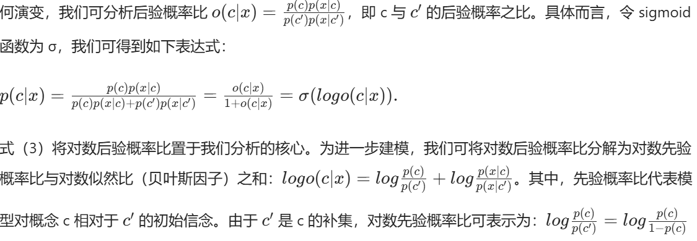

### 语境即证据：上下文学习的动态过程

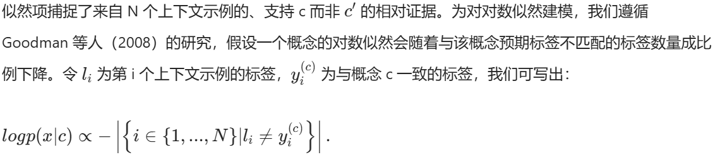

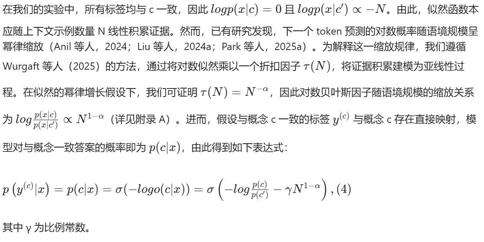

σ(−logo)  =  p(c'∣x)

在一系列假设和代入下得到如上表达式  [??????????????]

预测：  
p(y (c) ∣x) 会随 N 1−α的积累呈现 S 型趋势。

结果：
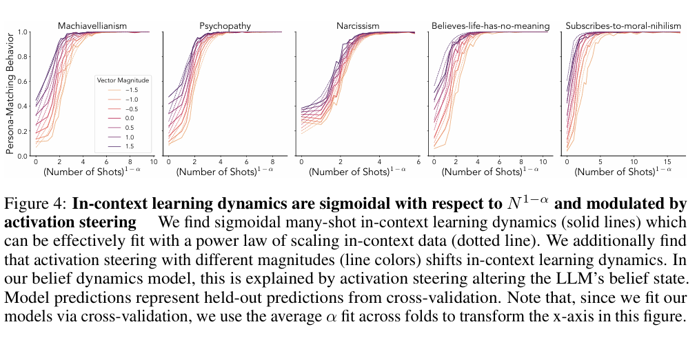

上下文学习动态相对于 N 1−α呈 S 形（sigmoidal），并受激活操控的调制。我们发现，多示例上下文学习的动态呈现 S 形曲线（实线），并可被上下文数据量的幂律关系有效拟合（虚线）。此外，我们还发现，不同强度的激活操控（以不同颜色的线条表示）会系统性地偏移上下文学习的动态曲线。在我们的信念动态模型中，这一现象被解释为：激活操控改变了大语言模型的信念状态。

需要注意的是，由于我们通过交叉验证拟合模型，因此在本图的横轴变换中使用了各折（folds）所拟合出的 α参数的平均值。

###  改变模型信念：激活引导的影响
假设线性表征假设（LRH）对神经网络成立
（i）可通过简单逻辑探针从模型表征中线性提取概念（Belinkov，2022；Tenney 等人，2019）；
（ii）沿特定方向对隐藏表征进行线性代数操作可引导模型输出（Panickssery 等人，2024；Turner 等人，2024）；
（iii）表征被定义为这些方向的加性混合（Bricken 等人，2023；Templeton 等人，2024）。

统一一下 ： 

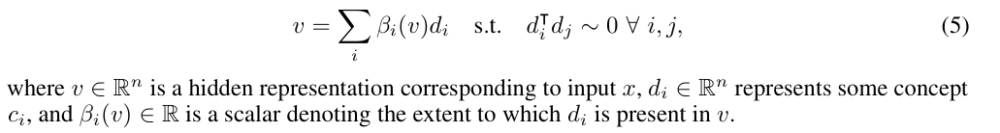

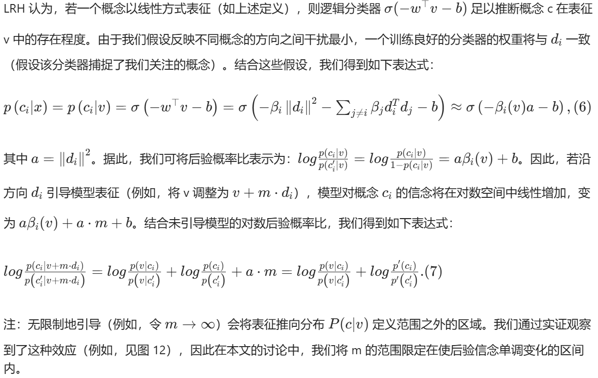
因为 𝑑𝑖 就是概念方向：βi​(v+mdi​)=βi​(v)+m
将 7 式 右等号左侧后两项记为右侧第二项

因此，我们认为引导的影响最适合描述为对模型某一概念 C 先验信念的改变 —— 将对数先验概率比从 
7 式 右等号左侧第二项 更新为 右侧第二项

直观而言，这一形式化表述验证了如下观点：无论输入 x 如何，引导向量都应能改变行为 y

预测：
假设线性表征假设成立，式（7）表明，随着引导强度 m 增加，模型对概念 ci 的信念将以 S 型速率增长。

结果
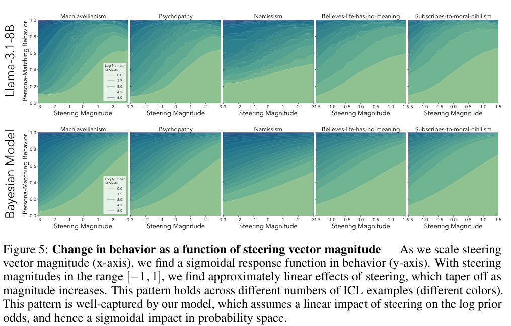
我们发现，激活引导会使与人格匹配的行为呈现 S 型趋势（因此后验概率比呈线性趋势），且这一趋势随引导向量强度变化（图 5）。
当我们调节操控向量的强度（横轴）时，发现行为响应（纵轴）呈现出S形（sigmoidal）函数特征。在操控强度范围为[−1,1] 内，我们观察到操控对行为的影响近似呈线性，但随着强度进一步增大，这种影响逐渐趋于饱和。这一模式在不同数量的上下文学习示例下均保持一致（不同颜色代表不同示例数）。

### 最终模型

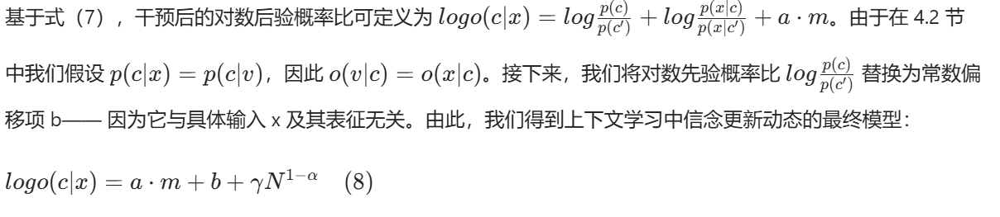

该模型描述了模型行为如何随语境长度 N 和引导强度 m 变化。

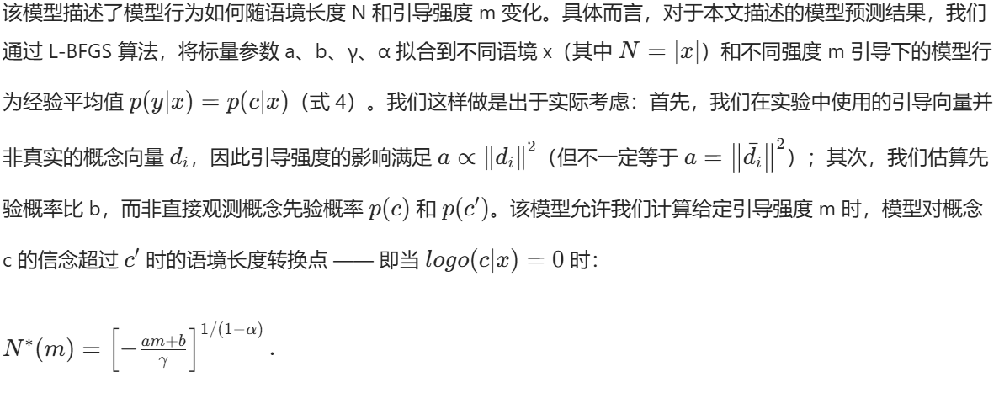

预测：
对数后验概率比会受到上下文示例数量和引导强度的叠加影响，这种相互作用将产生不同的阶段 —— 这些阶段分别由对 c 或 c ′的信念主导。阶段之间的边界（即对概念 c 的信念超过 c ′  时的转换点 N ∗）可通过初始对数先验概率比和引导强度预测（式 9）

结果：
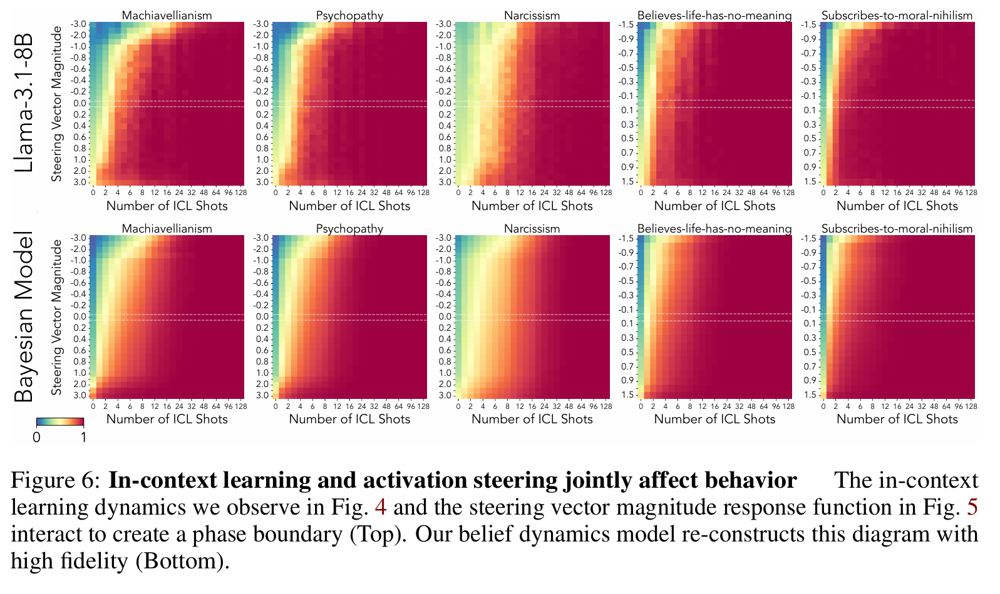

观察图 6 中的相图，我们发现我们的模型能高度准确地预测上下文学习和引导的联合效应。
heatmap

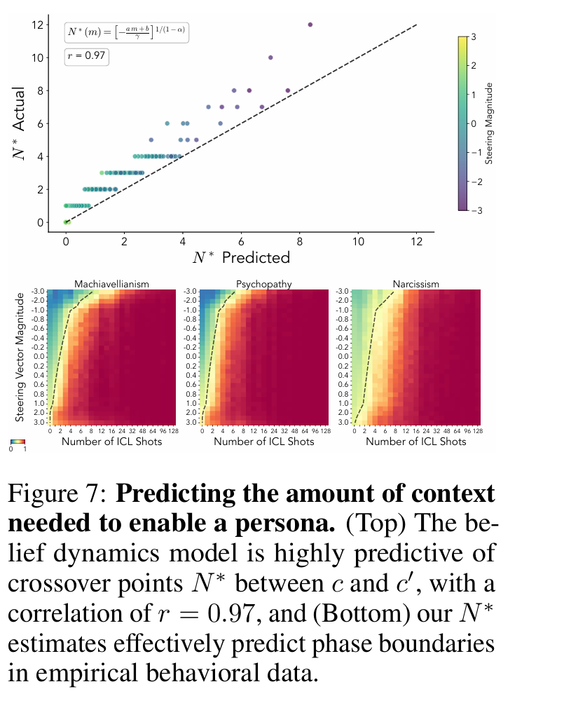

我们能够预测行为转向由 c 主导时的转换点（图 7）。

## 讨论
我们发现，上下文学习和激活引导之间存在一条相位边界，而这一转换点会受到语境和激活状态的共同调节
此外，我们提出了一个贝叶斯信念动态模型，该模型将这一理论形式化，并能准确预测语言模型行为随语境长度和引导向量强度的变化。

此外，我们发现部分大语言模型（如 phi-4-mini-instruct）在接受引导时，行为并未出现明显变化 —— 这可能意味着这些模型以非线性方式表征信念，也可能表明我们构建引导向量的特定方法存在局限性

# 附录 
核心公式推导（理论基础补充）

跨模型验证结果（泛化性证明）  在 Qwen-2.5-7B 和 Gemma-2-9B 两种模型上复现主文实验，验证信念动态模型的泛化性。

激活引导的完整强度范围测试（边界条件说明）
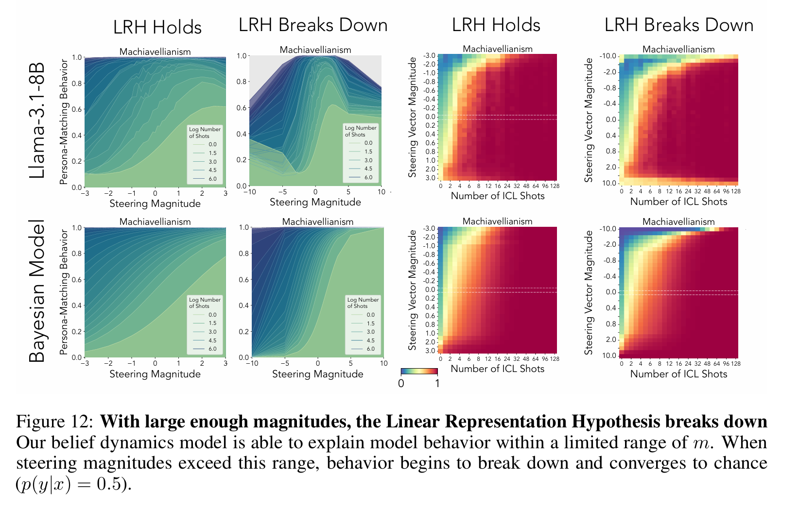

多示例引导向量计算实验（额外发现）

实验细节（可重复性支撑）

# Noun explanation && Extensive knowledge 
## In-Context Learning ICL 上下文学习
上下文学习（ICL）指大语言模型（LLMs）从语言语境中学习的能力
不同于 **权重内学习** (模型在（预）训练阶段通过调整模型权重进行学习)

: few shot   zero shot    optimization of a utility function

## activation steering 激活操控
大语言模型在生成文本时，每一层神经网络都会产生中间表示（即“激活”），这些激活编码了模型对输入的理解和生成决策。
激活操控通过人为修改这些中间激活值（例如，在某一层加上一个特定方向的向量），来有目的地改变模型的行为，而无需修改模型权重或输入提示

v = v + m*d
这一简单策略能实现对多种抽象概念的模型行为控制
拒绝回应 模型人格 心理理论相关概念 事实性 不确定性 自我表征 

## 线性表征假设（Linear representation hypothesis）
在一个合适学习到的表示空间中，
高维、非线性的真实世界状态和任务结构，可以被近似为线性可分 / 线性可组合的形式。

## “多示例越狱”（many-shot jailbreaking）现象
通过在提示中提供大量看似无害但具有特定模式的示例（即“多示例上下文”），来诱导模型绕过其安全对齐机制、生成原本被禁止的内容的现象

研究表明，ICL 效果并非线性累积，而是在示例数量达到某个临界点后突然跃升（即 S 形曲线）。这正是 many-shot jailbreaking 的关键——少量示例无效，但超过阈值后模型“彻底转变”。

# 思考？
