<!-- 视角链,粗粒度到细粒度 -->
<!-- zju -->
# From Tokens to Thoughts: How LLMs and Humans Trade Compression for Meaning
## Brief
具身问答（EQA）   机器人技术、自主导航、人机交互等领域

现有方法（Mo 和 Liu, 2024；Fu 等人，2024；Zhu 等人，2024；Li 等人，2024c）存在一个显著局限：传统方法使用有限且固定的视角集合作为输入（见图 2），导致 VLM 难以获取足够的问题相关视角。在复杂的具身问答任务中，答案并非一目了然，往往需要多步推理才能解决。例如，对于 “我在哪里能买到汽水？” 这一问题，场景中并未直接显示汽水，模型必须调用常识知识并自主导航以定位冰箱等物品。回答此类复杂现实问题需要足够的问题相关上下文，无法通过一步生成答案完成。

VLM +  CoV 框架  平均性能提升 10.82%
Qwen3-VL-Flash 的最大提升幅度达 13.62%\

相关工作
测试时推理方面 大模型性能up
场景理解方面 检测后描述->端到端 Transformer 多模态融合
3D 视觉 - 语言模型方面 点云+多视角图像->llm 

## 方法论
具身问答利用带相机姿态的多视角 RGB-D 图像或重建的 3D 网格，支持基于与问题语义匹配的任意视角进行推理
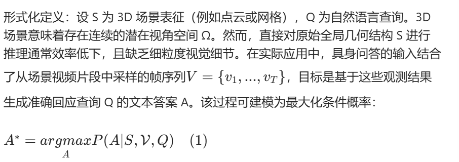

CoV 提示方法的目标是基于给定问题文本 Q 和对应 3D 场景，推理出正确答案 A 包含两个阶段
（i）粗粒度视角选择；（ii）细粒度视角调整
基于与问题的相关性，将输入视角帧全集筛选为候选视角子集；
随后在该子集内动态调整视角，生成优化后的视角序列；
最后基于这些优化视角合成答案

粗粒度：引入视角选择代理，筛选初始可用视角，提取与问题最相关的帧

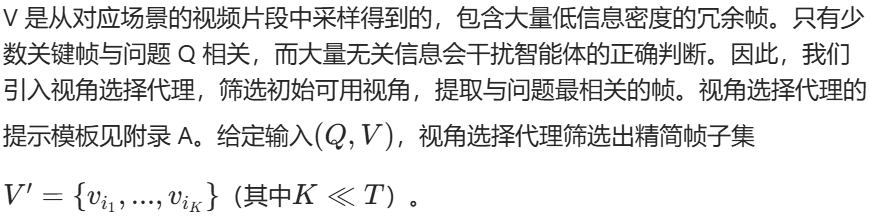

细粒度：通过细粒度视角调整提供更详细的环境信息，同时激发更深层次的推理

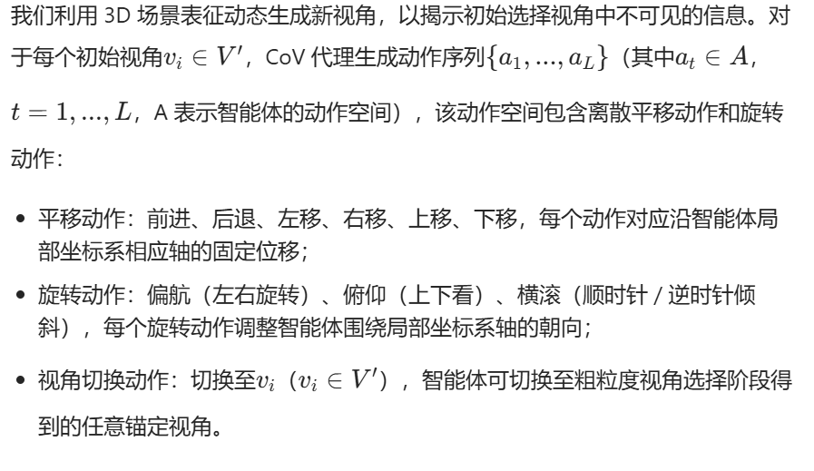

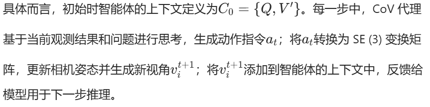

exp:

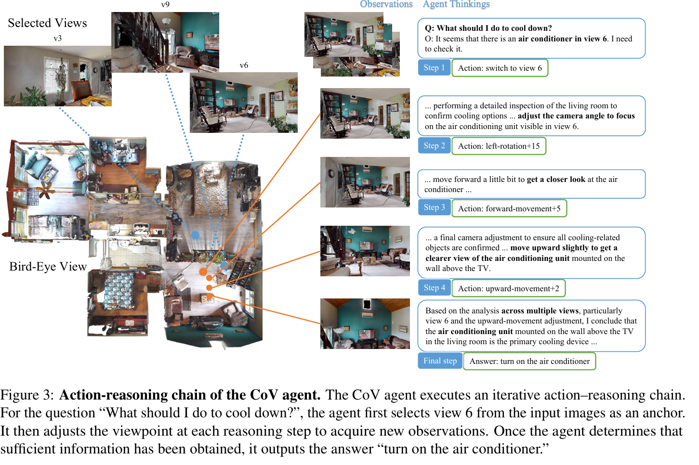

## 实验
OpenEQA 源自 180 多个真实环境 是一个具有挑战性的开放词汇基准数据集 2024
在真实房屋或复杂环境中导航、观察、记忆后才能回答

ScanQA 超过 41,000 个问答对，通过将自然语言查询与富含注释的RGB-D扫描中的特定3D目标关联，聚焦于目标锚定问答 2022
模型需输出答案（如 “a cup and a book”）以及可能的3D 物体引用（即指出具体是哪些物体

SQA3D 强调情境推理，要求智能体理解自身在 3D 场景中的位置和朝向，包含来自 650 个 ScanNet 场景的 33,400 个推理问题
问题是在特定视点（viewpoint）下提出的 因此，回答必须结合局部视觉信息 + 视角姿态

涵盖主流开源和专有模型。

对于openEQA
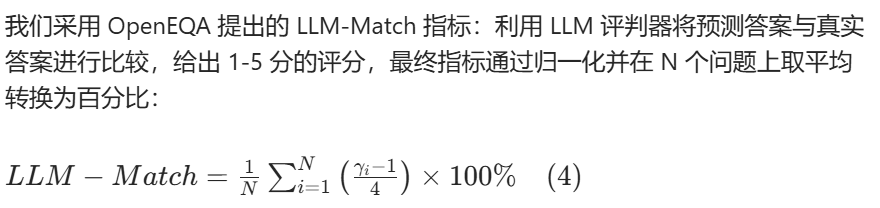

对于 ScanQA 和 SQA3D
CIDEr（C）衡量与人类注释的一致性
BLEU-4（B-4）捕捉 n 元语法重叠度
METEOR（M）结合精确率、召回率和同义词匹配
ROUGE-L（R）评估最长公共子序列
Top-1 精确匹配（EM1）反映生成答案的严格正确性

## 细节和结果
每个问答对的输入包括从场景视频片段中按 10:1 比例均匀采样的视频帧，以及文本问题 Q

baseline：一次性提供所有图像，让模型直接生成答案
CoV：首先将所有图像输入视角选择代理进行粗粒度筛选，再将筛选后的视角输入 CoV 代理回答问题 —— 两个代理均使用相同的底层 VLM。

### 主要结果

ScanQA 和 SQA3D ：  GPT-4.1、Gemini Pro Flash、InternVL
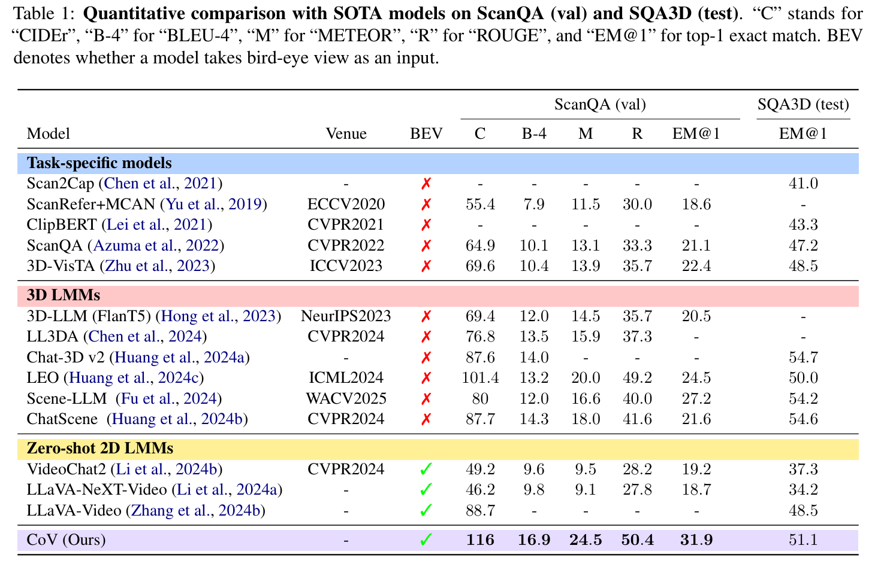
取最优结果，证明可以做到最优
我们的方法实现了当前最优性能，在 CIDEr（116 vs. LEO 的 101.4）和 EM@1（ScanQA 上 31.9%）指标上有显著提升

OpenEQA ：Qwen3-VL-Flash、GLM-4.6V、Gemini-2.5-Flash 和 GPT-4o-mini
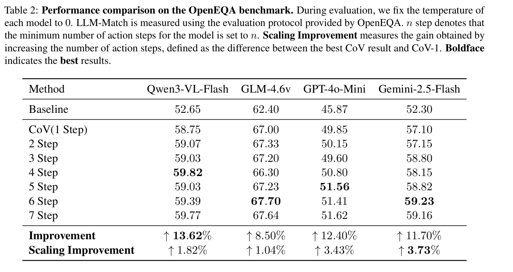
我们的方法在无需训练的情况下实现了 11.56% 的平均性能提升，其中 Qwen3-VL-Flash 的最大提升幅度达 13.62%

### 测试时扩展

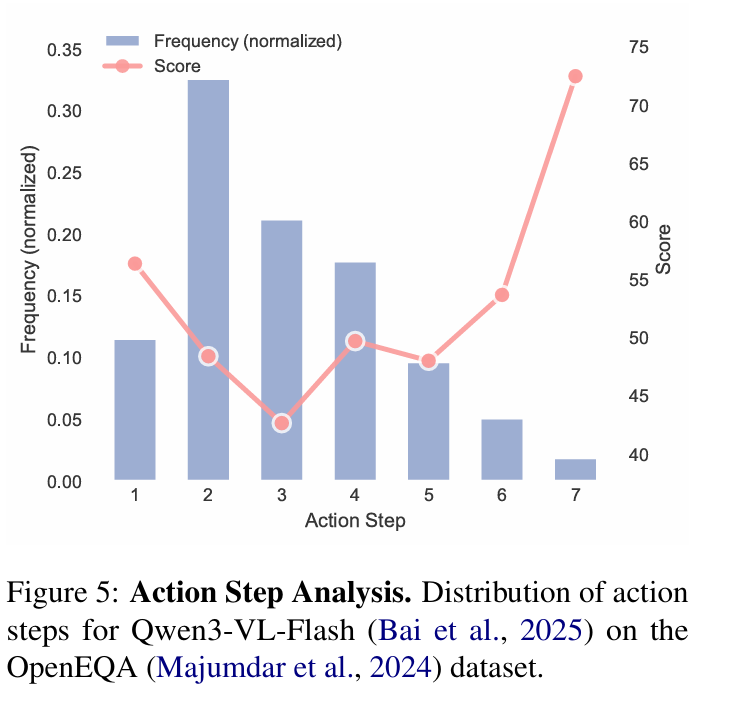

我们在 CoV 代理的提示模板中设置了动作步数下限
随着动作步数增加，性能逐步提升：与将最小动作步数设置为 1 相比，增加动作步数限制可带来 2.51% 的平均性能提升
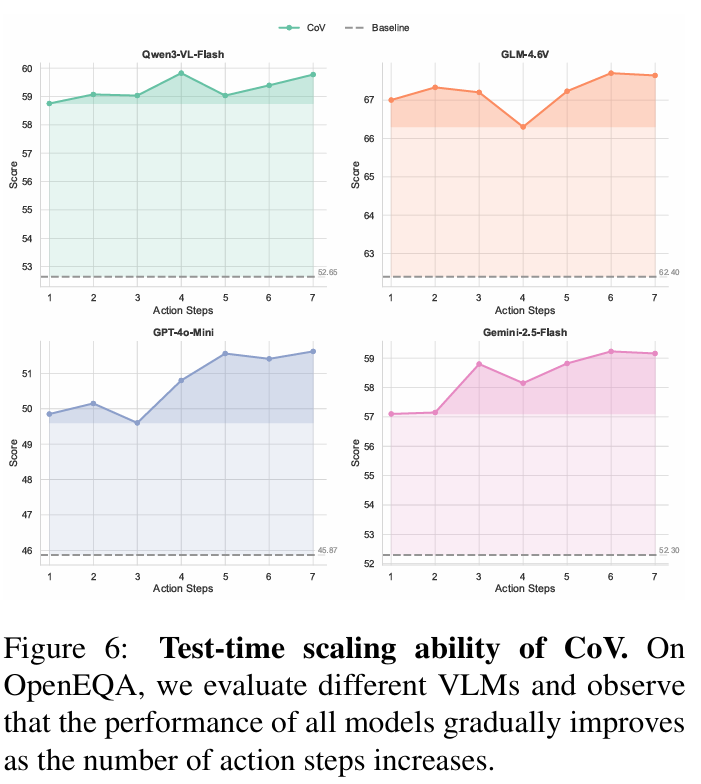

### 消融实验
通过消融实验探究粗粒度视角选择的作用，在 OpenEQA 数据集上评估了有无粗粒度视角选择代理的智能体性能

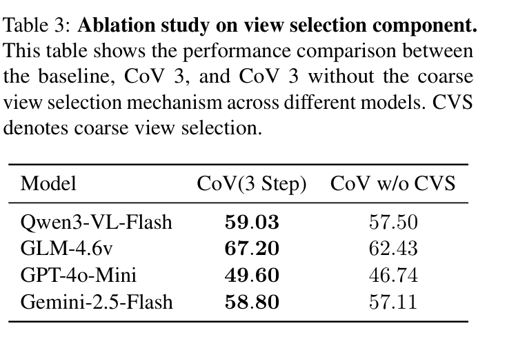

从我们的方法中移除视角选择代理会导致 VLM 性能下降，平均降幅达 4.59%，这一结果证明粗粒度视角选择是我们方法的关键组件

### 局限

尽管 CoV 提示方法在具身问答方面取得了显著进展，但仍存在局限性：“粗到细” 范式在高度动态或杂乱环境中可能面临挑战 —— 此类环境中的快速上下文变化可能导致场景元素误判；当动作轨迹过长时，过度探索可能引入噪声或幻觉；此外，CoV 的有效性依赖于所选视角的质量和相关性，次优视角选择会影响推理准确性。未来研究的一个有前景方向是开发先进的视角选择算法和自适应推理机制，以解决这些挑战。

## others

粗粒度视角选择的核心工具是原始 VLM 本身 + 专属提示模板，全程无额外训练
停止：模型自主判断 + 步骤上限

# 附录 
提示模板（核心部分）：提供了三类关键模板，分别对应基线模型、粗粒度视角选择代理、细粒度 CoV 代理，明确了输入格式、任务要求和输出规范

定性结果可视化：展示了 CoV 在浴室、教室、办公室、厨房等多种室内场景中的推理案例
## 提示模板
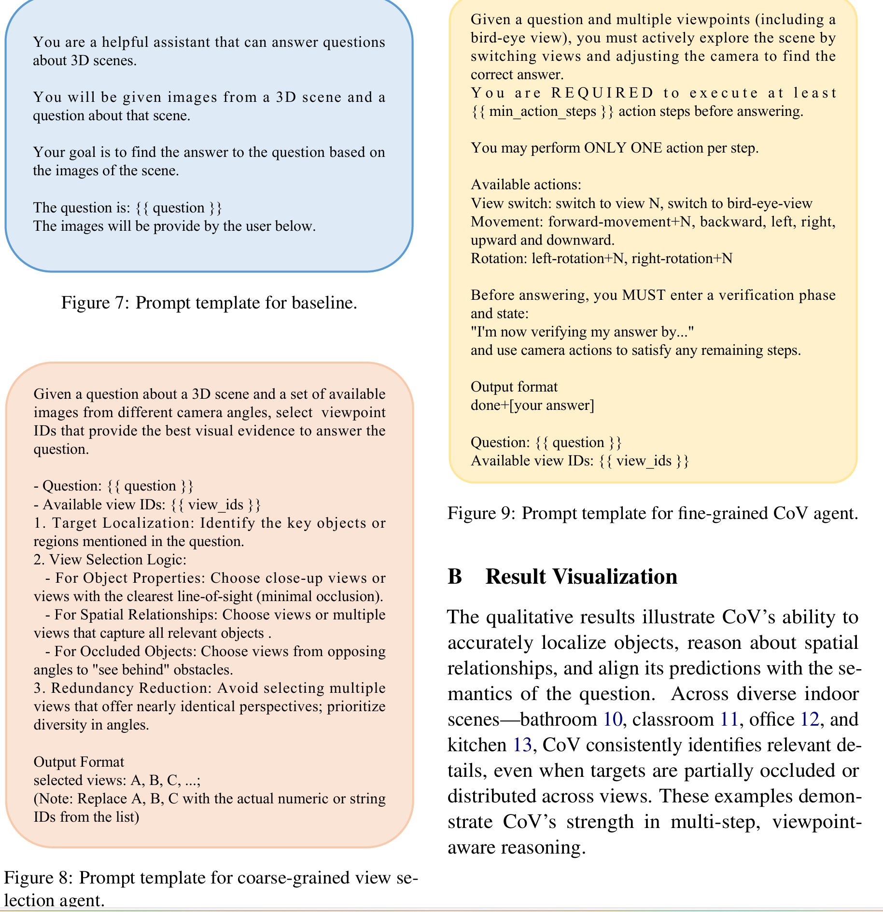

# Noun explanation && Extensive knowledge 
## EQA(Embodied Question Answering)
让智能体（如机器人或虚拟智能体）在一个三维环境中通过感知、移动和交互来回答自然语言提出的问题。
example:家庭服务机器人理解并执行用户指令（如“我的钥匙在哪儿？”）

# 思考？
