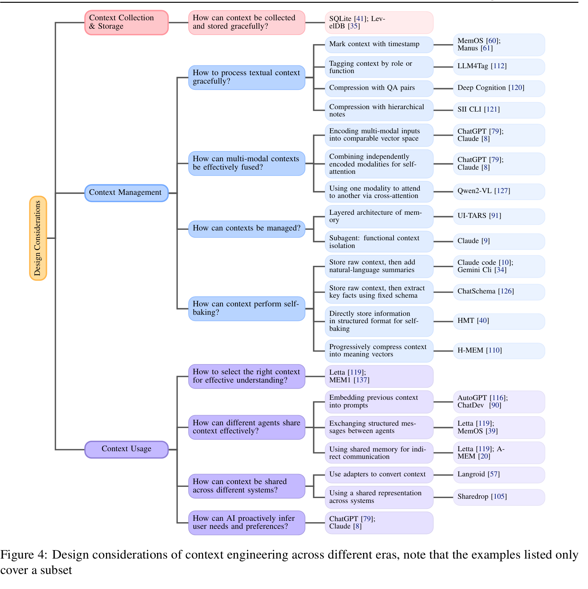
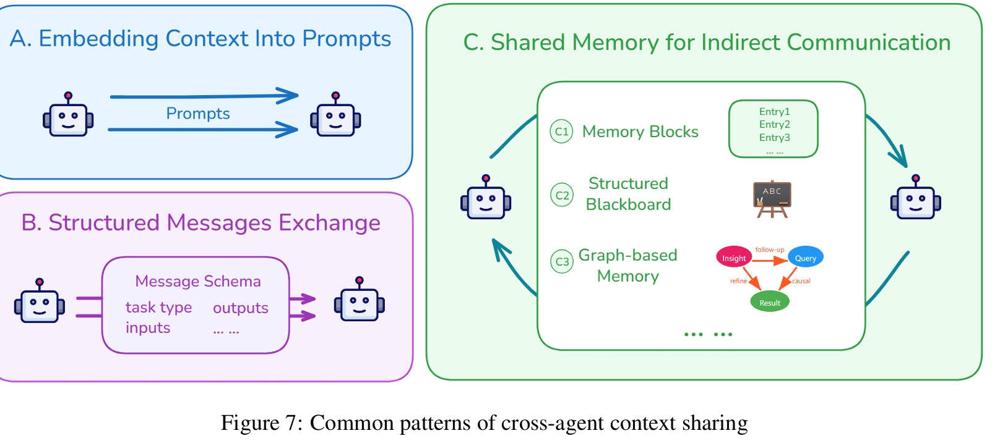

<!-- 对上下文 和 上下文工程 的 系统化/形式化定义 和对其中出现的问题的分析及解决方法 -->
<!-- 综述类 --> 
<!-- chinese -->
#  Context Engineering 2.0:The Context of Context Engineering
本文将探讨情境工程的理论背景，给出其系统性定义，梳理其历史演进脉络与概念框架，并分析实践中的关键设计考量。通过对这些问题的探讨，我们旨在为情境工程奠定理论基础，并勾勒其广阔的发展前景。本文可为人工智能领域的研究者共同推进系统性情境工程的发展提供参考

## 介绍
（prompt engineering）（Liu et al., 2021; Reynolds and McDonell, 2021; Wei et al., 2022）、检索增强生成（RAG）（Lewis et al., 2020; Izacard and Grave, 2022）、工具调用（tool calling）（Yao et al., 2022; Schick et al., 2023）以及长时记忆机制（long-term memory mechanisms）（Wu et al., 2022; Dai et al., 2019）

情境工程常被误认为是近期才出现的技术创新，而 “情境” 的定义也往往被局限于对话历史、系统提示词或智能体中心式的环境输入。事实上，情境的内涵可被更广泛地界定，且情境工程的相关实践已存在 20 余年。

情境工程的本质是弥合人类（碳基）与机器（硅基）智能之间的认知鸿沟
情境工程 1.0—— 基于结构化、低熵输入的原始计算阶段（Dey, 2001a）；
情境工程 2.0—— 能够理解自然语言、处理模糊性的智能体阶段（Jennings et al., 1998）；
情境工程 3.0—— 具备人类级智能、支持精细化通信与无缝协作的阶段（Morris et al., 2023）；
情境工程 4.0—— 超人类智能阶段，机器可主动构建情境并挖掘人类未明确表达的需求

本文的核心贡献如下：
将情境工程置于更广阔的历史视角中，追溯其在现代智能体出现之前的起源；
提出一套系统且广义的理论框架，包括从熵减视角定义的情境工程本质，以及反映其技术进展的四阶段演化模型；
通过对比典型实践提出通用设计考量，为未来智能系统的开发提供指导。

## 理论框架
**Entity and Characterization**
Char : E → P(F)  某个实体的特征描述
其中，特征描述函数 Char（e）的输出结果为表征该实体 e 的所有信息集合。
**Interaction**
交互行为指用户与应用程序之间所有可观测的互动行为，既包含点击操作、指令输入等显性行为，也涵盖注意力分配模式、环境参数调整等可能对计算系统产生影响或受计算系统影响的隐性行为

用户输入指令属于显性交互行为；而终端运行状态、过往检索情境、存储模块的调用情况以及工具调用状态等，则均属于隐性交互相关内容
**Context**
针对特定的用户 - 应用程序交互行为，情境可定义为
C=∪（e∈相关实体集合）特征描述函数 Char（e）
**Context engineering**
情境(上下文)工程是通过对情境的采集、存储、管理及运用环节进行设计与优化，进而提升机器的理解能力及任务执行性能的系统性过程
情境工程：（情境 C，任务 T）→情境处理函数 f

f(C) = 组合函数F（操作 1，操作 2，……，操作 n）（C）
组合函数F 用于整合各类情境工程操作环节 φi

2.0 阶段的情境工程所包含的操作集合 {φi} 可能涵盖以下八项内容：（1）通过传感器等渠道采集相关情境信息；（2）对情境信息进行高效存储与管理；（3）将情境信息转换为统一且可交互的表征格式；（4）处理文本、音频、视觉等多模态输入信息；（5）整合并复用历史情境（即 “自主整合”）；（6）筛选关键情境要素；（7）实现不同智能体或系统间的情境共享；（8）依据反馈信息或习得规律动态调整情境

情境工程的适用范畴:
情境工程所采用的具体技术与形式会随技术发展不断革新，但弥合人类意图与机器理解能力之间鸿沟这一核心目标

意义:
能够借鉴数十年来积累的相关经验
可解释部分情境设计方案能跨技术、跨时代适用的原因
它为预测情境工程的未来发展趋势奠定了基础，助力我们预判随着机器理解能力的持续提升，情境工程将呈现怎样的演进方向

**阶段特征**
机器智能的发展可细分为以下四个阶段：（1）原始计算阶段；（2）智能体中心式智能阶段；（3）人类级智能阶段；（4）超人类智能阶段。
1.0 时代：原始计算阶段（20 世纪 90 年代 - 2020 年）
这一阶段的机器解读情境的能力极为有限。它们虽能处理结构化输入数据，识别简单的环境信号，但无法深入理解信息背后的含义与人类意图。
2.0 时代：智能体中心式智能阶段（2020 年 - 至今）
以 2020 年 GPT - 3 模型发布为标志的大语言模型崛起（弗洛里迪、基里亚蒂，2020；布朗等，2020），成为情境工程与智能体中心式智能发展的重要转折点。此阶段的机器具备中等水平的智能，不仅能够理解自然语言输入，还可推断出部分隐含意图。
3.0 时代：人类级智能阶段（未来）
随着技术的突破性发展，智能系统有望具备与人类相当的推理和理解能力（格尔策尔、彭纳钦，2021[?怎么得到结论的]）。届时，情境工程将突破现有模式，智能体将能像人类一样感知情境，并吸收处理高熵信息。
4.0 时代：超人类智能阶段（推测性阶段）
当智能系统的能力超越人类后，便会具备全局洞察能力，甚至能比人类自身更深刻地洞悉人类意图。届时，传统的主客体关系将发生逆转：机器不再被动适配人类设定的情境，而是主动为人类构建新情境，挖掘人类未明确表达的需求，并引导人类思考。

## 历史演进
### 二十余年前：1.0 时代
这一阶段的核心特征是人类需主动适配机器

普适计算
构想将计算技术无缝融入日常生活环境，使设备无需用户主动输入即可提供服务

情境感知计算
旨在探索系统能否通过感知用户状态、环境及任务，动态调整自身行为

尽管概念层面取得了这些进展，但当时的技术局限依然显著。
**理论基础**
阿宁德・K・戴伊（Anind K. Dey）于 2001 年提出的情境定义成为该领域的基石（Dey, 2001a）：
“情境是可用于描述实体所处状态的任何信息。实体指与用户和应用程序交互相关的人、地点或物体，包括用户与应用程序本身。”

**核心实践**
情境工程 1.0 时代的一项关键创新，是人机交互从键盘、鼠标等传统输入设备，向分布式、传感器中心的范式转型（Schilit & Theimer, 1994; Abowd & Mynatt, 2000）。

基于这一愿景，阿宁德・戴伊提出了情境感知系统的通用框架，为该代系统提供了概念与架构基础（Dey, 2001a）。该框架通过 “情境工具包”（**Context Toolkit**）得以落地

**Context Toolkit**
1.情境组件（Context Widgets）：封装传感器并提供标准化接口；
2.解读器（Interpreters）：从原始情境数据中提取高层语义；
3.聚合器（Aggregators）：整合多源情境信息；
4.服务（Services）：提供应用级的情境功能访问；
5.发现器（Discoverers）：支持情境组件的动态注册与发现
（Salber et al., 1999）。

### 3.2 二十年后：2.0 时代
智能体在整个情境处理流程中实现了全方位升级 —— 从情境获取方式，到对原始信号的容错能力、解读能力，再到最终用于智能行为的利用方式，均发生了根本性转变。具体而言，这一演进主要体现在以下三个方面：

**情境获取：先进传感器的应用**
手机，手表，脑机，汽车，眼动仪....

**原始情境容错性：从结构化输入到人类原生信号**
在达到人类级智能之前，系统的智能水平主要取决于其 “类人化程度”，而最核心的衡量标准是对原始情境的容错能力 —— 即处理高熵信息输入的能力。
借助基础模型与多模态感知技术的进步，这些系统如今能够处理以往被视为过于原始或非结构化的输入，使情境信息可直接以原生形式被接收，无需大量预处理 —— 这标志着系统在情境解读灵活性上向人类水平迈出了根本性一步。

**情境理解与利用：从被动感知到主动理解与协作**
 
1.0 时代的情境感知系统通常基于简单的 “条件 - 动作” 规则运行（Schilit & Theimer, 1994; Abowd & Mynatt, 2000），即感知预定义信号并触发固定响应。例如，“若位置为办公室，则将手机调至静音”。这类系统仅能根据用户所处环境做出反应，而无法感知用户正在进行的行为。相比之下，2.0 时代的系统旨在主动解读用户行为，并通过协作实现共同目标。例如，当用户撰写研究论文时，系统可分析其前文内容与当前写作意图，推荐合适的下一部分内容。它不仅感知环境，更深度融入用户的工作流程 —— 这正是我们所定义的 “情境协作”（context-cooperative）：系统从 “情境感知”（context-aware）演进为 “情境协作”。

Design consideration sof context engineering across different eras，
note that the examples listed only cover a subset

## 情境采集与存储
最小充足性原则（Minimal Sufficiency Principle）：系统仅需采集和存储支持任务所需的必要信息 —— 情境的价值在于 “充足性” 而非 “体量”；
语义连续性原则（Semantic Continuity Principle）：情境的核心目的是维持 “意义的连续性”，而非单纯的数据连续性。

### 1.0 时代：单设备采集与本地存储
总体而言，这一时代的存储策略优先保障单设备独立可用，而非跨设备同步或数据安全保护。

### 2.0 时代：分布式采集与分层存储
存储方式普遍采用分层架构，根据数据用途制定存储策略：
短期高频访问数据：缓存于快速访问内存或边缘节点，以最小化延迟；
中期留存数据（如活动记录、用户偏好）：存储在本地嵌入式数据库（如 SQLite（Hipp, 2000）、LevelDB（Ghemawat & Dean, 2014）、RocksDB（Facebook, 2013））；若安全性要求较高，则存入操作系统支持的安全存储或硬件安全模块（Kostiainen et al., 2012）；
长期持久化数据：采用云存储平台或远程服务器数据库，以满足扩展性与跨设备同步需求。

### 人类级情境生态系统（3.0 时代）
进入 3.0 时代，人工智能系统将具备媲美人类感知的情境感知能力

可无缝采集触觉信息（如纹理、压力、温度），还原人类的触觉体验；
可通过嗅觉与味觉解读环境状态，例如将烟雾识别为危险信号，或评估食物新鲜度；
可从语调、停顿、眼神接触甚至沉默中捕捉意图与情感，理解人类交互中复杂的社交情境。

具备人类级智能的系统会将情境整合为长期个人数字记忆。

##  情境管理
### 文本情景处理
有效的情境工程不仅在于原始情境的采集，更关键在于情境的处理方式。
常用方案如下

**1. 为情境添加时间戳（Mark Context with Timestamp）**
实现简单、维护成本低
却未提供语义结构，难以捕捉长程依赖或高效检索相关信息

**2. 按功能与语义属性标记情境（Tagging Context by Functional and Semantic Attributes）**
此方法通过为每条情境条目明确标记功能角色（如 “目标”“决策”“行动”）来组织信息，提升条目可解读性。近年的系统支持多维度标记（包括优先级、信息来源等）
但灵活性稍显不足

**3. 基于问答对的压缩（Compression with QA Pairs）**
将情境重构为独立的问答对，以提升检索效率，
但这种方式会破坏原始思路的连贯性

**4. 基于分层笔记的压缩（Compression with Hierarchical Notes）**
此方法以树状结构组织信息，从宽泛概念逐步分支到具体子要点。
尽管该结构有助于清晰呈现信息，但主要反映信息的分组方式，而非观点间的逻辑关联

### 多模态情境处理
在 2.0 时代，我们总结出以下几种常用策略

**1. 多模态输入映射至可比向量空间（Mapping Multimodal Inputs into a Comparable Vector Space）**
该方法将文本、图像、视频等不同模态的输入转换到共享向量空间，使其语义可直接比较。
在该空间中，不同模态的语义相关内容会被拉近，无关内容则被推远（Peng et al., 2023; Jaegle et al., 2021; Lv et al., 2024）

**2. 结合不同模态进行自注意力计算（Combining Different Modalities for Self-Attention）**
将各模态投影到共享嵌入空间后，模态专属 token 通过单一 Transformer 架构联合处理。在统一的自注意力机制中，文本与视觉 token 在每一层相互关注，实现细粒度的跨模态对齐与推理。现代多模态大语言模型均采用此方案，使其能够捕捉细节对应关系（如文本短语与图像区域的关联），而非依赖独立嵌入的浅层拼接（OpenAI, 2024; Anthropic, 2025a）。

**3. 通过交叉注意力实现模态间关注（Using One Modality to Attend to Another via Cross-Attention）**
该方法利用交叉注意力层，使一种模态（如文本）能直接聚焦于另一种模态（如图像）的特定部分。具体而言，将一种模态的特征作为注意力机制中的查询（queries），另一种模态的特征作为键（keys）和值（values）（Vaswani et al., 2017）。这种设计使模型能有针对性地、灵活地跨模态检索相关信息。
然而，传统设计通常需要预先指定模态间的交互方式，而人类大脑无需依赖此类固定映射，即可灵活整合跨感官与记忆通道的信息。

### 情境组织
**记忆的分层架构**
在不同时间尺度上有效管理信息，是人工智能系统面临的核心挑战。

与操作系统决定将哪些数据载入 RAM 的逻辑一致，情境工程的核心任务是筛选应进入情境窗口的信息，以支持高效推理（langchain Research, 2025）

例如，LeadResearcher 系统在处理超长情境（>20 万字）时，会将研究计划存储在持久化记忆中，避免关键信息因情境窗口限制而丢失（Team, 2025b）。其核心洞察在于：不同类型的信息需要不同的留存策略 —— 近期情境需快速检索，但可能很快失效；而重要模式与习得知识则需跨会话持久化。

为清晰呈现，本文提出的框架聚焦于双层记忆模型，但相关原则可自然扩展至更复杂的架构。

**一些定义**

该迁移函数代表记忆巩固过程 —— 短时记忆中频繁访问或高度重要的信息经处理后，成为长时记忆的一部分。迁移过程受重复频率、情感显著性、与既有知识结构的相关性等因素调控。

### 情境隔离
**子智能体（Subagent）**
子智能体为突破情境限制、降低情境污染风险提供了创新方案，是通过功能性情境隔离实现高效情境管理的新兴策略（Team, 2025a）。

每个子智能体都是专用的人工智能助手，拥有独立的情境窗口、定制化系统提示词与受限的工具权限。当任务与某子智能体的专业领域匹配时，主系统可将其委派给该单元，子智能体独立运行且不污染主对话情境。

**轻量级引用（Lightweight References）**
情境隔离通常依赖于将大量信息存储在外部，仅在模型窗口中暴露轻量级引用。
HuggingFace 的 CodeAgent 采用的沙箱（sandbox）方案中，庞大的输出数据存储在独立沙箱中，仅在需要时检索。通过这种方式，模型仅与简洁的引用交互，而沙箱保留完整数据并按需提供。

### 情景抽象
对话轮次、工具输出、检索文档等原始情境会快速累积。若不加以处理，不断增长的历史信息会迅速超出系统承载能力，导致难以识别对未来推理或决策真正重要的内容。
因此，可扩展智能体的关键能力之一是情境抽象 —— 将原始情境转换为更紧凑、结构化的表征形式。我们将这一过程称为 “自主整合”（self-baking）

**1. 采用分层记忆架构（Using Hierarchical Memory Architectures）**
当前系统普遍采用分层记忆组织的架构原则。通过按不同抽象层级组织信息，分层记忆为管理增长的情境提供了系统化方案：底层存储原始情境，确保细粒度细节可访问；随着情境体量增加，原始信息逐步汇总为更抽象的表征并传递至上层。新信息通常从最底层进入，逐步向上 “整合”，使系统在不超出情境窗口限制的同时，仍能保留指向原始细节的可检索链接。从这个意义上说，分层记忆补充了短时记忆与长时记忆的划分：**原始情境通常存储在底层短时记忆中，而更抽象的表征则对应长时记忆**（He et al., 2025; Patel & Singh, 2025）。
**2. 添加自然语言摘要（Add Natural-Language Summaries）**
该模式下，系统以原始非结构化形式存储完整情境，同时定期生成摘要以提供截至目前的压缩视图。这些摘要通常以自然语言撰写，可手动或自动生成，用于快速概览近期事件。
**3. 基于固定模式提取关键事实（Extract Key Facts Using a Fixed Schema）**
该模式在自然语言摘要的基础上增加了结构化解读：系统不仅存储原始情境，还将关键信息提取到预定义格式中，以提升访问与推理效率。
模式可采用多种形式：
1. 实体图谱（entity map）：将关键实体（人、物品、地点等）表示为节点，每个节点包含实体属性（如名称、类型）、当前状态（如位置、状态）及与其他实体的关联（如 “拥有”“合作”“位于”）；
2. 事件记录（event records）：将事件拆解为不同维度的模板；
3. 任务树（task tree）：将复杂目标按层级结构分解为子任务。

**4. 逐步将情境压缩为语义向量（Progressively Compress Context into Meaning-Capturing Vectors）**
除存储原始情境外，该方案将信息编码为密集数值向量（即嵌入向量，embeddings），以反映输入的语义含义。这些向量具备可压缩性，支持构建多尺度抽象的分层记忆。向量经过自主整合过程：旧嵌入向量定期通过池化（pooling）等操作汇总为紧凑表征，或与既有长时状态融合后重新编码，形成逐步抽象、稳定的语义记忆。

## 情景使用

### 系统内情境共享
现代大语言模型应用通常由多个智能体组成，每个智能体负责复杂推理流程的一部分。多智能体系统有效的一个实际原因是，它允许系统处理比单个智能体更多的令牌，从而有效扩展整体流程的容量（Team, 2025b）。在此类系统中，核心挑战在于：如何实现智能体间的情境共享，以达成连贯的协作行为？

**1. 将历史情境嵌入提示词（Embedding Previous Context into Prompts）**
该方法通过将历史情境直接纳入下一个智能体的输入提示词来传递信息，通常会对信息进行重新格式化以提升清晰度。
**2. 智能体间交换结构化消息（Exchanging Structured Messages between Agents）**
智能体通过固定格式的结构化消息进行通信。这些消息通常遵循预定义模式（schema），包含任务类型、输入数据、输出结果、推理步骤等字段。接收方智能体读取消息后继续执行任务。Letta（Team, 2024）、MemOS（Han et al., 2025）等系统采用该方案，确保跨智能体信息传递的清晰度与一致性。
**3. 利用共享内存实现间接通信（Using Shared Memory for Indirect Communication）**
智能体通常通过读写共享内存空间进行间接通信 —— 共享内存可实现为集中式外部存储，或单个智能体内存中的公共区域。智能体不直接发送消息，而是将信息存储在共享空间（通常组织为内存块），后续通过检查该空间获取更新。每个内存块存储一个情境单元，并标注基本元数据（如添加者、添加时间、数据类型）。MemGPT（Team, 2024）、A-MEM（Chen et al., 2024a）等系统采用该方案支持智能体间的间接通信与协调。

另一种方式是使内存更具结构化：不再将原始数据放入通用池，而是将信息写入共享 “黑板”（blackboard），并按主题、任务或目标划分为不同片段（Du et al., 2025; Salemi et al., 2025）。每个智能体仅监控与其专业领域相关的片段，并相应添加或修改内容。

内存还可组织为图谱形式：例如，任务内存引擎（TME）（Ye, 2025）将智能体的推理过程表示为任务图谱 —— 每个节点编码单个步骤（包括输入、输出、执行状态），边则捕获步骤间的依赖关系。

### 跨系统情境共享
在多智能体环境中，“系统” 可理解为任何独立的平台、模型或应用程序 —— 它们维护自身的情境或状态以执行任务。

**1. 使用适配器转换情境（Use Adapters to Convert Context）**
每个系统保留自身格式，通过添加转换器将情境转换为对方系统可读取的形式。

**2. 采用跨系统共享表征（Using a Shared Representation Across Systems）**
所有系统从一开始就约定使用相同的表征形式，确保彼此可直接读写。

共享数据格式（如 JSON 或 API）  通过人类可读摘要共享情境   将情境表征为语义向量

### 面向理解的情境选择
即使扩展了情境窗口，大语言模型的性能仍受限于其可依赖的输入令牌质量。

当前步骤应从可用情境中选择哪些子集？
consider:

1. 语义相关性（Semantic Relevance）
选择与当前查询或目标语义最相似的记忆条目。
2. 逻辑依赖（Logical Dependency）
当前任务直接依赖前序步骤生成的信息（如先前的规划决策、工具输出或推理链）的情况。
3. 时效性与频率（Recency and Frequency）
近期使用或频繁访问的条目更可能被再次检索。
4. 信息重叠（Overlapping Information）
若多条信息表达相同含义，可过滤掉较旧或细节较少的条目（Du et al., 2025; Jiao et al., 2024）。

5. 用户偏好与反馈（User Preference and Feedback）
随着时间推移，人工智能智能体可适应用户习惯，学习用户倾向于重视的信息类型。

**常见筛选策略（Common Filtering Strategies）**
结合上述因素，系统采用不同的筛选策略：
在检索增强生成（RAG）流程中，第一步是将源信息分割为可管理的片段 —— 可采用固定行或令牌窗口等简单策略，或基于抽象语法树（AST）的结构化分割（尊重函数、类或模块边界，保留语义连贯性）；
检索过程可通过多种方式实现：语义检索依赖基于嵌入向量的搜索，根据与查询的向量相似度选择片段（Chen & Xu, 2024）；非语义检索可直接采用 Grep 等工具，通过字符串或正则表达式匹配，无需解读含义；结构化检索利用知识图谱，借助实体与依赖关系（如函数调用图谱）连接跨文件和模块的信息（Wen et al., 2025）；
由于这些方法常返回重叠或嘈杂的候选结果，许多系统引入重排序阶段（有时由大语言模型驱动）以优化相关性 —— 在精度提升与效率之间权衡，不同实现（如 Windsurf）的设计选择存在差异（Mohan, 2025）。

### 主动用户需求推理 6.4
当前上下文的大多数应用都是被动式的
上下文工程应支持智能体具备主动行为能力：推断用户未明确表述的潜在需求、偏好和目标，并据此主动发起有帮助的交互。
主动偏好挖掘的几种常见形式
**从相关问题推断隐藏目标**
系统可通过分析用户查询序列推断隐藏目标。
**基于用户困境主动提供帮助**

### 终身上下文的保存与更新
终身上下文的持续保存与更新不仅需要可扩展的存储能力，还要求设计一个动态、语义稳健且具备时间感知能力的记忆系统。
**挑战一：存储瓶颈**
首个挑战是如何在严格的资源约束下保留尽可能多的相关上下文。
**挑战二：处理性能下降**
另一挑战源于注意力机制在大规模场景下的失效。大多数基于 Transformer 的模型依赖全局注意力机制，其 O (n²) 的复杂度导致推理延迟快速增加、GPU 内存占用过高以及 I/O 吞吐量降低。
**挑战三：系统不稳定性**
随着记忆的长期累积，即使是微小的错误也可能影响系统的更多部分。曾经影响范围有限的错误如今可能广泛传播，导致意外或不稳定的行为。
**挑战四：评估难度**
随着记忆的累积，判断系统推理是否正确变得愈发困难。当前大多数基准测试仅验证系统是否能够检索到信息，而不检查该信息是否仍然相关、准确或有帮助。
**迈向上下文语义操作系统**
终身上下文工程的挑战已无法通过简单的 “扩大上下文窗口” 或 “提升检索准确性” 来解决。它需要构建一个能够随时间演进的语义操作系统，类似于人类的心智。
主动添加、修改和遗忘知识
新颖的架构来替代 Transformer 的扁平时间建模方式
能够通过追溯、纠正和解释推理链中的每个步骤来实现自我解释

### 新兴工程实践
**键值缓存（KV Caching）**
KV 缓存通过存储过往 token 的注意力状态（键和值），避免在生成新 token 时重新计算这些状态。
**工具设计**
工具设计的关键因素是**描述和规模**。
在描述方面，工具需要明确的用途和清晰的定义
过大的工具集会导致性能下降 —— 因为重叠的工具描述和增加的选择复杂性会使正确工具的选择变得更加困难。
**上下文内容**
智能体不应隐藏自身错误：在上下文中保留错误能让模型观察到自身的失败，这对于学习纠正行为和提升整体性能至关重要（Manus，2025）。
**多智能体系统**
**实用技巧**
在执行复杂任务时，许多系统会维护一个 todo.md 文件来列出子目标，并在任务推进过程中更新该文件并标记已完成项。然而，模型在长任务中可能会忘记早期目标。一个实用的解决方案是在更新待办清单时，用自然语言复述这些目标，将其整合到模型的近期上下文中，确保关键目标始终处于模型的即时注意力范围内（Manus，2025）。

## 应用场景
### 命令行界面（CLI）
以Gemini CLI为代表，通过GEMINI.md文件记录项目关键信息，按文件系统层级实现上下文继承与隔离，整合静态环境信息与动态对话历史，支持AI摘要压缩与协同管理。

### 深度研究（DeepResearch）
如通义DeepResearch，通过“搜索-提取-子问题生成-证据整合”多轮循环推进研究，采用上下文快照压缩长历史，突破窗口限制，实现长周期知识密集型任务支持。

### 脑机接口（BCIs）
直接捕获神经信号，拓展上下文收集维度（注意力、情绪等），减少显式输入依赖，指向“外部环境+内部认知”的上下文收集新方向。

## 挑战与未来方向
### 上下文收集的局限性与低效性
依赖显式输入，用户意图难精准表达，需发展多模态收集与需求推断技术，BCI是潜在突破点。

### 大规模上下文的存储与管理
上下文规模激增，需设计可扩展、高效检索的存储组织方案。

### 模型对上下文的理解能力有限
在复杂逻辑、多模态关联理解上不足，需强化语义推理与跨模态对齐能力。

### 长上下文处理的性能瓶颈
Transformer架构存在复杂度问题，需探索高效处理长文本且保障理解质量的新架构。

### 相关且有用上下文的筛选
现有过滤机制不足，需开发自适应选择策略，精准匹配任务目标。

### 数字存在（Digital Presence）
数字上下文成为人类身份与记忆的持久形式，带来新的认知与应用延伸可能。

# 结论
上下文工程是随机器智能演进的长期学科，核心是弥合人机意图鸿沟；未来将向“机器主动管理上下文”发展，有望推动AI超越人类认知理解，拓展自我认知边界。

# Noun explanation && Extensive knowledge 
## 高熵信息
高熵信息指的是不确定性高、无序度高、冗余或关联性弱的信息 —— 其核心特征是 “信息密度低、可预测性差”，难以直接提取有效价值，且会增加系统处理的复杂度。

# 思考？
参考文献上百...