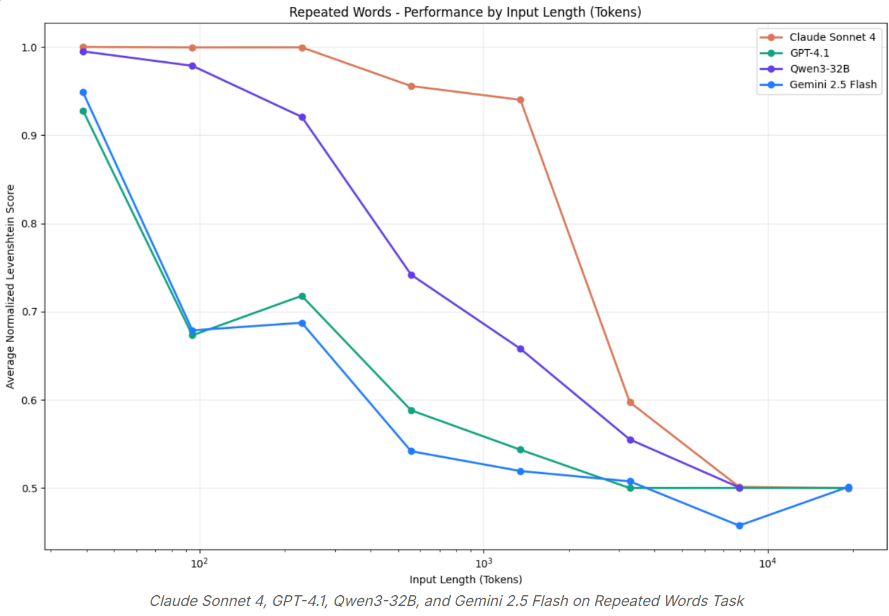
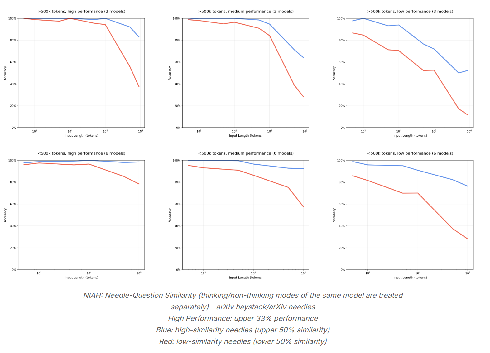
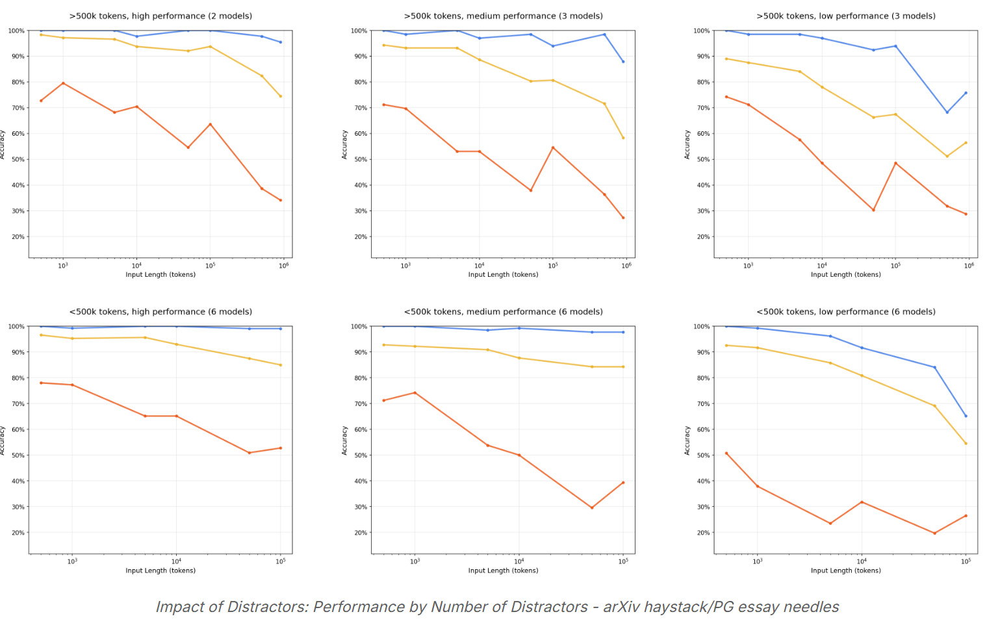
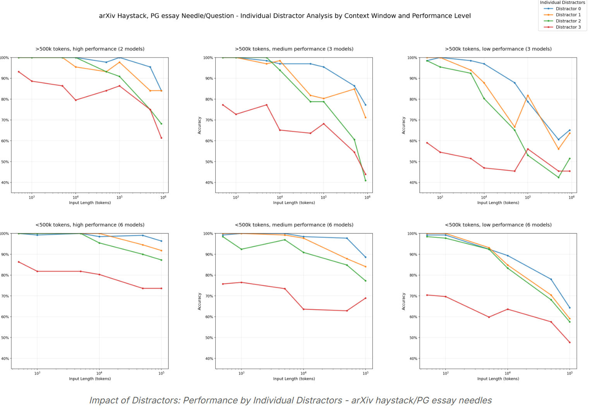
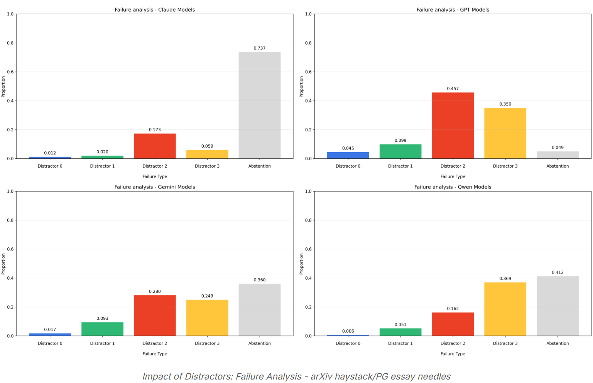
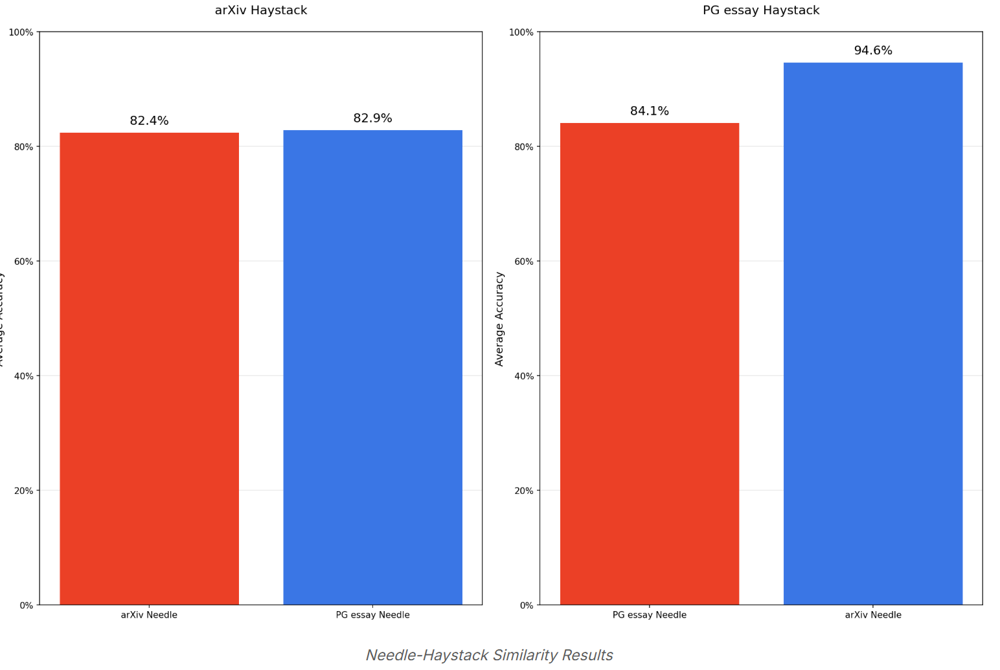
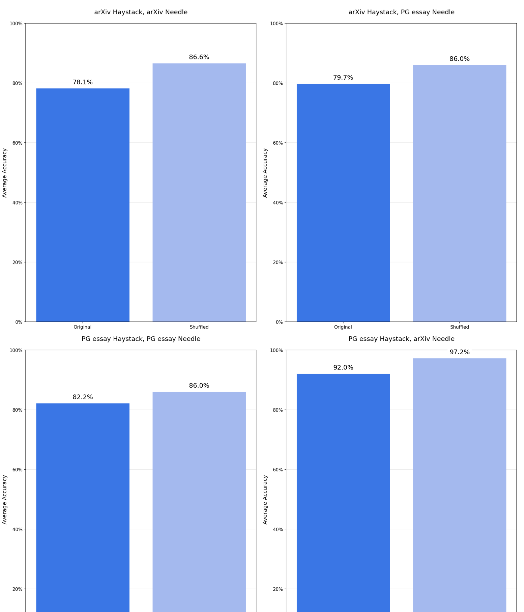
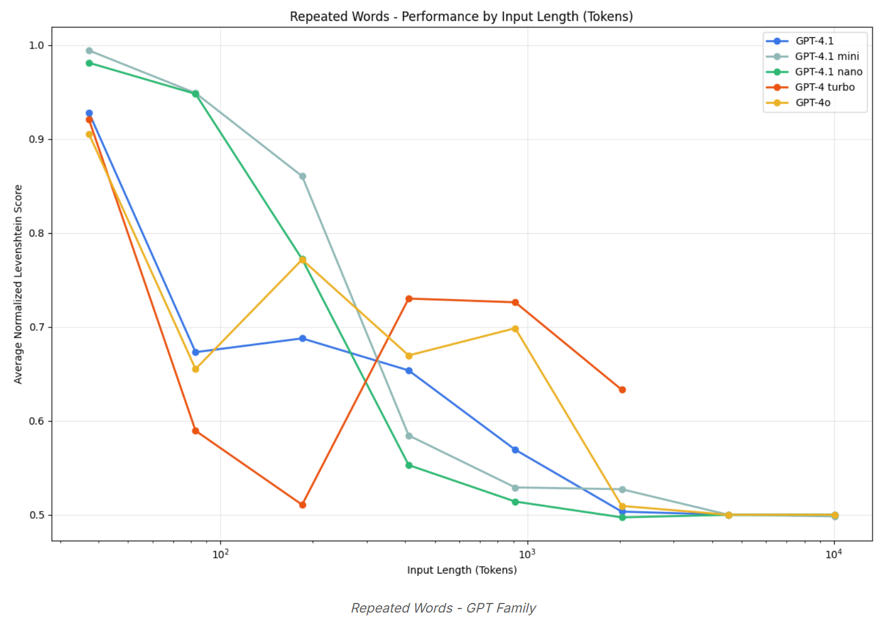
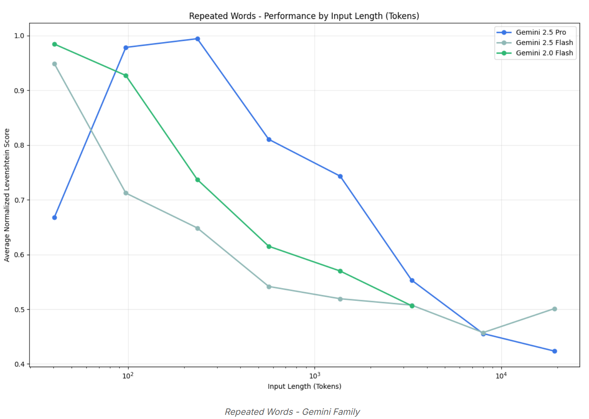
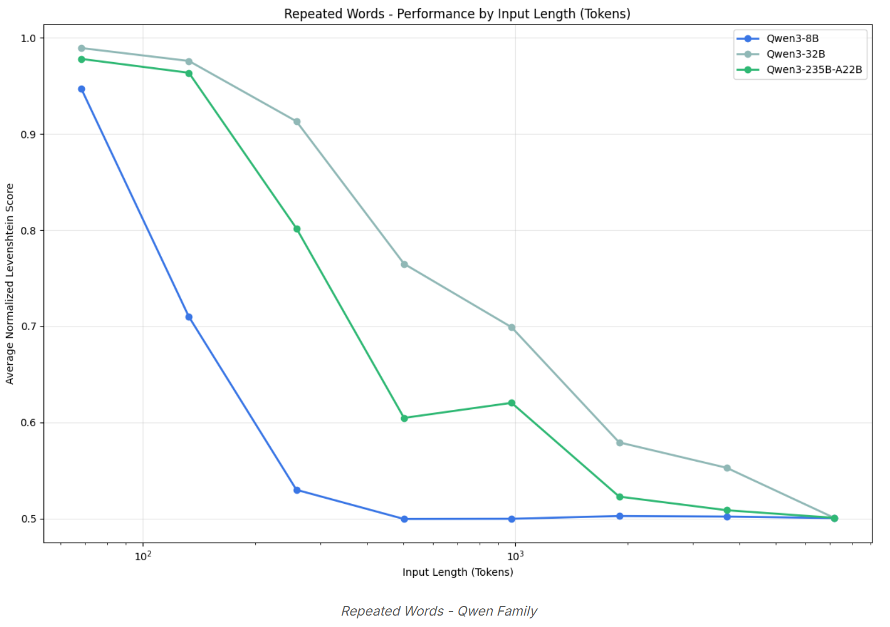

#  Context Rot: How Increasing Input Tokens Impacts LLM Performance (Chroma)
## 背景和动机
大语言模型（LLMs）通常被认为会均匀处理上下文—— 也就是说，模型处理第 10,000 个 token 时应与处理第 100 个 token 时同样可靠。然而在实际应用中，这一假设并不成立。我们发现，即使在简单任务上，模型性能也会随输入长度的变化而显著波动。

evaluate :18 个大语言模型，包括当前最先进的 GPT-4.1、Claude 4、Gemini 2.5 和通义千问 3

NIAH 本质上是一项简单的检索任务：将一个已知句子（即 “针”）嵌入一篇由无关文本构成的长文档（即 “干草堆”）中，然后提示模型检索该句子(当前模型表现良好)。尽管该基准测试具有良好的可扩展性，但它通常仅评估直接词汇匹配能力—— 这一特性可能无法代表那些需要灵活处理、以语义理解为核心的任务场景

对标准的 “大海捞针”（NIAH）任务进行了**扩展**：
1.语义关联而非直接词汇匹配的情况
2.对haystack content进行变异处理

此外，我们还纳入了两项额外评估：一项是基于 LongMemEval 基准的**对话式问答评估**，另一项是让模型**复现一系列重复词汇的合成任务**。每项任务都特意设计得较为简单，且通过严格控制变量，以单独隔离上下文长度带来的影响

我们的研究表明，即便在这些极简条件下，模型性能仍会随输入长度的增加而下降，且下降方式往往出人意料、并非均匀一致。而现实世界的应用场景通常涉及远更高的复杂性 —— 这意味着输入长度对性能的影响在实际应用中可能会更为显著。

## 简介
通常，任务复杂度会随输入长度的增加而提升，这使得我们难以区分性能下降的原因：是源于**输入长度**的增加，还是**任务本身难度**的提升？为解决这一问题，我们的实验在保持任务复杂度恒定的前提下，仅改变输入长度 —— 从而能够直接衡量输入长度本身对模型性能的影响
## 贡献
对 18 个大语言模型（含主流闭源模型与开源权重模型）开展了全面评估，揭示了模型性能随输入长度增加呈现的**非均匀变化特征**；
详细阐述了不同模型在处理干扰信息以及问答相似度变化场景时，所表现出的模型特异性行为模式；
公开了可复现本研究结果的完整代码库。
## NIAH 的扩展实验
问题：哪个角色去过赫尔辛基？
针信息：事实上，优希（Yuki）住在奇亚斯马博物馆（Kiasma museum）附近。
NoLiMa任务72.4% 的 “针 - 问题”不仅测试模型的非词汇匹配能力，还考察其世界知识储备。
目前，针对 “非词汇匹配的独立影响” 的专项测试仍显不足.

在本报告中，我们明确区分 “干扰信息” 与 “无关内容” 的定义：

干扰信息（Distractors）：与 “针信息” 主题相关，但无法准确回答问题的内容；
无关内容（Irrelevant content）：与 “针信息” 和问题均无关联的内容。

已有研究表明，干扰信息对模型性能的影响具有非均匀性，但大多数相关评估仅针对短输入长度和较早期模型。现有研究声称**最先进的模型对干扰信息具有更强的抗干扰能力**，但其**在不同输入长度下的表现尚未经过充分测试**。

“大海捞针”（NIAH）任务中另一个未被充分探索的方面是 “草垛” 本身 —— 它通常仅被视为扩展输入长度的工具，这一做法隐含一个假设：**草垛内容本身不会影响任务性能**。若模型确实对草垛内容不敏感，那么改变草垛的主题、叙事逻辑等属性应不会对结果产生影响。然而，**这一假设在很大程度上仍未得到验证**。
为此，我们设计了**四项受控实验**，以探究上述因素的影响：

1.针 - 问题相似度（Needle-Question Similarity）**实验旨在衡量随着输入长度增加，“针 - 问题” 相似度对模型性能的影响**
计算 “针 - 问题” 对的余弦相似度
为确保结果的稳健性，我们采用五种嵌入模型的平均值：text-embedding-3-small、text-embedding-3-large、jina-embeddings-v3、voyage-3-large 和 all-MiniLM-L6-v2

2.干扰信息的影响（Impact of Distractors）**衡量干扰信息与输入长度之间的非均匀作用关系**
Bseline: 仅含 “针信息”，无干扰信息；
Single distractor: “针信息”+ 一条随机位置的干扰信息；
Multiple distractor: “针信息”+ 四条随机位置的干扰信息。

3.针 - 草垛相似度（Needle-Haystack Similarity）
我们采用两类主题截然不同的 “草垛” 文本：保罗・格雷厄姆（Paul Graham）的散文和 arXiv 学术论文 ，并为每类草垛设计对应的 “针信息”
为衡量 “针 - 草垛” 相似度，我们先对草垛文本进行嵌入处理，为每条 “针信息” 检索相似度最高的 5 个文本块，再计算这些文本块的余弦相似度平均值。

4.草垛结构（Haystack Structure）
原始结构组（Original）：保留每个文本片段内自然的思路流动；
打乱结构组（Shuffled）：将整个草垛的句子随机重排，保持整体主题不变，但消除逻辑连贯性。

对每个模型：
8 种输入长度；
11 个 “针信息” 位置。

评估过程中，模型的温度参数（temperature）默认设为 0（即确定性输出），除非该设置与模型不兼容（如 o3 模型）或官方明确不建议

在适用情况下，我们同时评估模型的标准模式与 “思考模式”。
**实验结果**
1.在所有实验中，模型性能均随输入长度增加而持续衰减；
2.“针 - 问题” 相似度越低，性能衰减速率越快；
3.干扰信息的影响具有非均匀性（即不同干扰信息的干扰强度存在差异）：这种影响随输入长度增加而愈发显著，且不同模型对干扰信息的响应模式存在明显区别；
4.“针 - 草垛” 相似度对模型性能的影响并非均匀一致，这一现象需要进一步研究；
5.草垛的结构模式始终会影响模型对长输入的处理效果。

## 实验设计 1
### 主题聚类方法
通过 
分割chunks  text-embedding-3-large嵌入处理  UMAP降维  HDBSCAN聚类  最大边际相关性  
选取 20 个代表性文本块，手动分析最大聚类的文本块，确定其**核心主题与表达风格**

通过该方法，我们发现 PG 散文的高频主题为 “写作建议”（多以轶事形式呈现），而 arXiv 论文的高频主题为 “信息检索”（尤其聚焦于重排序任务）。
### 问题设计
针对每个核心主题，我们设计对应的查询问题：
PG 散文：“我从大学同学那里得到的最好的写作建议是什么？”
arXiv 论文：“哪个低延迟重排序模型更适用于科学领域？
**针信息设计与验证**
在撰写 “针信息” 前，我们首先验证草垛文本中是否存在这些问题的现成答案，以确保实验公平性：
文本块->向量数据库，用问题的嵌入向量检索 top10相似文本块，手动检查确保不存在替代答案,模型的错误输出均源于自身幻觉（hallucination），而非对现有文本的误读。

针对每个问题，我们撰写 8 条 “针信息”，且每条均通过近似预测验证属于对应高频聚类（写作建议 / 信息检索）：当针信息属于目标聚类的概率 > 0.9 时，认为其主题与草垛文本高度融合。所有针信息均为手动撰写，以避免数据污染。
**针 - 问题模糊度控制**
对于 8 条针信息，我们通过以下方法量化并控制其模糊度（即 “针 - 问题” 相似度）：
求解二者的余弦相似度  取五种模型平均值作为最终相似度  
PG 散文主题的 “针 - 问题” 相似度范围为 0.445-0.775，五种模型计算结果的标准差 < 0.1；arXiv 论文主题的相似度范围为 0.521-0.829，标准差同样 < 0.1
## 实验结果 1

实验结果：NIAH 针 - 问题相似度（同一模型的思考 / 非思考模式分别统计）——arXiv 草垛 /arXiv 针信息
高性能组（High Performance）：性能排名前 33% 的模型
蓝色（Blue）：高相似度针信息（相似度排名前 50%）
红色（Red）：低相似度针信息（相似度排名后 50%）

针 - 问题相似度越低，模型性能随输入长度增加的衰减速度越快。

在短输入长度下，即使是低相似度的针 - 问题对，模型也能表现良好 —— 这一现象在高 / 中性能模型中尤为明显，说明这些模型具备处理各类针 - 问题对的能力（无论相似度高低）。

通过固定针 - 问题对、仅改变无关内容的数量，成功将输入长度隔离为性能下降的主要影响因素。

在 11 个不同的针信息位置下，该特定 NIAH 任务的模型性能未出现显著差异。

## 实验设计 2
针对每个草垛主题（PG 散文与 arXiv 论文），我们选取一条 “针 - 问题” 相似度较高的针信息（八条中排名第二），并手动撰写四条干扰信息

问题：“我从大学同学那里得到的最好的写作建议是什么？”
针信息：“我认为大学同学给我的最好写作建议是每周坚持写作。”
干扰信息：
“我从大学教授那里得到的最好写作建议是每天坚持写作。”
“我从大学同学那里得到的最糟糕写作建议是用五种不同风格撰写每篇文章。”
“我从同学那里得到的最好写作建议是用三种不同风格撰写每篇文章 —— 这是高中时期的事了。”
“我曾认为大学同学给我的最好写作建议是用四种不同风格撰写每篇文章，但现在不这么认为了。”

我们并未对所有八条针信息均添加干扰信息进行测试，而是选择一条高相似度针信息构建实验场景 —— 该场景下针信息本应相对容易被识别。从之前的实验结果可知，由于 “针 - 问题” 相似度高，模型在不同输入长度下对该针信息的检索表现普遍较好，这一设定能帮助我们更精准地隔离并衡量干扰信息本身的影响。

无干扰组（基准组）：仅包含针信息；
单干扰组：针信息 + 一条干扰信息（随机位置嵌入）；
多干扰组：针信息 + 四条干扰信息（随机位置嵌入整个草垛）。

【随机位置】？

## 实验结果 2
干扰信息影响：按干扰信息数量划分的性能表现 ——arXiv 草垛 / PG 散文针信息

实验结果进一步表明，干扰信息的影响具有非均匀性：例如在 “arXiv 草垛 + PG 散文针信息” 的组合场景中，3 号干扰信息（红色标注）导致的模型性能下降幅度明显大于其他干扰信息。

干扰信息影响：按单个干扰信息划分的性能表现 ——arXiv 草垛 / PG 散文针信息

为深入探究这种非均匀影响，我们分析了多干扰组（4 条干扰信息）场景下不同模型的失败案例。在 “arXiv 草垛 + PG 散文针信息” 组合中，我们发现 2 号和 3 号干扰信息在各模型的幻觉输出中出现频率最高。

干扰信息影响：失败案例分析 ——arXiv 草垛 / PG 散文针信息

这些失败案例还揭示了不同模型在处理语义模糊性时的特异性差异：
Claude 系列模型始终保持最低的幻觉率。具体而言，Claude Sonnet 4 和 Opus 4 表现得尤为保守 —— 当存在不确定性时，它们倾向于 “弃权”，明确声明无法找到答案；
相比之下，GPT 系列模型的幻觉率最高 —— 在存在干扰信息的情况下，它们常生成看似确信但实际错误的响应。

【非均匀作用 和相似度有关？ 但又和context length 有什么关系呢？】
## 实验设计 3
**针 - 草垛相似度计算方法**
对草垛文本进行嵌入处理，为每条针信息检索相似度最高的 5 个文本块；
计算这 5 个文本块与针信息的余弦相似度平均值，作为该针信息与草垛的最终相似度；
为确保结果稳健性，上述过程在五种不同的嵌入模型上重复进行，取平均值作为最终结果。
**相似度量化结果**
PG 散文草垛场景：
PG 散文针信息的平均针 - 草垛相似度为 0.529，变异系数为 0.101；
arXiv 论文针信息的平均针 - 草垛相似度为 0.368，变异系数为 0.111；
arXiv 论文草垛场景：
arXiv 论文针信息的平均针 - 草垛相似度为 0.654，变异系数为 0.0858；
PG 散文针信息的平均针 - 草垛相似度为 0.394，变异系数为 0.105。

## 实验结果 3

在 PG 散文草垛中：arXiv 论文针信息的模型表现显著优于 PG 散文针信息；换句话说，当 “针信息” 与 “草垛” 在语义上不融合时，模型性能更优；
而在 arXiv 论文草垛中：arXiv 论文针信息与 PG 散文针信息的模型表现仅存在微小差异。
仅通过两个主题的测试，不足以得出 “针 - 草垛相似度越高，模型任务性能越差” 这一可泛化结论。但该结果确实凸显了长上下文处理的非均匀特性—— 即使固定任务结构和针 - 问题相似度，仅改变针与草垛的语义相似度，也会影响实验结果。这一发现揭示了长上下文基准测试中一个尚未被充分探索的领域，同时为未来研究指明了具有意义的方向。

## 实验设计 4
草垛的逻辑连贯性始终会损害模型性能。
尽管这一结论与**直觉相悖**【**？我不这么认为**】，但数据明确显示：当草垛保留自然的思路逻辑时，模型表现更差；而对草垛进行句子重排、消除局部连贯性后，模型性能反而持续提升。

原始结构组（Original）：保留每个文本片段内自然的思路流动；
打乱结构组（Shuffled）：将整个草垛的句子随机重排，保持整体主题不变，但消除逻辑连贯性。
## 实验结果 4

在所有 18 个模型及所有针 - 草垛配置组合中，我们观察到一个一致规律：模型在打乱版草垛上的表现始终优于逻辑结构化草垛。
这一结果可能对理解模型内部处理机制具有重要启示：输入文本的结构模式可能会影响注意力机制（attention mechanism）的分配方式，尤其是在输入长度增加时。
尽管该方向超出了本报告的研究范围，但它为模型可解释性研究指明了一个潜在方向 —— 探究输入结构如何影响注意力分配。理解长输入场景下这些结构性因素的作用，可能有助于解释模型在长上下文任务中的失败模式。

## LongMemEval 基准测试
为在更贴近真实的场景中评估模型性能，我们采用了 LongMemEval 基准测试 —— 这是一项针对对话式问答的长上下文评估任务。

这要求模型在单次调用中完成两项任务：
1.从对话历史中检索相关信息（检索任务）；
2.将检索到的信息整合，以对新查询提供有效响应（推理任务）。

我们通过两种实验场景，系统测试了 “增加该额外步骤” 与 “输入长度增长” 的综合影响：
聚焦输入组（Focused input）：仅包含相关信息片段，模型只需执行简单推理；
完整输入组（Full input）：采用 LongMemEval 标准的 11.3 万 token 长输入，包含大量无关上下文。此时模型需在长上下文中完成检索，再进行推理。

## 实验结果
在所有模型中，聚焦提示词（仅含相关信息）的性能显著高于完整提示词（含无关上下文）。
我们还观察到不同问题类型存在明显的性能差异模式：
在非思考模式下：无论是聚焦提示词还是完整提示词，模型均在 “知识更新类问题” 上表现最佳，其次是 “多会话类问题”，最后是 “时间推理类问题”；
而在思考模式启用后：性能排名发生变化，变为 “知识更新类问题” 最优，其次是 “时间推理类问题”，最后是 “多会话类问题”。

## 重复词任务
此前的实验探究了输入长度本身对模型性能的影响，但当输出长度随输入长度同步增加时，模型表现会发生什么变化？由于大语言模型均为**自回归模型**（autoregressive），其输出本质上也是输入的一部分 —— 每个 token 的生成都依赖于原始输入和截至当前已生成的所有 token。

然而，我们的研究结果表明：即便对于这类极其简单的任务，随着上下文长度（含输入 + 输出长度）的增加，模型性能仍会呈现非均匀性衰减。

我们设计了一项受控任务：模型需复现一串重复词序列，其中某个特定位置插入了一个唯一词（与重复词不同）。提示词明确要求模型完全精确复现输入文本。

**评分方法**
采用归一化编辑距离（Normalized Levenshtein distance） 评分：距离越近（趋近于 0），表示复现越精确。

无效案例处理
我们将以下情况判定为 “未尝试任务” 并排除：
空输出且带有终止原因（如 GPT-3.5 Turbo 的 finish_reason='content_filter’）；
非空但无效的输出：
仅观察不执行：指出文本差异，但未复现（例：Claude Opus 4 提示 “发现 'apples' 与 'apple' 的差异，是否需要修正？”）；
拒绝回答：直接表示无法协助（例：GPT-4.1 输出 “抱歉，我无法提供帮助”）；
随机输出：无意义字符序列（例：Gemini 2.5 Pro 输出 “-\n-\n--\n-...”）。
对于 “先指出差异再复现” 的案例（如 Claude Opus 4 先说明 “存在 'apples' 的差异”，再完整复现文本），我们纳入评分，但会因未严格遵循 “完全精确复现” 的指令而给予轻微惩罚。
注：GPT-3.5 Turbo 因 60.29% 的任务输出触发 content_filter 而被完全排除
**分析维度**
我们从以下 3 个维度分析模型输出：
归一化编辑距离（整体复现精度）；
唯一词的存在性与位置：
正确：唯一词存在且位于指定位置；
位置错误：唯一词存在，但位置偏离；
词数差异（输入词数 - 生成词数）
## 实验结果
随着上下文长度增加，所有模型的性能均呈现持续衰减
跨模型家族的共性现象：部分模型会拒绝尝试任务（规避版权风险  认为序列存在不一致性）
**其他关键发现**
1. 唯一词位置准确性
当唯一词位于序列开头附近时，模型的位置复现准确率最高 —— 这一趋势在输入长度增加时尤为明显（长序列中，模型对开头信息的记忆精度显著高于中间或结尾）。
2. 词数生成差异
随着上下文长度增加，模型常出现 “生成重复词直至达到输出 token 限制” 的情况。我们通过 “输入词数 - 生成词数” 量化这一现象：
正值：生成词数少于输入词数（欠生成）；
负值：生成词数多于输入词数（过生成）。

**GPT 模型家族表现**
GPT-4.1 的拒绝率为 2.55%，通常从输入长度 2500 词左右开始拒绝，典型响应如 “抱歉，我无法提供帮助”；
GPT-4 Turbo 在约 500 词处出现局部性能峰值：
50-250 词区间：倾向于过生成（重复常用词直至输出限制）；
500 词时：词数生成精度最高；
超过 500 词后：开始出现欠生成（输入词数 - 生成词数为正值，且随长度增加差值扩大）。

**Gemini 系列模型表现**
总体而言，随着上下文长度增加，Gemini 系列模型的性能同样呈现衰减趋势。其中，Gemini 2.5 Pro（蓝色）的初始性能（50 词时）较低 —— 因为该模型在短序列下就会出现生成词数不足的情况。
除了 Gemini 2.5 Flash 在 “apples”/“apple” 组合中未出现随机词外，所有模型在所有词组合中均会生成输入中未存在的随机词：
随机词通常从 500-750 词开始出现；
输出变异性排序：Gemini 2.5 Pro > 2.0 Flash > 2.5 Flash。
Gemini 2.5 Pro 输出示例：
组合 “golden”/“Golden”（2500 词）：
"I'-a-le-le-le-le-le-le-'a-le-le-le-le-le-le-le--le-le-le-le-le-le-le...
组合 “orange”/“run”（10000 词）：
orange orange orange--g.-g/2021/01/20/orange-county-california-sheriff-deputies-wore...

**Qwen3-8B 表现**
该模型是唯一出现 “未尝试任务” 的模型，未尝试率为 4.21%。从约 5000 词开始，该模型会输出与任务无关的随机文本

## 总结和展望
即使面对简单任务，大语言模型（LLMs）在不同上下文长度下的性能仍存在不一致性
推测在这些复杂场景下，模型性能的衰减可能会更为严重。

本研究通过严格控制变量，将输入长度单独作为核心影响因素，保持任务难度恒定。未来研究的一个重要方向是：量化拆分模型性能衰减的来源—— 区分衰减是源于任务本身的固有难度，还是模型处理长上下文的能力不足

此外，本研究尚未解释性能衰减背后的核心机制。我们的观察表明，上下文的结构属性（如相关信息的位置、重复频率等）会影响模型行为，但对于其背后的原因，目前尚无明确答案。要深入探究这些影响，需要开展更深入的机制可解释性研究

凸显了上下文工程的重要性

模型的上下文是否包含相关信息并非唯一关键因素，更重要的是这些信息的呈现方式。我们的实验表明，即使是最先进的模型，也会受此影响 —— 因此，有效的上下文工程是确保模型可靠运行的核心前提

# Noun explanation && Extensive knowledge 
## context rot 上下文腐烂
当输入给模型的上下文越来越长时，模型并不会线性提升理解和推理能力，反而可能 出现准确率下降、遗漏关键信息或被噪声干扰。
这种性能衰减过程就被称为 Context Rot

## Normalized Levenshtein(编辑距离) Score（归一化 Levenshtein 分数）
Normalized Levenshtein Score =1-/(Levenshtein(A,B)/max(∣A∣,∣B∣)) 约等于 相似度

## NOLIMA(Needle Overlap Language Inference and Matching Assessment)
在NOLIMA中，问题和「针」之间几乎没有词汇重叠，模型必须依赖潜在的关联推理来定位「针」

## YaRN（Yet another RoPE Normalization）
大模型位置编码改进方法（长上下文技术）
核心效果：
让 LLM 支持更长上下文（32k → 128k+），并且高位 token 不会乱码或指向错误位置。

## aligned GPT-4.1 judge
一个被对齐过、用于自动评分其他模型输出的 GPT-4.1

## UMAP
快速、结构友好的降维算法，用于 embedding 可视化。

## HDBSCAN（Hierarchical Density-Based Spatial Clustering of Applications with Noise）
基于密度的层次聚类算法
是 DBSCAN 的“可变密度、更智能、更稳定”版本。
常与 UMAP 搭配：
UMAP 降维 → HDBSCAN 聚类

## Maximal Marginal Relevance, MMR
同时最大化“相关性 + 多样性”的检索重排序方法
MMR=relevance−λ⋅redundancy

relevance：和 query 的相关性
redundancy：和已经选的文档是否重复（embedding 相似度）
λ 控制多样性

## 变异系数
变异系数 = 标准差除以均值，用于描述相对波动程度

## 非均匀作用??:
系统的行为（或误差、性能、响应）在不同领域/位置/条件下并不一致，而是存在结构化的差异。
干扰信息（irrelevant distractors）对模型造成的性能损伤不是均匀分布的，而是随位置、密度、语义类别而不同。

# 思考？
本文在研究context长度对输出的影响，不应该控制 有效信息密度吗 ？
研究标题是 increaseing input tokens，但是实验内容和分析重点与其有很大差别？

本文在实验设计和得分评判，结果分析上较为侧重