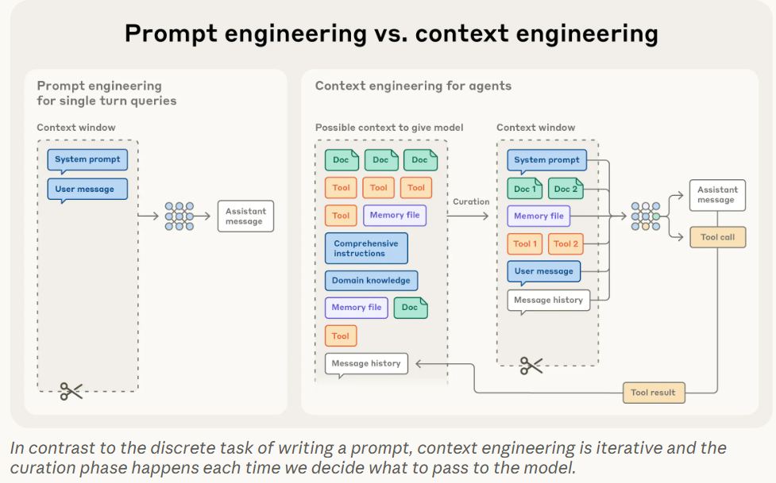
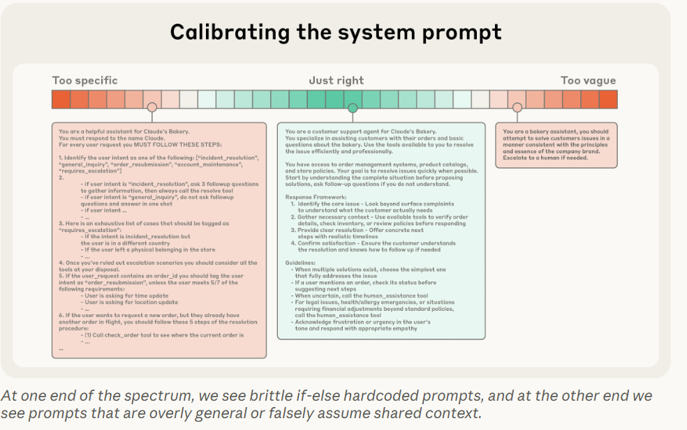

<!-- 如何在大语言模型有限的注意力资源下，通过精心筛选和动态管理上下文内容 以构建更可靠、高效的长期运行 AI 智能体-->
<!-- 应该说是技术报告 -->
# Effective context engineering for AI agents - anthropic
上下文是 AI 智能体的关键资源，但也是有限的。本文将探讨如何有效地筛选和管理驱动这些智能体的上下文。

上下文指的是在对大语言模型（LLM）进行采样时所包含的一组 token。

要考虑在任意给定时刻提供给 LLM 的整体状态，以及该状态可能引发的潜在行为

## 上下文工程 vs 提示工程
在 Anthropic，我们将上下文工程视为提示工程的自然演进。

提示工程指的是编写和组织大语言模型（LLM）指令以获得最佳输出的方法

而上下文工程则是指在 LLM 推理过程中，筛选并维护最优 token 集（即信息）的一整套策略——这不仅包括提示本身，**还涵盖所有可能被送入上下文窗口**的其他信息。

随着我们转向构建更强大的智能体——这些智能体需要在多轮推理和更长时间跨度中持续运行——我们就必须发展出管理整个上下文状态的策略，包括系统指令、工具、模型上下文协议（MCP）、外部数据、对话历史等

与编写提示这一离散任务不同，上下文工程是迭代性的：每次决定向模型传递哪些内容时，都会发生一次上下文筛选。

## 为何上下文工程对构建强大智能体至关重要？
在“大海捞针”（needle-in-a-haystack）类基准测试中，研究者发现了“上下文衰减”（context rot）现象

这种注意力稀缺源于 LLM 的架构约束。
transformer n的平方

虽然像位置编码插值（position encoding interpolation）等技术可以让模型通过适配原始训练上下文长度来处理更长序列，但代价是 token 位置理解的一定程度退化。这些因素共同造就了一种性能“渐变”而非“硬性断崖”：模型在长上下文中依然具备很强能力，但在信息检索和长程推理方面的精确度，相比短上下文场景仍会有所下降。

## 高效上下文的构成要素
鉴于大语言模型（LLMs）受限于有限的注意力资源，优秀的上下文工程意味着：找到最小可能的高信息量 token 集合，以最大化实现期望结果的概率。

**系统提示（System Prompts）**
“恰当抽象层次”（right altitude）
恰到好处:
**过高（过于抽象）：**
提供模糊、高层的指导（如“构建一个很棒的 Web 应用”），却未给出具体信号，或错误地假设模型与人类共享背景知识
结果：模型行为不可预测。
**过低（过于硬编码）：**
工程师在提示中嵌入复杂的 if-else 逻辑，试图精确控制智能体行为
结果：系统变得脆弱、难以维护，且无法泛化。

**建议做法：**
将提示划分为清晰的逻辑区块，如 <背景信息>、<指令>、## 工具使用指南>、## 输出格式要求> 等；
使用 XML 标签或 Markdown 标题分隔（尽管随着模型能力提升，格式重要性可能下降）；
追求信息的最小完备集（minimal yet sufficient）——“最小”不等于“简短”，而是无冗余、无缺失。

极简提示 -> 观察失败 ->针对性补充

**工具 （Tools）**
由于工具定义了智能体与其信息/操作空间之间的契约，因此其设计必须高度重视效率
既要返回token 高效的信息，也要引导智能体采取高效的行为

常见的失败案例：  工具集过于臃肿，覆盖功能过多，或导致智能体在选择工具时面临模糊的决策点  

自包含 对错误鲁棒 用途极其明确   输入参数应当 具备描述性 无歧义 契合模型固有优势

few-shot prompting是一种广为人知的最佳实践，我们依然强烈推荐
然而，团队常常试图将大量边缘案例塞进提示中，企图穷尽 LLM 在特定任务中应遵循的所有规则。我们不建议这样做
我们的核心指导原则是：深思熟虑，保持上下文既信息丰富又紧凑精炼。
接下来，我们将深入探讨如何在**运行时动态检索上下文**

## 上下文检索与智能体驱动的搜索（Context Retrieval and Agentic Search）

agent is LLMs autonomously using tools in a loop
随着底层模型能力不断提升，智能体的自主性也在增强：更聪明的模型能够独立探索复杂的问题空间，并从错误中恢复

基于嵌入（embedding-based）的预推理检索机制：在推理前将重要上下文提取出来供智能体推理使用
但随着领域向更“智能体化”（agentic）的方向演进->在此基础上补充“即时”（just-in-time），即 JIT）。

与事先预处理所有相关数据不同，“即时”策略下的智能体会**保留轻量级的标识符**（如文件路径、存储的查询语句、网页链接等），并在运行时通过工具动态将所需数据加载到上下文中。

这种方式模拟了人类认知——我们通常不会记住整套知识库，而是借助外部组织与索引系统（如文件系统、收件箱、书签）按需检索相关信息

优点:
除了节省存储开销外，这些引用的元数据本身也提供了高效优化行为的信号——无论是显式提供还是隐含可推
目录层级、命名规范、时间戳等都传递了重要线索，帮助人类和智能体理解信息应在何时、以何种方式被使用

让智能体自主导航和检索数据，还实现了**渐进式揭示**（progressive disclosure）
通过探索逐步发现相关上下文。每一次交互都会产生新的上下文，用于指导下一步决策：文件大小暗示复杂度；命名习惯提示用途；时间戳可作为相关性的代理指标。
仅在工作记忆中保留必要内容，并通过“记笔记”策略实现额外的持久化。这种自我管理的上下文窗口使智能体聚焦于相关子集，而非被海量但可能无关的信息淹没。

权衡:
运行时探索比检索预计算数据更慢。
深思熟虑的工程设计，确保 LLM 拥有合适的工具和启发式规则，以有效导航其信息空间

混合策略：预先加载部分数据以提升速度，同时保留自主探索的权限以按需获取更多信息

## 面向长期任务的上下文工程（Context Engineering for Long-Horizon Tasks）
token 总量超过 LLM 上下文窗口
仍能保持连贯性、上下文一致性和目标导向行为
我们开发了几种直接应对上下文污染约束的技术：上下文压缩（compaction）

### 上下文压缩（Compaction）

压缩是指：当对话接近上下文窗口上限时，对内容进行摘要，并用该摘要初始化一个新的上下文窗口。
压缩的艺术在于取舍：过于激进的压缩可能导致丢失细微但关键的上下文——其重要性可能到后期才显现。对于实现压缩系统的工程师，我们建议在复杂的智能体轨迹（traces）上仔细调优提示词

首先最大化召回率（recall），确保压缩提示能捕获轨迹中的所有相关信息；
再逐步提升精确率（precision），剔除冗余内容。

### 结构化笔记（Structured Note-Taking）

结构化笔记（又称“智能体记忆”）是一种让智能体定期将笔记写入上下文窗口之外的持久化存储中，并在后续会话中重新加载的技术。

在上下文重置后，智能体读取自己的笔记，继续长达数小时的训练或地牢探索。这种跨摘要步骤的连贯性，使得仅靠LLM 上下文窗口无法实现的长期策略成为可能

### 子智能体架构（Sub-agent Architectures）
子智能体架构提供了另一种突破上下文限制的途径。与其让单个智能体试图维护整个项目的全局状态，不如让专用的子智能体处理聚焦任务，每个子智能体都拥有干净的上下文窗口。

每个子智能体可能消耗数万 token 进行广泛探索，但仅返回一个高度浓缩的工作摘要（通常为 1,000–2,000 token）。

**The choice**

上下文压缩：适用于需要大量来回交互、强调对话连贯性的任务；
结构化笔记：在具有明确里程碑的迭代式开发中表现最佳；
子智能体架构：适合需要并行探索、深度分析的复杂研究任务。

## 结论
上下文工程代表了我们构建大语言模型（LLM）应用方式的一次根本性转变。随着模型能力不断提升，挑战已不再仅仅是“编写完美的提示词”，而在于在每一步都审慎地筛选和组织进入模型有限注意力资源的信息。

核心指导原则始终如一：
找出最小但高信息量的 token 集合，以最大化实现期望结果的概率

# Noun explanation && Extensive knowledge 
## self-contained
一个“自包含”的组件（如函数、工具、模块或系统）是指其运行不依赖外部隐式状态或未声明的依赖项，所有必要信息都显式包含在内部或通过明确接口传入

✅ 自包含工具：read_file(path="src/main.py")
❌ 非自包含工具：read_last_opened_file()（需记住“上次打开的文件”）

## 基于嵌入的预推理检索机制
在模型推理前，用向量相似度从外部知识库中提前检索可能相关的文本片段，并注入上下文。常用于 RAG，但可能包含过时或冗余信息。

## just-in-time context
智能体按需动态加载上下文：只保留轻量引用（如文件路径），在运行时通过工具实时获取所需数据，避免一次性塞入大量无关内容。

## 上下文污染（context pollution）
上下文窗口中混入过多低价值、冗余或过时信息，导致模型注意力分散、关键信号被淹没，降低任务表现。需通过压缩、清理或结构化记忆来缓解。

# 思考？
提示词工程
大海捞针，单一目标，流式输入，动态舍弃（在多目标上怎么办?）

