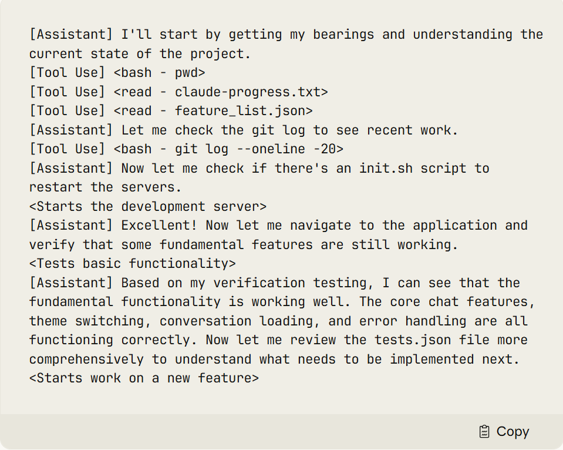

<!-- 将复杂的长线任务通过结构化分解分配给 Initializer Agent + Coding Agent -->
<!-- 应该说是技术报告 -->
# Effective harnesses for long-running agents - anthropic
当前，智能体在跨越多个上下文窗口执行任务时仍面临挑战。我们从人类工程师的工作方式中汲取灵感，设计出一种更高效的执行框架，以支持长时间运行的智能体。

## intro & background
长时间运行智能体的核心挑战在于：它们必须在离散的会话中工作，而每次新会话开始时，对之前发生的事情没有任何记忆。
由于上下文窗口长度有限，而大多数复杂项目无法在一个窗口内完成，因此智能体需要一种机制来弥合不同编码会话之间的断层。

为了解决这一问题，我们为 Claude Agent SDK 设计了一个双重解决方案

一个**初始化智能体（initializer agent）**，在首次运行时搭建基础环境；以及一个**编码智能体（coding agent）**，负责在每次会话中做出增量式进展，同时为下一次会话留下清晰的**工件（artifacts）。**

## 长时间运行智能体所面临的问题
Claude Agent SDK   具备上下文管理能力，例如上下文压缩（compaction）

然而，仅靠上下文压缩是不够的。即使使用像 Opus 4.5 这样先进的前沿编码模型，在 Claude Agent SDK 上循环运行**多个上下文窗口**，如果只给它一个**高层指令**（例如“构建一个 claude.ai 的克隆”），它仍然难以开发出一个**达到生产质量的** Web 应用。

Claude 的失败主要表现为两种模式：
1. 试图一次性完成太多工作
这经常导致模型在实现中途耗尽上下文，使得下一次会话接手时面对一个半成品且缺乏文档的功能。此时，新会话的智能体不得不猜测之前发生了什么，并花费大量时间重新让基础应用跑起来。
2. 过早宣告任务完成
在项目后期，当某些功能已经实现后，后续的智能体会环顾四周，看到已有进展，便草率地宣布工作已完成。

So

首先，我们需要一个**初始环境**，为提示（prompt）中要求的所有功能打好基础，从而引导智能体采用“逐步推进、逐个实现功能”的工作方式。
其次，我们应提示每个智能体在每次会话中做出增量式进展，并在会话结束时将环境置于一种**干净状态**（clean state）。这里的“干净状态”指的是：代码质量足以合并到主分支——没有严重 bug，结构清晰、注释完善，其他开发者可以轻松在此基础上开始新功能的开发，而无需先清理无关的混乱代码。

**解决方案**
1. 初始化智能体（Initializer Agent）
一个 init.sh 脚本、一个名为 claude-progress.txt的进度日志文件、一个初始的 Git 提交

2. 编码智能体（Coding Agent）
做出增量进展，并留下结构化的更新
例如更新 claude-progress.txt、提交清晰的 Git 记录等

## 环境管理
在更新版的《Claude 4 提示工程指南》中，我们分享了多上下文窗口工作流的一些最佳实践，其中包括一种执行框架结构（harness structure）:
用不同的提示词指示初始化智能体（initializer agent）搭建完整的初始环境

### 功能清单(Feature List)
提示初始化智能体根据用户最初的高层指令，生成一份详尽的功能需求清单。以“克隆 claude.ai”为例，这份清单包含了 200 多项具体功能

exp:“用户可以打开一个新对话，输入查询，按下回车，并看到 AI 的回复。”

每项功能初始状态均标记为 passes: false（未通过），以便后续的编码智能体清晰了解完整功能的全貌，并逐项实现。

{
  "category": "functional",
  "description": "New chat button creates a fresh conversation",
  "steps": [
    "Navigate to main interface",
    "Click the 'New Chat' button",
    "Verify a new conversation is created",
    "Check that chat area shows welcome state",
    "Verify conversation appears in sidebar"
  ],
  "passes": false
}

明确指示编码智能体只能通过修改 passes 字段的状态来更新该文件，并使用强有力的措辞强调：严禁删除或修改测试项，否则可能导致功能缺失或引入 bug

经过多轮实验，我们最终选择使用 JSON 格式存储该清单。相较于 Markdown，模型在处理 JSON 时更不容易意外修改或覆盖内容，结构也更稳定

### 增量式进展（Incremental Progress）
有了这一初始环境框架后，我们要求后续的编码智能体每次只专注实现一个功能。
我们的实验发现，最有效的方法是：

要求智能体将代码变更提交到 Git，并编写描述清晰的提交信息；
同时在 claude-progress.txt 进度文件中记录本次会话的摘要。

这种做法带来了多重好处：

智能体可借助 Git 回滚错误变更，快速恢复到可用状态；
下一阶段的智能体无需猜测历史状态，能直接从结构化日志和版本历史中理解当前进展；
避免了重复调试基础功能，显著提升了整体效率。

### 测试（Testing）
我们观察到的最后一个主要失败模式是：Claude 倾向于在未充分测试的情况下就将某个功能标记为完成

常常无法识别端到端（end-to-end）功能是否真正可用

在 Web 应用开发场景中，我们发现：一旦**明确提示智能体使用浏览器自动化工具**，并像真实用户一样进行端到端测试，其验证效果显著提升。

例如，我们为 Claude 配置了 Puppeteer MCP 服务器，使其能够：

自动操作浏览器；
截图验证 UI 状态；
模拟用户点击、输入、导航等行为。

提供这类测试工具后，Claude 能够发现仅靠代码审查无法察觉的 bug（如 UI 渲染错误、状态不同步等），并主动修复。

### 快速进入状态（Getting Up to Speed）
在上述所有机制就位后，每个编码智能体在每次会话开始时都会被提示执行一系列“定位步骤”（getting its bearings）

运行 pwd，确认当前工作目录（只能编辑该目录下的文件）；
读取 Git 日志和进度文件，快速了解最近的工作内容；
读取功能清单文件（feature_list.json），选择一个尚未完成的最高优先级功能进行开发

这种方法为 Claude 节省了每个会话中的大量 token，因为它无需重新推导如何测试代码。
此外，我们还让初始化智能体编写一个 init.sh 脚本，用于启动开发服务器。在实现新功能前，智能体会先运行该脚本并执行一次基础的端到端测试

以“claude.ai 克隆”项目为例，这意味着智能体每次都会：

启动本地开发服务器；
通过 Puppeteer MCP 自动打开新对话；
发送消息并验证是否收到 AI 回复。

这样一来，Claude 能迅速判断应用是否处于可运行状态。如果发现上一阶段留下了破坏性变更，它会**优先修复现有 bug**，而不是直接开发新功能

## 展望
一个通用的编码智能体是否在所有上下文中表现最优？还是采用多智能体架构能获得更好性能？

引入专业化智能体——例如测试智能体、质量保障（QA）智能体或代码清理智能体——可能在软件开发生命周期的不同子任务中表现更优

当前演示主要针对全栈 Web 应用开发进行了优化。未来的一个方向是将这些经验泛化到其他领域。

# Noun explanation && Extensive knowledge 
## 消融实验
即通过移除生物体的某一部分，观察行为变化，从而推断该部分的功能
消融实验的常见形式
功能禁用
简化配置
随机化输入

# 思考？
没有量化指标？
复现性？