<!-- 基于 Qwen2.5/3 架构,多阶段训练的开源智能体 将 “交互缩放” 作为继模型大小、上下文窗口后的第三大性能提升维度   -->
<!-- MiroMind Team  -->
# Belief Dynamics Reveal the Dual Nature of In-Context Learning and Activation Steering

与以往仅通过扩大**模型参数量**或**上下文长度**来提升性能的智能体不同，MiroThinker 在模型层面探索了**交互式扩展**（interactive scaling）——将更深入、更频繁的智能体与环境交互系统性地训练为性能提升的第三维度

而交互式扩展则通过环境反馈与外部信息获取来纠正错误

## 引言
8B、30B 和 72B
数据夸赞自己的模型

## 智能体工作流（Agentic Workflow）

基于ReAct 采用单智能体架构。给定查询 q 后，模型会在 “推理 - 工具调用 - 观察” 的迭代循环中交替运行，直至任务终止。在第 t 步，智能体维护一条轨迹

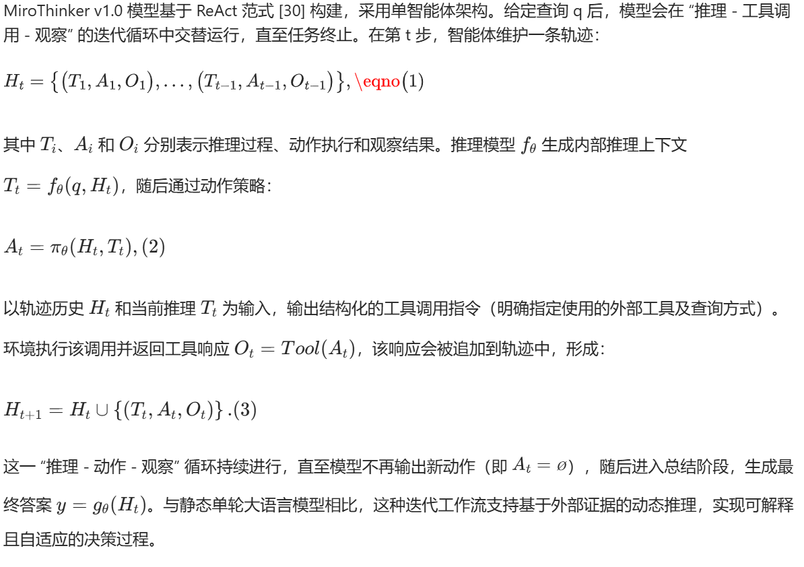

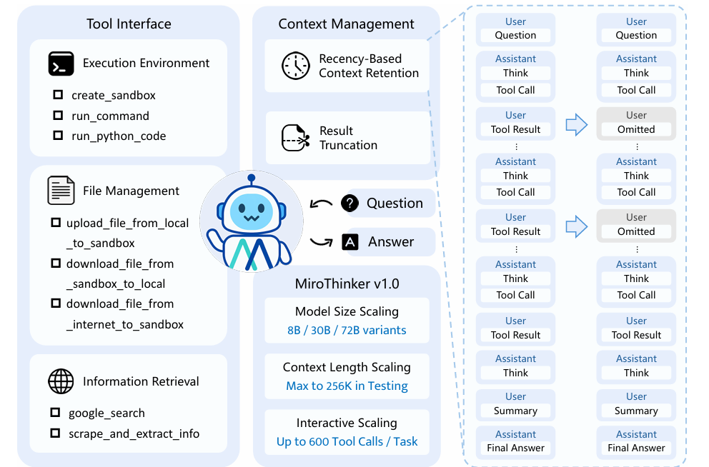

配备了模块化工具接口，暴露一系列专用工具。每个工具封装特定功能（如代码执行、文件处理或网络检索），使模型能够突破纯文本生成的局限

**工具接口**   
执行环境（Execution Environment）
文件管理（File Management）
信息检索（Information Retrieval）

**上下文管理**
基于时效性的上下文保留（Recency-Based Context Retention）：在标准 ReAct 范式 [30] 中，所有工具输出都会保留在消息历史中，常导致上下文利用效率低下。实证发现，模型后续动作主要依赖近期观察结果，而非早期信息。

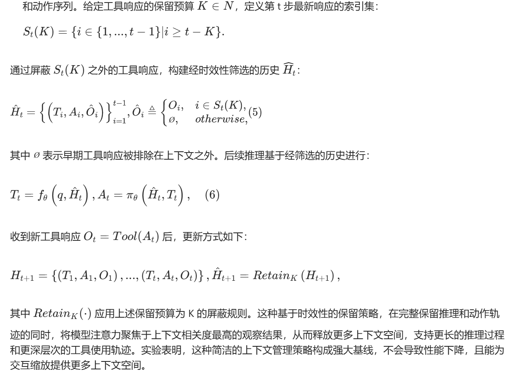

写这么复杂实际上就是选了此前一段时间的

结果截断（Result Truncation）：部分工具（如 run_command 和 run_python_code）偶尔会产生过长输出，易导致模型上下文溢出。为缓解这一问题，我们对超过预定义长度限制的工具响应进行截断，并在末尾添加标签 “[Result truncated]” 以提示内容已缩短。

## 数据构建（Data Construction）

**多文档问答（MultiDocQA）合成**

**智能体轨迹合成**

智能体范式             工具调用机制                  多样化数据合成
ReAct+MiroFlow  函数调用+模型上下文协议（MCP） 采用多个领先的大语言模型驱动轨迹合成过程

**开源数据收集**

## 训练流水线
MiroThinker 基于开源的 Qwen2.5 和 Qwen3 模型构建，采用三阶段训练流程：
（1）监督微调（Agentic Supervised Fine-tuning），确立基础智能体行为；
（2）偏好优化（Agentic Preference Optimization），使决策与任务目标对齐；
（3）强化学习（Agentic Reinforcement Learning），驱动模型在真实环境中进行创造性探索与泛化。

### 监督微调

第一阶段通过监督微调（SFT）赋予 MiroThinker 智能体行为，模型学习模仿包含多跳推理和工具使用的专家轨迹。

**数据构建**
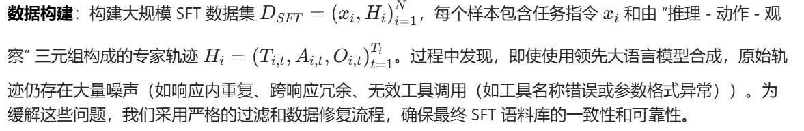

**训练目标**
每条轨迹被视为用户与助手的多轮对话 —— 用户提供初始任务指令 x 及后续工具观察结果 Ot，助手生成推理过程 Tt和工具调用指令 At。训练阶段不实际执行工具调用，观察结果为预录内容并作为上下文输入。

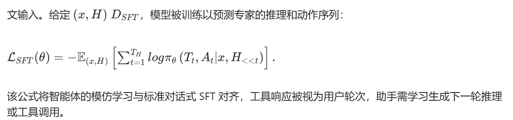 

对每条专家轨迹，在第𝑡步，在给定任务指令 + 之前所有历史（推理、动作、观察）的情况下，
让模型尽可能高概率地生成和专家一模一样的"当前推理 ​+ 当前动作"

### 偏好优化

第二阶段通过直接偏好优化（DPO）优化决策能力，偏好数据源自 SFT 模型合成。

**数据构建**

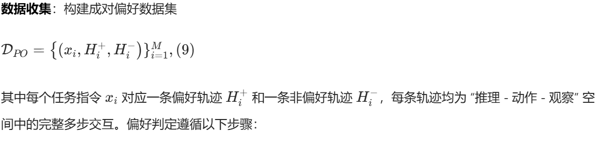

判断标准：仅以正确答案
质量控制: 推理连贯、包含明确规划过程且最终答案清晰正确 过滤存在重复、截断或格式异常等表面问题的样本，仅保留高质量轨迹

**训练目标**
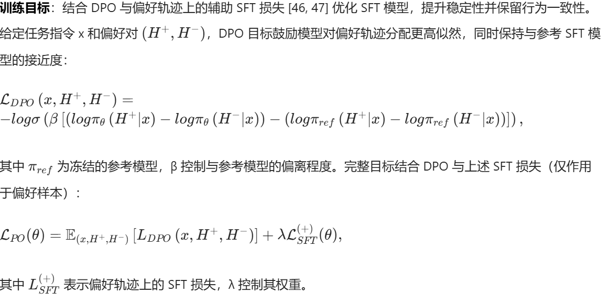 

### 强化学习
最后阶段利用强化学习，使智能体通过与真实环境的直接交互和探索，发现创造性解决方案并适应多样真实场景。我们采用组相对策略优化（GRPO），通过滚动轨迹对策略模型进行一次在线策略更新。

**流式滚动加速**  每个智能体工作器从任务队列中流式接收提示，直至收集到足够的本轮完成轨迹；所有未完成任务将推回任务队列供下一轮迭代s

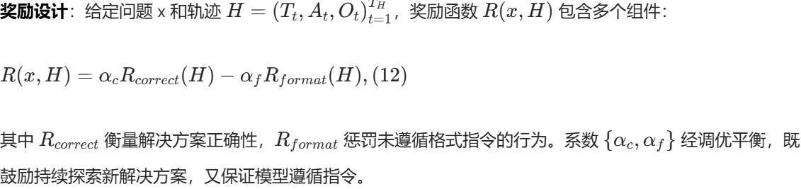

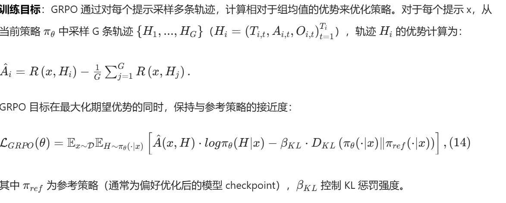

前半部分：GRPO 优化
后半部分：偏移控制，与参考策略的距离不能太大

----------------
## 实验和结论
### 配置 性能
以 Qwen2.5 和 Qwen3 模型为初始化基础，训练后在多个智能体基准上评估 MiroThinker v1.0
工具已明确禁用对 HuggingFace 的访问
.....

### 交互扩展
均展现出比监督微调（SFT）版本更长、更深的交互轨迹。在可验证奖励的引导下，RL 使模型能够探索更全面的解决方案路径，显著提升交互深度，在得出结论前系统地测试多种策略并验证中间结果。
这种行为转变与准确率提升直接相关，平均带来 8-10 个百分点的增益。我们将这种交互深度与性能之间的稳定关联称为 “交互缩放”：随着**工具增强交互的频率和深度增加**，研究推理能力相应提升。这一维度与模型规模、上下文长度共同构成三大缩放维度，定义了 MiroThinker 迈向更通用智能体能力的路径。

### limitations
交互缩放下的工具使用质量  过长的推理链  语言混合  有限的沙箱能力

# 附录 

# Noun explanation && Extensive knowledge 
## test-time scaling
Test-time scaling 指的是：在模型参数不变的情况下，只在“推理阶段”额外投入计算资源，从而提升模型表现的一类方法。

它不依赖额外训练，不改变模型权重，也不改变数据分布
一次想得多深

eg
增加推理步数（最经典）
多样本 / 多路径推理
外部循环 / 反思
## Interactive Scaling
模型输出一个动作
环境 / 工具 / 人返回反馈
模型再基于反馈继续决策
重复多轮

模型能力来自“闭环交互”
不断和外界对齐、修正

## 智能体基础模型（Agent Foundation Models, AFMs）
这类模型不仅学习通用的语言理解能力，还在基础模型训练阶段就显式融入面向智能体的能力，如决策制定、工具使用以及与外部环境的交互。当前的研究尤其聚焦于代码智能体与搜索智能体，旨在提升模型在基于工具的问题求解、检索增强推理和自主任务执行等方面的能力。

GPT-5 [1]、Claude-4.5 [7]、Grok-3 [29]、Kimi K2 [2]、MiniMax M2 [3]、GLM-4.6 [4] 和 DeepSeek-V3.1 [5]

## 深度研究模型（Deep Research Models）

深度研究模型作为一类专门面向复杂多跳推理与长上下文、高检索强度任务的 LLM 智能体被提出。这些模型将动态信息检索与迭代式规划融入其工作流中，能够自主获取并综合知识，生成全面、深入的答案。

OpenAI Deep Research [24]、Claude Research [9]、Kimi-Researcher [23]、Grok DeepSearch [29]

## DPO
不需要显式奖励模型、不需要 RL 的偏好对齐方法，用来把模型对齐到“人类更喜欢的输出”

在 DPO 之前，主流是 **RLHF**:
训练一个 Reward Model 
把语言模型当成 policy
用 PPO 等 RL 方法最大化奖励

DPO 的动机：
能不能直接用偏好数据，跳过 reward model 和 RL

(x,y+,y-)
那训练后的模型应该给y+比y-更高的条件概率。
也即  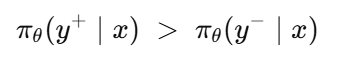   

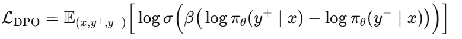

E：平均
当 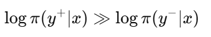 那么loss ~ 0  

## GRPO （Group Relative Policy Optimization）
GRPO 是一种不需要价值函数（critic）、不需要单独奖励模型的强化学习式对齐方法，它通过“同一问题下多答案之间的相对好坏”来更新模型

当前策略 𝜋𝜃采样 K 个完整输出 / 轨迹  y1 - yk
以某种方式给它们打分 r1 - rk
**这些分数只在“组内”比较**

模型不需要知道“绝对奖励是多少”，
只需要知道：“在这一组里，谁更好，谁更差”
与平均水平 rˉ 进行比较

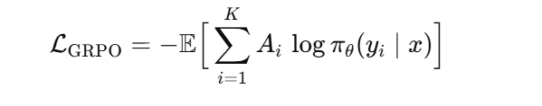

Ai​=ri​−rˉ
## KL（Kullback–Leibler divergence）
概率分布之间的差距
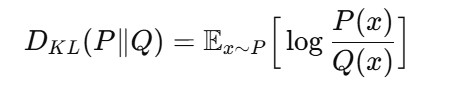

# 思考？
