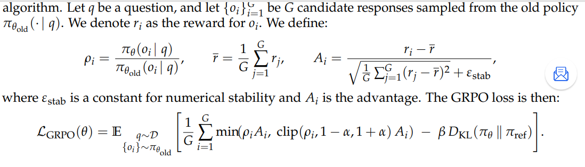
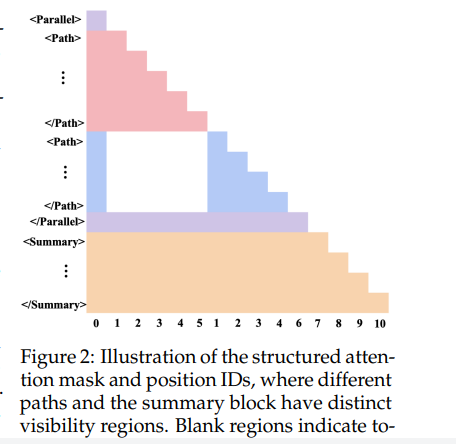
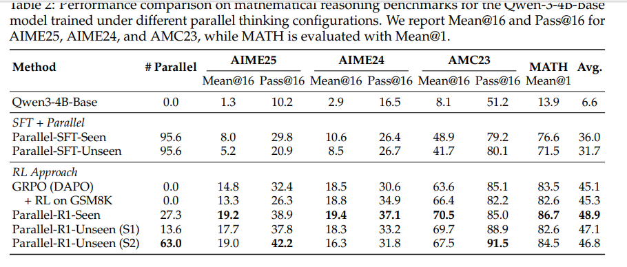
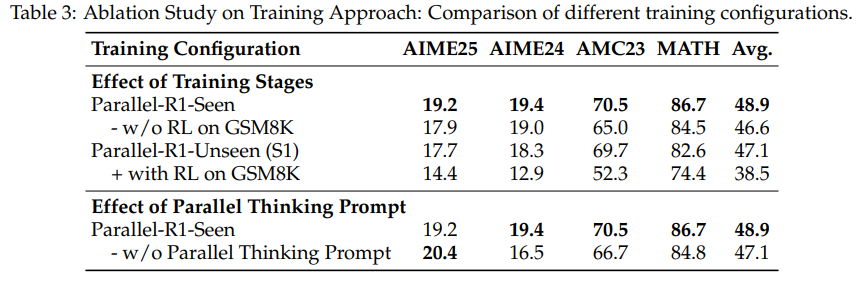
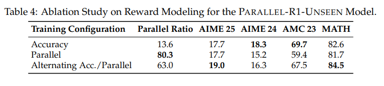
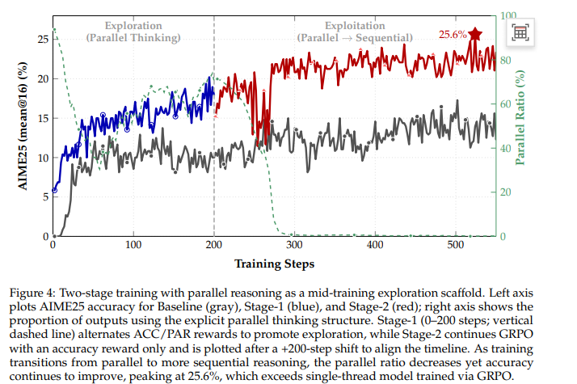

<!-- the first reinforcement learning (RL) framework
that enables parallel thinking behaviors for complex real-world reasoning tasks -->
<!-- Tencent AI Lab  -->
# Parallel-R1: Towards Parallel Thinking via Reinforcement Learning
并行思考（parallel thinking）已经成为提升大语言模型（LLM）推理能力的一种新方法，其核心在于同时探索多条推理路径

我们首先在较简单任务上，对提示词生成的轨迹进行 SFT，从而让模型初步具备并行思考能力

随后再切换到 RL，让模型在更困难的问题上探索并泛化这一能力

模型以标准的自回归方式生成内容，直到输出一个特殊的 <Parallel> 标签。此时，它会启动多个线程来探索不同的解决路径或视角，随后总结它们的输出。这些内容被合并回主上下文后，生成过程继续。该循环可能会重复数次，直至模型得出最终答案。

**并行思考与顺序思考结合**
**如何激活并行思考**

SFT:只是让模型学到表层模式匹配，而不是形成一种深层、内在的推理能力
RL:允许模型在探索中自行学习这类行为

首个面向通用数学推理任务

## related word
### 并行思考
一类常见的“蛮力式”策略是：在一开始就生成多条彼此独立的推理轨迹，最后再把它们的结果合并；或者让不同思路按照固定时间间隔彼此交换想法 -- 缺乏自适应性

Monte Carlo Tree Search 和 Tree of Thoughts 这样的方法提供了更精细的并行机制 -- 依然依赖于基于外部验证器而手工设计的启发式规则来引导

更近期的一些工作尝试通过 RL 或 SFT 来获得这种自适应性。然而，这些研究要么：
1. 主要关注效率问题——通过 SFT，把一条很长的单链式思维链无损地改写为自适应并行形式；但这种做法会限制新推理模式的发现；
2. 要么只在 Countdown 这类玩具任务上展示了 RL 的效果

### 通过 RLVR 提升推理能力
近期研究已经表明，RLVR 在许多不同领域中都很有效，包括：
数学问题求解，代码生成，多模态推理，关系抽取，以及交互式 GUI 导航。

不过，这一方向仍然面临一些重要挑战。现有方法在faithfulness（推理是否忠实反映真实思考过程）和robustness（鲁棒性）方面，往往还没有完全解决问题。更重要的是，大多数方法默认采用的仍然是严格的顺序推理范式

## 方法论
SFT 成功本质上完全依赖于预先生成好的训练数据质量,这使得方法高度依赖复杂而昂贵的数据流水线，尤其是在为最终的高难度问题生成训练数据时更是如此

冷启动->RL：
一种是不改模型架构；
另一种是修改模型架构。

SFT 只会让模型学会“长得像”，RL 才有机会让模型学会“什么时候该并行、怎么并行”
### 并行思考行为的形式化  （ 单条路径分叉，而不是多路径投票 ）
关键步骤（critical steps） ： 困惑或不确定的时刻

作者将 LLM 的并行思考形式化为两个阶段：

Exploration（探索）：当模型检测到一个关键步骤时，它会暂时中断主推理链，同时开启多线程搜索，生成 N 条彼此独立的轨迹。
Summary（总结）：探索结束后，模型把这些结果汇总，提炼关键见解，消除冲突，并得出最有希望的结论；随后再自动回到主推理链，继续后续推理。

**workflow**:
在推理时，模型首先在主推理过程中进行普通的自回归生成；当它预测出一个 **Parallel token** 时，就暂停主推理链，并在多个独立的 **Path.../Path** 块中同时展开多条推理线程；在所有并行线程生成完成后，模型会把这些输出自动整合进一个简洁的 **Summary.../Summary** 块中，从多个角度汇总见解；最后，再把这些并行思考上下文并回主链，继续完成剩余推理。这样的动态、自适应并行推理，能更有效地利用并行性。

### 简单的数据pipeline
**Key Finding 1** : 
一个强模型可以为 83.6% 的简单 GSM8K 问题生成有效的并行思考轨迹，但对于更困难的 DAPO 问题，则一条有效轨迹都生成不出来，成功率为 0.0%。

使用详细的 zero-shot prompt，为这些较容易的问题构造大规模、高质量语料+算法过滤：Parallel Thinking Format Check

“冷启动”数据不是用来教模型如何解决最终目标任务的，而是专门用来教模型并行思考的“格式”

### 强化学习与思考(不修改模型架构 Parallel-Seen)
利用 RL，把这种格式和能力从简单问题推广到更困难的数学任务上

RL 优化的不只是“答案对不对”，而是一整套何时触发 <Parallel>、如何展开 <Path>、如何写 
 的策略。

整体训练分三阶段:
1. 冷启动(SFT)
   使用蒸馏版 Qwen3-8B 模型（即 DeepSeek-R1-0528-Qwen-3-8B）生成高质量并行思考输出，并抽取其中非 thinking 部分（最终短 CoT）作为 gold annotation
   GSM8K 训练集 -> Parallel-GSM8K 7k样本  学习基本格式
2. RL Easy Math
   after 1 生成标签能力仍然不稳定  此阶段使用与冷启动相同的问题集合，并采用 GRPO 训练
   奖励 R_final = R_parallel * R_acc
3. RL General Math
   GRPO RL  仅使用 Racc 提升任务表现

### 结构化模型+强化学习(修改模型架构 Parallel-Unseen)
两项机制：
1. path-window masking
   限制 <Path> 块内的每个 token 只能看到同一路径中的 token 以及共享上下文，从而阻止跨路径信息泄漏
2. multiverse position encodings
   为每条路径分配互不重叠的位置索引集合，确保不同路径的位置嵌入空间不会重叠
   prefix: 1 2 3 4
   Path A: 101 102 103
   Path B: 201 202 203

直接把seen训练方案搬到unseen无效，者把原因归结为：attention mask 从简单数学迁移到困难数学时泛化很差。为解决这一问题，作者移除了第一阶段 RL，并重新设计了奖励计划，评估两种备选方案

(S1) Accuracy-only：只优化任务正确性，不直接鼓励并行使用。
(S2) Alternating accuracy and parallel：在固定窗口 W=10 步中交替使用两类奖励。
     80% ：仅R_acc
     20% ：acc并parallel : 1.2 acc :1.0 in_acc: -1.0

通过这样的设计，Parallel-R1-Unseen 既能利用结构隔离的优势，又能避免对表层并行模式的过拟合

{这说明在 RL 场景里，更“正确”的结构先验，不一定带来更好的优化行为。这是很值得琢磨的点。}

## 实验
### setup
model : Qwen3-4B-Base
evaluation : AIME’24 AIME’25 AMC’23(mean@16 pass@16)   MATH(1回答，1.0T)
training : 
代码基于 VERL 改写，训练时基本遵循其官方 recipe，没有额外做超参数调优。
在 cold start 阶段，作者在构造出的 Parallel-GSM8K 上做 SFT；
在 Stage 1 中，可选地在 GSM8K 上再做 RL；
在 Stage 2 中，在 DAPO 训练集上做 RL 300 个 gradient update steps。

### main results

Parallel-R1 确实比强 baseline 更好
只靠 SFT 不够
Seen 反而最好
这个很有意思。按直觉，Unseen 更“真正并行”；但结果上最强的是 Seen。说明在这个 setting 下，RL 可优化性 比 “结构上更纯粹” 更重要。
### analysis
**训练方式消融**
S1unseen + 一阶段RL 反而会严重伤害性能，平均下降 8.6%
作者 ： 这是因为结构化 attention mask 在简单数学任务上学到的模式，无法很好迁移到更困难数学问题的分布中，从而导致对表面模式的过拟合

对因果模型来说，stage 1 RL 对“启动自适应并行思考”很关键；
对结构化模型来说，则需要完全不同的 training recipe 和 reward schedule，才能有效泛化。

既然冷启动 SFT 已经把格式教会了，为什么还要在 easy math 上再做一段 RL？
作者给出的答案是：
对 Seen：必须要，因为 SFT 只教“会写”，stage 1 RL 才教“会用”
对 Unseen：不能照搬，因为它会把结构 mask 在简单题上的模式学死，迁移到难题时反而崩。

------
**提示词消融**
作者还做了关于并行思考 prompt 的消融。表 3 显示，去掉这个 prompt 会带来最高约 1.8% 的平均性能下降。
这表明，在训练中提供更细致的指令，有助于模型更好理解推理过程，而不只是记住输出模式
------
**奖励消融**

交替奖励能更好地平衡两者
------
**RL训练期间并行思考行为的演化**
Key Finding 2：模型的并行思考行为会在 RL 训练过程中持续演化：从早期的计算性探索，逐渐转变为后期的多视角验证。

随着 RL 训练推进，<Parallel> block 的平均相对位置不断上升。这说明模型越来越倾向于在推理链的更后面才使用并行思考，而不是一开始就用

模型学会了一种更**风险规避（risk-averse）**的方式来确保答对：

先用一条高置信度主路径推出候选解；
再在最后部署 <Parallel> block，从多个视角做验证

------
**EX：把并行思考作为RL训练中期的探索策略**
Key Finding 3：并行思考本身可以作为一种有效的、结构化的探索机制，用来提升 RL 训练。

RL 的一个根本挑战，是要保证模型足够探索策略空间，避免陷入局部最优。作者认为，如果强制模型在某些推理步骤生成多个并行 thought blocks，就相当于加入了一种强归纳偏置，逼迫模型做更有结构、更多样的探索，从而把它引向更鲁棒的策略空间

验证:分阶段训练

前200用S2的交替奖励
200后禁用准确率

这种性能提升发生在模型对显式并行结构的依赖下降的同时。也就是说，stage 2 中并行比例在下降，但准确率还在继续上升
## conclusion
作者提出了一种渐进式训练 curriculum，并配合一个简单且可扩展的数据管线，把这一复杂技能成功地启动出来。他们通过将格式学习、行为学习和核心推理能力学习分成不同阶段，逐步完成了这一能力的训练。实验表明，他们的方法在多个困难数学推理 benchmark 上，相比强 baseline 都取得了稳定的准确率提升

模型学到了一种风险规避策略；
它会把并行思考从早期的计算性探索，转移到后期的多视角验证；
更重要的是，作者识别并验证了并行思考作为训练中期脚手架的潜力：加入一个临时的、被强制的探索阶段，可以在 RL 训练后解锁更高的性能上限。

## appendix
1. Baseline Prompt：就是普通的 “Let’s think step by step ... Final Answer:”。
Parallel Thinking Prompt：这是更关键的。它明确要求模型在“适合多视角或独立推理”的步骤插入 <Parallel>，并且：
每个 <Parallel> 里至少要有两条独立 <Path>
<Path> 之间不能互相编号、互相引用
</Parallel> 后面要立刻接一个 

这种过程要按需反复出现
最后仍然以 Final Answer: 结尾。

2. 格式检查算法，用来判断并行思考轨迹是不是well-formed。它本质上就是一个栈检查器

3. 两个 case

# Noun explanation && Extensive knowledge 
## GRPO (Group Relative Policy Optimization)
不是单独给每个回答打“绝对分”，而是把同一道题采样出来的一组回答放在一起比较，谁比同组平均水平更好，就往谁那个方向更新

## RLVR（Reinforcement Learning with Verifiable Rewards，可验证奖励强化学习）
是一种通过强化学习来优化语言模型的方法。它使用的是基于结果、并且能够自动检验的奖励，因此不需要训练额外的奖励模型，也不需要逐步级别的人类标注

# 思考？
这篇论文里的“子线程 / threads”主要是“推理上的概念线程”，不是你平时理解的那种真的开了系统线程或独立进程。
也就是说，<Path> 更像是模型输出中的“并行分支段落”。论文没有给出任何运行时实现，证明它真的在硬件或程序层面启动了多个并发 worker

并不是真正独立执行的子线程