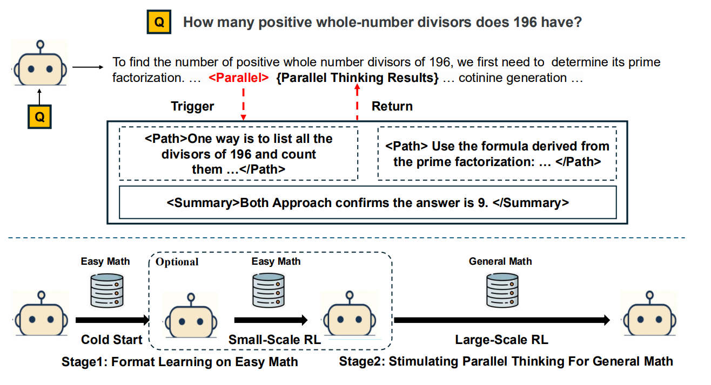

<!-- the first reinforcement learning (RL) framework
that enables parallel thinking behaviors for complex real-world reasoning tasks -->
<!-- Tencent AI Lab  -->
# Parallel-R1: Towards Parallel Thinking via Reinforcement Learning
并行思考（parallel thinking）已经成为提升大语言模型（LLM）推理能力的一种新方法，其核心在于同时探索多条推理路径

我们首先在较简单任务上，对提示词生成的轨迹进行 SFT，从而让模型初步具备并行思考能力

随后再切换到 RL，让模型在更困难的问题上探索并泛化这一能力

模型以标准的自回归方式生成内容，直到输出一个特殊的 <Parallel> 标签。此时，它会启动多个线程来探索不同的解决路径或视角，随后总结它们的输出。这些内容被合并回主上下文后，生成过程继续。该循环可能会重复数次，直至模型得出最终答案。

**并行思考与顺序思考结合**
**如何激活并行思考**

SFT:只是让模型学到表层模式匹配，而不是形成一种深层、内在的推理能力
RL:允许模型在探索中自行学习这类行为

首个面向通用数学推理任务

## related word
### 并行思考
一类常见的“蛮力式”策略是：在一开始就生成多条彼此独立的推理轨迹，最后再把它们的结果合并；或者让不同思路按照固定时间间隔彼此交换想法 -- 缺乏自适应性

Monte Carlo Tree Search 和 Tree of Thoughts 这样的方法提供了更精细的并行机制 -- 依然依赖于基于外部验证器而手工设计的启发式规则来引导

更近期的一些工作尝试通过 RL 或 SFT 来获得这种自适应性。然而，这些研究要么：
1. 主要关注效率问题——通过 SFT，把一条很长的单链式思维链无损地改写为自适应并行形式；但这种做法会限制新推理模式的发现；
2. 要么只在 Countdown 这类玩具任务上展示了 RL 的效果

### 通过 RLVR 提升推理能力
近期研究已经表明，RLVR 在许多不同领域中都很有效，包括：
数学问题求解，代码生成，多模态推理，关系抽取，以及交互式 GUI 导航。

不过，这一方向仍然面临一些重要挑战。现有方法在faithfulness（推理是否忠实反映真实思考过程）和robustness（鲁棒性）方面，往往还没有完全解决问题。更重要的是，大多数方法默认采用的仍然是严格的顺序推理范式

## 方法论
SFT 成功本质上完全依赖于预先生成好的训练数据质量,这使得方法高度依赖复杂而昂贵的数据流水线，尤其是在为最终的高难度问题生成训练数据时更是如此

冷启动->RL：
一种是不改模型架构；
另一种是修改模型架构。

SFT 只会让模型学会“长得像”，RL 才有机会让模型学会“什么时候该并行、怎么并行”
### 并行思考行为的形式化  （ 单条路径分叉，而不是多路径投票 ）
关键步骤（critical steps） ： 困惑或不确定的时刻

作者将 LLM 的并行思考形式化为两个阶段：

Exploration（探索）：当模型检测到一个关键步骤时，它会暂时中断主推理链，同时开启多线程搜索，生成 N 条彼此独立的轨迹。
Summary（总结）：探索结束后，模型把这些结果汇总，提炼关键见解，消除冲突，并得出最有希望的结论；随后再自动回到主推理链，继续后续推理。

**workflow**:
在推理时，模型首先在主推理过程中进行普通的自回归生成；当它预测出一个 **Parallel token** 时，就暂停主推理链，并在多个独立的 **Path.../Path** 块中同时展开多条推理线程；在所有并行线程生成完成后，模型会把这些输出自动整合进一个简洁的 **Summary.../Summary** 块中，从多个角度汇总见解；最后，再把这些并行思考上下文并回主链，继续完成剩余推理。这样的动态、自适应并行推理，能更有效地利用并行性。

### 简单的数据pipeline
**Key Finding 1** : 
一个强模型可以为 83.6% 的简单 GSM8K 问题生成有效的并行思考轨迹，但对于更困难的 DAPO 问题，则一条有效轨迹都生成不出来，成功率为 0.0%。

使用详细的 zero-shot prompt，为这些较容易的问题构造大规模、高质量语料+算法过滤：Parallel Thinking Format Check

“冷启动”数据不是用来教模型如何解决最终目标任务的，而是专门用来教模型并行思考的“格式”

### 强化学习与思考(不修改模型架构)
利用 RL，把这种格式和能力从简单问题推广到更困难的数学任务上

### 

##

# Noun explanation && Extensive knowledge 
## GRPO

## RLVR（Reinforcement Learning with Verifiable Rewards，可验证奖励强化学习）
是一种通过强化学习来优化语言模型的方法。它使用的是基于结果、并且能够自动检验的奖励，因此不需要训练额外的奖励模型，也不需要逐步级别的人类标注

# 思考？
