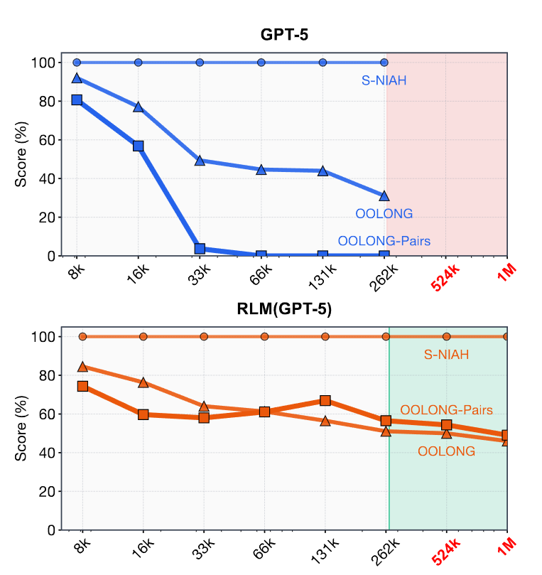
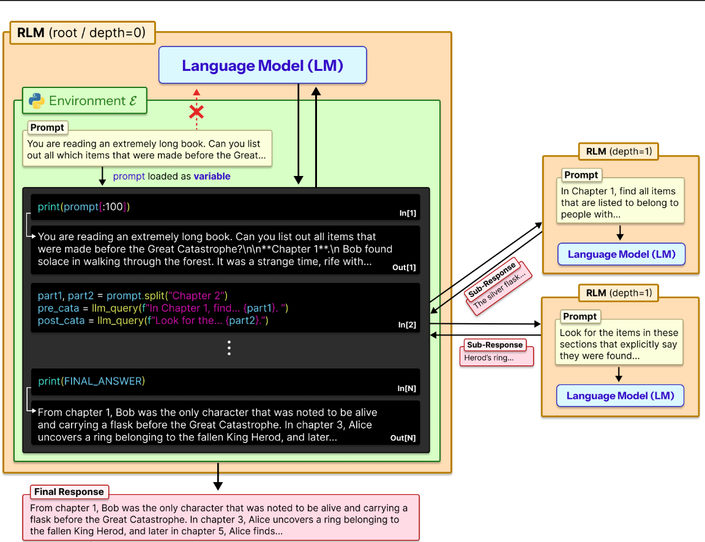
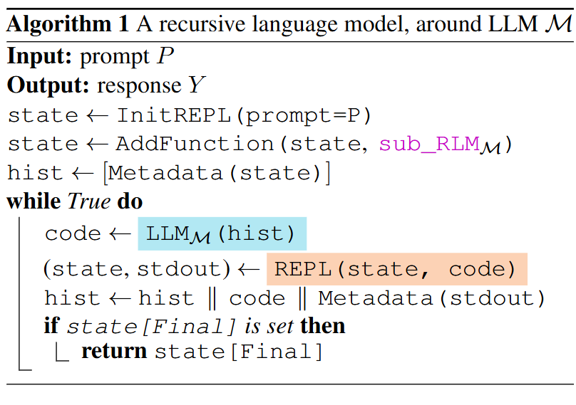
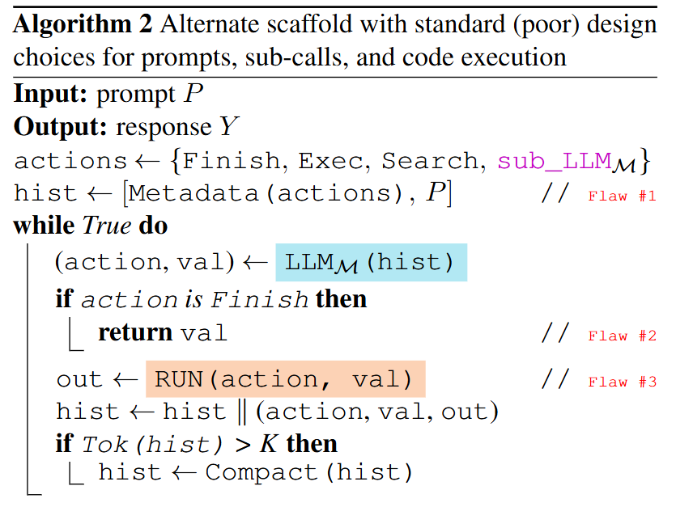
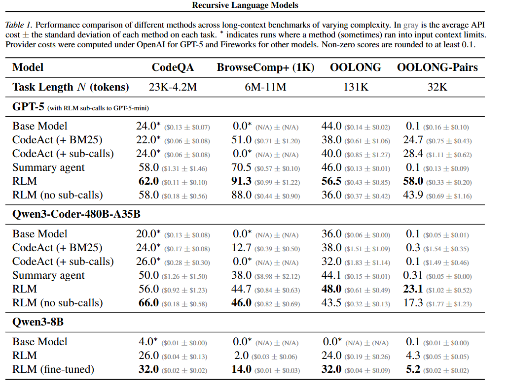
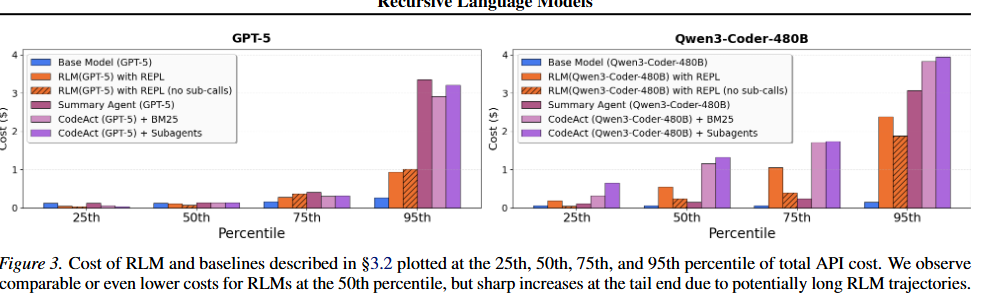

<!-- 提出了一种全新的长上下文推理框架 —— 递归语言模型（RLM） -->
<!-- 代码里可以调用 llm_query()，对子片段再跑一次 LLM，形成递归。 -->
# Parallel-R1: Towards Parallel Thinking via Reinforcement Learning
提出递归语言模型（RLM），一种通用推理范式：它将长提示视为外部环境的一部分，允许大模型以程序化方式检查、分解提示，并对提示片段递归调用自身

RLM 能够成功处理超出模型上下文窗口两个数量级的输入；即便在较短提示下，在四类多样化长上下文任务上，其效果也显著优于原生顶尖大模型与常见长上下文框架

## intro 
RLM的核心思想:
任意长度的用户提示不应直接送入神经网络（如 Transformer），而应被视为外部环境的一部分，让大模型以符号化、递归的方式与之交互

1. 纯提示词
2. 小规模后训练()

## RLM
给定任意长度的提示字符串 P，RLM 与一个持久化的外部环境 ε 交互，并返回一个响应字符串 Y（如图 2）。我们**希望实现**：

实际上无界的输入 token 数（|P| ≫ K）
无界的输出 token 数
无界的语义处理范围，例如能够完成 Ω(|P|) 或 Ω(|P|²) 量级的语义工作

**现有 LLM 可以通过提示词做到这一点，而将一个 8B 模型训练为原生递归模型也非常有前景**

只有标准输出的元信息（如短前缀、长度）会被追加到 M 的历史记录中，用于下一次迭代

RLM

RLM 算法 1 将长提示外置到 REPL 环境作为变量，根模型仅持有元信息与执行日志，不加载全文；通过生成代码切片、遍历、递归调用子 LLM处理片段，中间结果存在环境变量，最终输出 FINAL 结果。全程不突破基座上下文窗口，可处理无限长度输入。

传统智能体

缺陷 1：把提示 P 直接放进上下文窗口
缺陷 2：用 Finish 直接自回归输出答案
缺陷 3：子调用不是 “程序化递归”，只是口头说

**三个关键设计**:
1）将提示作为外部符号句柄
2）输出不由自回归生成限制
3）必须支持符号化递归

## 扩展长上下文任务(实验)
### task
按照复杂度随提示长度增长的方式来刻画任务

大海捞针（NIAH）：需要找的信息固定，复杂度 O (1)
OOLONG：答案几乎依赖每一行，复杂度 O (N)
OOLONG-Pairs：需要两两组合，复杂度 O (N²)

任务介绍:
S-NIAH 单针大海捞针任务，从大量无关文本中找到特定短语或数字。
BrowseComp-Plus 面向深度研究的多跳问答基准 需要跨多篇文档推理
OOLONG 长上下文推理基准 几乎需要用到每一条数据
OOLONG-Pairs OOLONG 的改造版本，要求聚合成对条目来构造答案
LongBench-v2 CodeQA 代码仓库理解的多选题基准，对当前顶尖模型具有挑战性
### baseline
GPT-5
Qwen3-Coder-480B-A35B

对比以下通用方法：
**CodeAct（+ BM25）**与 RLM 不同：它不会将提示卸载到代码环境，而是直接提供给 LM。
**CodeAct + 子调用** 支持子 LM 调用的 CodeAct。仍然将上下文直接加载到模型中
**Summary agent（摘要智能体）** 当上下文填满时迭代压缩上下文
**RLM with REPL ** 本文的核心方法
**RLM with REPL（无子程序）** 消融实验：有 REPL 环境，但不能递归调用子模型( without the ability to invoke sub-LM calls)
**Finetuning（RLM-Qwen3-8B）** 在小规模上做的原生递归模型训练

## result & discussion

observation 1 : RLM 可扩展到千万 token 级别，并在长上下文任务上超过基础 LLM 与现有通用智能体框架   RLM 可以轻松超越基础模型的上下文窗口限制

observation 2 (递归消融): REPL 对处理长输入至关重要，递归子调用在信息密集型输入上带来巨大收益

observation 3 :LLM 性能随输入长度与任务复杂度下降，而 RLM 的扩展性好得多

observation 4 :RLM 推理成本与基础 LLM 相近，但因轨迹长度不同而具有高方差

observation 5 :RLM 是模型无关的推理策略，但不同模型在上下文管理与子调用上表现不同

observation 6 :在一个领域上训练 RLM 可提升下游泛化性能

training-free
即使没有显式训练，RLM 也表现出清晰的长上下文分解行为
分块 + 递归调用 LLM  用代码过滤输入  通过变量传递递归输出

## 相关工作/未来工作
目前处理长上下文 :
修改模型架构并重新训练 原生支持
在模型外层搭建框架

limits:
同步调用导致速度慢
仅使用了一层递归
原生训练 RLM 潜力巨大
## appendix
A : 额外训练细节

B : 失败尝试（负结果）

统一提示词在不同模型上会出问题
代码能力弱的小模型做不好 RLM
输出长度不够的模型会卡住
同步调用很慢
结构化输出（FINAL 标记）不稳定

C : 详细提示词

D : 额外基准细节

E : 更多 RLM 轨迹案例

F : 额外运行时间 & 成本分析
# Noun explanation && Extensive knowledge 

# 思考？
只做了一层递归，可探索更深递归

# 问题?
## 如何split 提示词
1）均匀分块
2）按行拆分（OOLONG 任务）
3）正则 / 关键词截取 (BrowseComp+ 轨迹)
4）按文档拆分（BrowseComp+）

exp:
chunk = context[10000:20000]
ans = llm_query("提取这段的核心事件", chunk)

## 子程序上下文
先探查上下文（长度、前缀）

{The root is instructed to operate like an RLM: generate code to peek into, decompose the prompt.
You can check the content of the ‘context‘ variable (e.g. print length, print prefix).}

选择拆分策略

{The choice of decomposition can greatly affect task performance.Uniform chunking or keyword searches.
}

--

不超过子模型窗口

{You have a total context window of approximately ~32k tokens.Be careful not to exceed this.}

只给小片段 + 小任务

{Only (constant-size) metadata … is appended to M’s history.The sub-RLM is invoked on programmatically constructed snippets.}

不重叠、不冗余

任务决定内容

{For information-dense tasks, need to process every line / every pair.For needle-in-haystack, only search relevant chunks.
}

## RLM with REPL（无子程序）的具体逻辑？ ？存疑
You can access, transform, and analyze this context interactively in a REPL environment.

You can:
- peek the context
- slice the context
- read parts of context
- print pieces of context
- use regex to search
- store variables

You CANNOT invoke sub-LLMs / llm_query()

## 训练方案
8B 全量微调

