<!-- 让 agent 主动把某个子任务“分叉出去做”，做完后再“折叠回来”  branch/return RL(flodGRPO)
让 agent 在“子任务天然闭合”的地方折叠上下文-->
<!-- ByteDance Seed  -->
# Scaling Long-Horizon LLM Agent via Context-Folding
我们开发了一个端到端的强化学习框架 FoldGRPO，并设计了专门的过程奖励，以鼓励有效的任务分解和上下文管理

1. 长时程 agent 的工作上下文不可持续增长
2. 主动的、过程性的上下文管理动作
3. 可以通过 RL 学出来的能力
   
现有长时程方法:
1. 基于摘要的方法(填满后压缩)
2. 多智能体系统(将任务分配给专门的智能体来管理上下文长度)

提出 **Context Folding（上下文折叠）**
1. branch 动作，用于创建一个临时子轨迹来处理局部子任务；
2. return 动作，用于总结结果并回到主线程，在此之后，该分支中的中间步骤会被“折叠”——即从上下文中移除——只保留 return 调用中给出的简洁摘要。

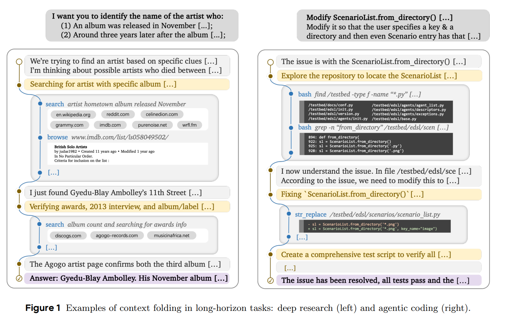

**关键创新:FoldGRPO** 在标准GRPO上加入了
1. 动态折叠的 LLM 上下文
2. 稠密的、token 级别的过程奖励，直接引导上下文折叠行为

我们的 RL 算法教会模型如何把问题有效地分解为适合分支处理的局部子任务，这一过程由 Unfolded Token Penalty 引导，用于抑制在主上下文中进行高 token 开销的操作
模型还通过 Out-of-Scope Penalty 学会在子任务内部保持聚焦，并学会在摘要中保留关键的信息，以帮助完成最终目标

contributions : Context Folding  FoldGRPO  在长时程基准上展示了有前景的性能

## 方法论
### 标准范式
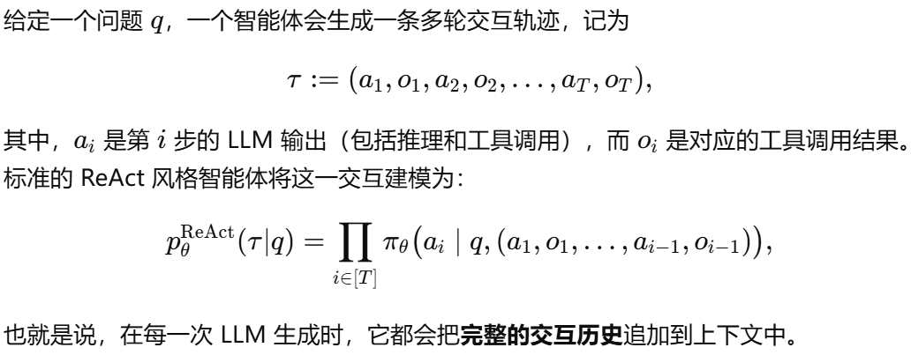

### context Folding
设计了  (i) branch(description, prompt)  (ii) return(message)
description 是该子任务的简要概述，prompt 是该分支的详细指令
message 描述了该分支的结果

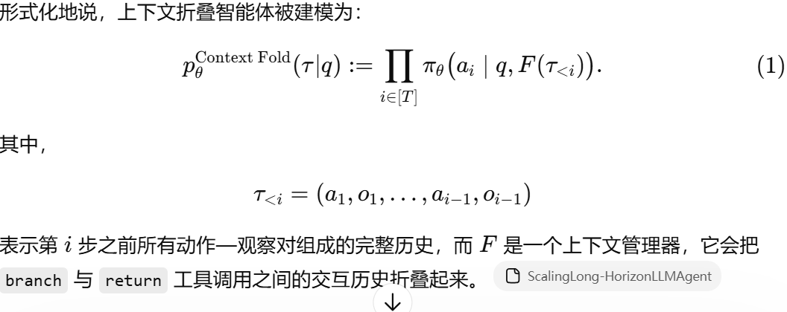

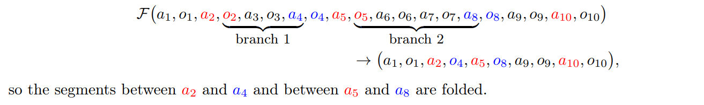

推理效率 : 维护的是一个上下文 KV-cache：当调用 return 动作时，它会把 KV-cache 回滚到与该分支对应的位置

实例化方式 : 采用一种 plan–execution 框架，其中智能体在两种状态之间交替
(i) Planning State（规划状态）：智能体在主线程中进行高层推理、分解任务，并决定何时为一个子任务创建分支。在这个状态中，会抑制高 token 开销的工具使用，以使主上下文聚焦于高层策略。
(ii) Execution State（执行状态）：智能体在一个活动分支中完成其被分配的子任务。为了保持结构清晰、避免嵌套复杂性，在执行状态中禁止再创建新的分支。

### FoldGRPO 面向 Context-Folding Agent 的端到端 RL
原始GRPO PPO-style update+group-relative advantage

FoldGRPO 对整个交互轨迹进行联合优化，这个轨迹既包括主线程，也包括那些子任务分支
输入：折叠后的轨迹  优势函数：不仅考虑正确性

FoldGRPO 的两个关键特征是
1. Context folding
   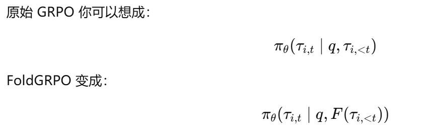
2. Process reward signal
   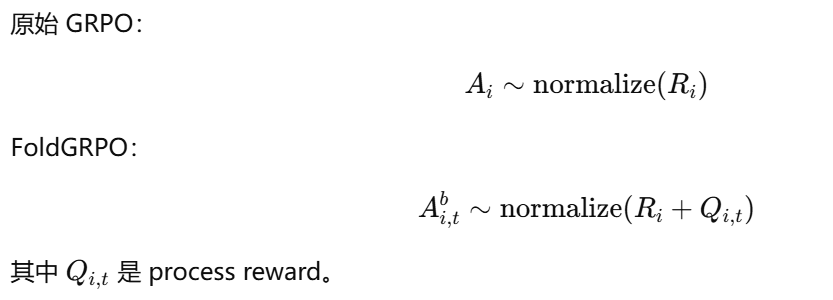
   主线程过长时有 Unfolded token penalty，branch 越界时有 Out-of-scope penalty，失败工具调用有 Failure penalty

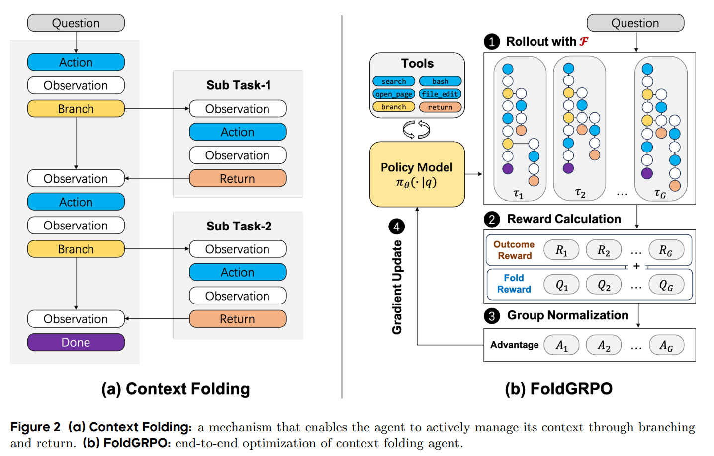

### Context Folding 和其他方法的联系
与常见的多智能体系统相比，我们的设计有以下不同：
(i) Context folding 不采用预定义的子 agent；相反，子 agent 是由主 agent 按需动态创建的；
(ii) 所有 agent 共享同一个上下文前缀，因此对 KV-cache 更友好；
(iii) 主 agent 和子 agent 是交错执行的，而不是并行运行的

与启发式的、基于摘要的上下文管理方法相比，这类方法会在任意时点丢弃细节；而 context folding 可以被看作是一种可学习的摘要机制，并且这种摘要是和子任务边界对齐的。这能够保证：推理过程在执行期间被保留下来，只有当它的效用已经实现之后，才会被压缩

## 实验
### datasets
深度研究（deep research） 和 agentic software engineering

**Deep Research**
BrowseComp-Plus (BC-Plus)

**Agentic SWE**
SWE-Bench Verified (SWEB-V)

难度分层,筛选

### Implementation
Seed-OSS-36B-Instruct 作为基础 LLM  RL,基于 VeRL no KL term

我们每次只维护 32K 的活动工作记忆
但通过 folding，可以在整个任务生命周期中处理最高 327K 量级的总交互

### Baseline
ReAct Agent，即始终保留全部上下文。我们考虑不同的上下文长度用于比较：
(a) short-context：32,768 tokens，与我们的方法上下文长度相同；
(b) medium-context：中间长度，例如 65,536 和 131,072；
(c) long-context：327,680，与我们方法的最大总 token 成本相同。

Summary Agent，当上下文满时触发一次 summary。我们将其最大上下文长度设置为 32,768，并允许 10 次 summary session，以进行公平比较

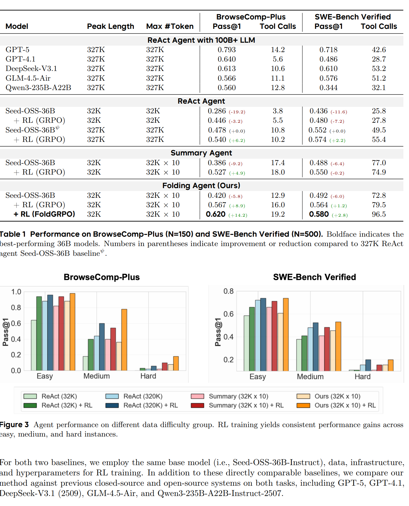

第一，context folding 这个机制本身就有价值，因为无 RL 版本已经比 32K ReAct 和 Summary 更强。
第二，真正把它推到最强的是 FoldGRPO，因为普通 GRPO 还不够，专门的过程奖励才让它把上下文管理行为真正学好

## 结果
### main
消融实验确认我们提出的 FoldGRPO 至关重要，它比 baseline GRPO 算法带来了显著更好的表现
性能提升与工具调用频率增加相关
### by difficulty
RL 训练在 easy、medium 和 hard 样本上都带来了稳定的性能提升。尤其值得注意的是，这种提升在 medium 和 hard 子集上显著更大
这些结果表明，agent 学会了把更多交互和计算分配给复杂问题，从而采取一种更自适应、更有效的问题求解策略

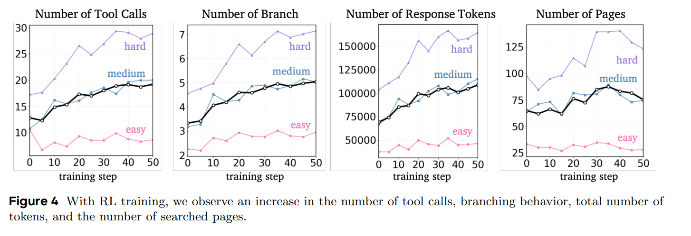

[越难的问题提升越明显]
### RL 算法 消融
我们可以看到，使用标准 GRPO baseline 训练会产生不良行为：
agent 会表现出更低的 Finish rate，生成过长的轨迹，并在子任务中失去焦点，这体现在更低的 Scope accuracy 上。这说明它没有有效地管理上下文。

我们的 FoldGRPO 修正了这些问题
它将主轨迹压缩到大约 8K tokens，同时总处理 token 超过 100K——实现了 90% 以上的上下文压缩，并展示了 agent 将长交互压缩为紧凑且有用历史的能力。

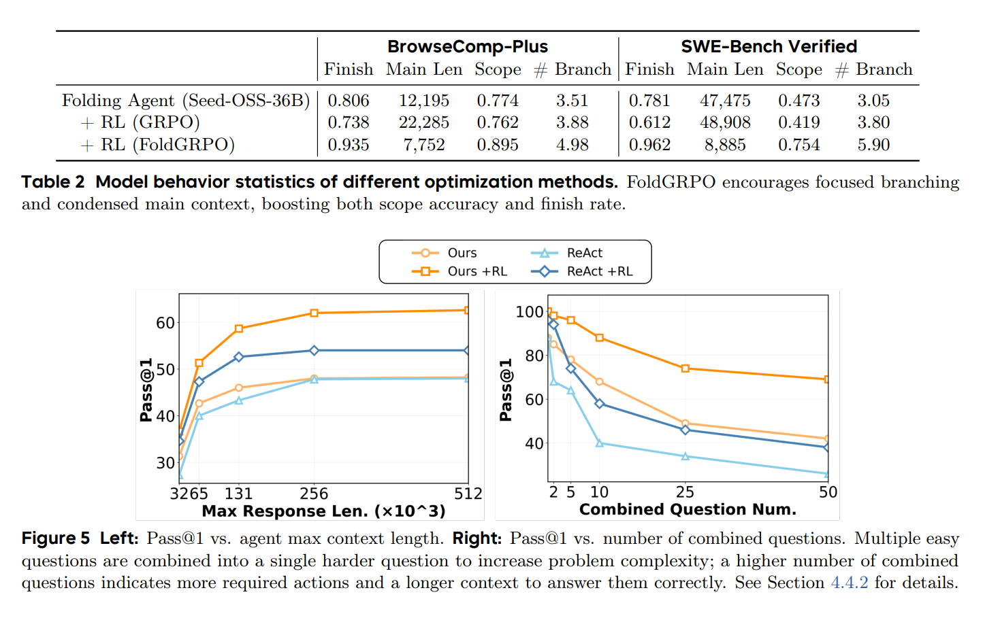

### Performance by Context Length
图 5
为了考察性能如何随着上下文长度扩展，我们在 BrowseComp 上评估了方法，并将分支数从 0 到 16 变化
作者发现，随着可用总预算增加，性能会上升；但到 320K 左右就开始 plateau

我们通过把多个问题组合成一个单独的复合查询，来提高任务复杂度，要求 agent 在一次会话中回答它们（图 6 给出了示例）。图 5（右）展示了当组合问题数从 1 到 50 时的结果。
在这个设定下，我们允许无限 branching
context folding 的收益变得更加明显，展示了很强的**长度泛化能力**(训练时最多 10 branches，测试时面对 50 个组合问题，平均用了 32.6 个 branches。)

### Further Analysis
**case study**
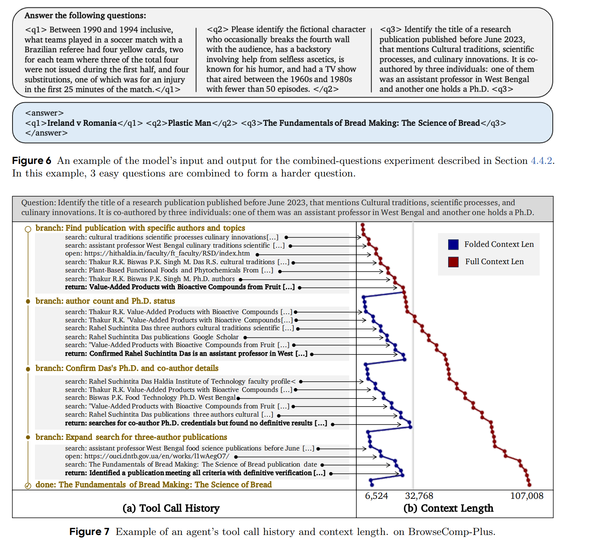

**Training Speed**
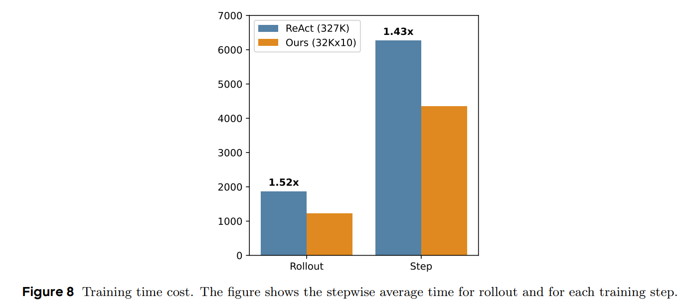

作者观察到，327K 的 ReAct 模型在每一步训练中的耗时更长。需要注意的是，论文使用了 async rollout

**Parallel Branching**
folding agent 是否能从 parallel branching——即同时创建多个并行运行的子分支——中受益，仍然是一个开放问题
parallel-branch 版本在 BrowseComp-Plus 上达到 0.6133 Pass@1
它优于 baseline，但与 single-branch 版本表现相近
训练后，parallel-branch agent 平均会创建约 2.3 个并行分支

并行 branch 会不会更强 不一定。
## related work / conclusion
上下文管理策略主要分为两种范式：

context summarization：agent 将信息卸载到外部 memory store，再在需要时取回
multi-agent collaboration：将任务划分给拥有聚焦上下文的专门 agent

强化学习能够通过环境反馈或人类反馈来有效地训练 agent，但过去主要关注的是外在的任务成功。对于内在技能的训练——例如 agent 如何管理自己的工作记忆——仍然是一个尚未充分探索的研究领域。
--

multi-layer context folding：发展层级化折叠策略

## appendix
1. 训练管线怎么适配多分支轨迹
训练时不是把所有 branch 子轨迹简单拼成一条长序列，而是把它们保留成“separate causally conditioned sequences”，也就是“彼此分开、但带因果依赖关系的多条序列”。作者还明确说，因此这种训练方式不能直接兼容现有基础设施，比如 VeRL

训练时要把“多分支轨迹”当成多条有关联的序列，而不是一条普通长文本。

工程优化
主 rollout 进程完成 95% 的 prompts 就先停下，剩下最慢的那些交给独立进程；更新语言模型时，使用的是“当前 batch 已完成的 95% + 上一步独立进程补完的数据”。

2. 不同任务的 system prompt / workflow 是怎么规定的
3. agent 实际能调用哪些工具，branch/return 具体怎么定义

# Noun explanation && Extensive knowledge 
## rollout/step
rollout  : 推理
step ： 更新参数

# 思考？
