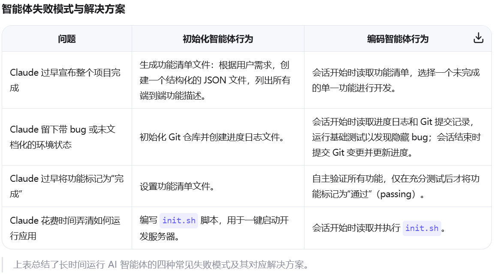

#  about context engineering

**提示词**(prompt)是人类直接输入给大语言模型(LLM)的指令或问题。在**早期AI应用中**，提示词工程(Prompt Engineering)是主要技术范式
核心关注点/feature:
静态交互：单次或短周期对话，无需维护长期状态
局部视角：关注如何编写"完美"的单次指令，而非整个交互流程
人类中心：人类承担主要认知负荷，负责将复杂任务分解为模型可处理的小步骤

Anthropic文档所述,提示词工程主要关注"如何编写有效的提示词，特别是系统提示词"，适用于早期一次性分类或文本生成任务

上下文(context)是大语言模型在生成响应时可见的所有token集合，包括但不限于：
系统指令与角色定义
用户与AI的对话历史
工具定义与调用历史
检索到的外部知识
记忆模块内容
环境状态信息

Anthropic将上下文定义为"模型采样时包含的token集合"，上下文工程(Context Engineering)则是"优化这些token效用的策略集合"

## from prompt to context 
随着大模型能力的飞速提升，情况开始发生变化。GPT-3的出现是一个转折点，随后的GPT-4、Claude 3等模型展现出前所未有的理解和生成能力。人们不再满足于简单的问答，而是希望AI能够完成需要多步骤推理、跨会话协作的复杂任务——比如开发一个完整的应用程序、进行深度的科研分析，或是协助完成一个需要数天时间的项目。这些长周期任务要求AI能够记住之前的进展，理解当前状态，并规划下一步行动。

模型开始处理多步骤、长周期任务
交互从"问答"扩展到"协作"
上下文窗口从扩展到128K+乃至百万级token

然而，仅仅通过优化提示词已经无法满足这些需求。Anthropic的工程师们发现，当他们让Claude尝试构建一个claude.ai的克隆版时，模型会倾向于一次性实现所有功能，导致代码在中途因上下文限制而中断，下一个会话开始时，新上下文中的模型不得不猜测之前发生了什么。有时，模型甚至会在项目完成一半时就宣布任务结束，因为它无法准确判断什么是"真正完成"。

Chroma的Context Rot研究（2025）揭示了关键问题：更长上下文窗口≠更好性能。即使在简单检索任务上，模型性能随上下文长度增加而显著下降，且受
语义相似度、干扰项、结构等因素影响。这一发现挑战了"无限扩展上下文"的天真假设，为上下文工程提供了**实证**基础。

Transformer架构的本质限制——每个token必须与上下文中所有其他token建立关联，形成O(n²)的计算复杂度。这意味着随着上下文增长，模型对每个token的注意力被不可避免地稀释，就像人类在信息过载时会失去焦点一样。
(Effective context engineering for AI agents - anthropic 中 对于 chroma 提出的 context Rot 的成因分析 )

提示词工程将AI视为静态函数：输入→处理→输出。而上下文工程将AI视为动态认知系统，其行为由整个状态空间决定。这一转变体现在：

时间维度扩展：从单次交互到跨小时/天的持续协作
信息维度扩展：从纯文本指令到多模态、工具化、记忆增强的综合状态
责任维度扩展：从人类提供完整指令到机器主动推断、管理、优化上下文

## 为何需要context engineering

[尽管随着模型能力进一步提高，模型可以接受的上下文越来越多，但这些研究者的实验和理论表明，这并不意味着我们可以通过无限制增加上下文长度来使得模型在解决更复杂，更多信息的问题中表现得更好]

因此,"上下文工程"（Context Engineering）应运而生。Anthropic将其定义为"优化模型采样时包含的token集合效用的策略集合"。这不再仅仅是关于"写什么提示词"，而是关于"如何在整个交互过程中精心策划每一次进入模型有限注意力预算的信息"。

GAIR论文进一步指出，上下文工程本质是熵减过程：
"人类交互依赖'填补空白'能力，而机器缺乏这一能力。人类需将高熵意图转化为低熵机器可理解信号。"

#  Context Engineering 2.0:The Context of Context Engineering
GAIR SJTU 综述性论文
系统地总结了二十年来前至今人类在 Context Engineering 上的工作，

包括对于context 的定义
{阿宁德・K・戴伊（Anind K. Dey）于 2001 年提出的定义成为该领域的基石（Dey, 2001a）：
“情境（上下文/context）是可用于描述实体所处状态的任何信息。实体指与用户和应用程序交互相关的人、地点或物体，包括用户与应用程序本身。”}

context 内容和形式的扩展
{先进传感器,信息的多种表现形式}

对于context的理解和应用

以及在此基础上，我们对于如何有效**利用context**开展的一系列工作，具体地

**情境采集与存储**
{单设备->分布式->生态系统(展望)}

**情境管理**
{
文本context: 时间戳  标记  压缩(问答对 / 分层笔记)

多模态context: 输入映射至可比向量空间   结合不同模态进行自注意力计算(统一的注意力机制)   交叉注意力实现模态间关注（key value 查询 不同模态 同语义）
}

**情境组织**
{
    记忆的分层架构
    

    该迁移函数代表记忆巩固过程 —— 短时记忆中频繁访问或高度重要的信息经处理后，成为长时记忆的一部分。迁移过程受重复频率、情感显著性、与既有知识结构的相关性等因素调控。
}

**情境隔离**
{
子智能体 : 每个子智能体都是专用的人工智能助手，拥有独立的情境窗口、定制化系统提示词与受限的工具权限。

轻量级引用  : 将大量信息存储在外部，仅在模型窗口中暴露轻量级引用。
}

**情景抽象**
{自主整合”（self-baking）}
{
    分层记忆架构
    自然语言摘要
    固定模式提取关键事实
    将情境压缩为语义向量
}

**情景使用**
{
  context share 
  
  系统内： 历史情境嵌入提示词  智能体间交换结构化消息  利用共享内存实现间接通信
  系统外： 使用adapter转换情境  采用跨系统共享表征

}

**面向理解的情境选择**
**主动用户需求推理**
**新兴工程实践**

最后
挑战与未来方向
{
上下文收集的局限性与低效性 大规模上下文的存储与管理 模型对上下文的理解能力有限 长上下文处理的性能瓶颈
相关且有用上下文的筛选  数字存在（Digital Presence）
}

#  Context Rot: How Increasing Input Tokens Impacts LLM Performance 
chroma 验证性实验报告

目标证伪
大语言模型（LLMs）通常被认为会均匀处理上下文—— 也就是说，模型处理第 10,000 个 token 时应与处理第 100 个 token 时同样可靠。
并给出实验，分析可能造成这一现象的原因

具体地
对标准的 “大海捞针”（NIAH）{简单任务，控制变量}任务进行了**扩展**：
1.语义关联而非直接词汇匹配的情况
2.对haystack content进行变异处理

**4+2实验**

**扩展的NIAH**
针 - 问题相似度（Needle-Question Similarity）
干扰信息的影响（Impact of Distractors） {干扰信息（Distractors）：与 “针信息” 主题相关，但无法准确回答问题的内容；}
针 - 草垛相似度（Needle-Haystack Similarity）
草垛结构（Haystack Structure）

**额外实验**
基于 LongMemEval 基准的问答评估（在多个维度上的long memory 测试，横跨时间，多session，知识更新）
{聚焦输入组 完整输入组}

复现一系列重复词汇的合成任务
模型需复现一串重复词序列，其中某个特定位置插入了一个唯一词（与重复词不同）。提示词明确要求模型完全精确复现输入文本
{多种组合 多种长度}

**验证对象：18种模型**

**结论**
即使面对简单任务，大语言模型（LLMs）在不同上下文长度下的性能仍存在不一致性
推测在这些复杂场景下，模型性能的衰减可能会更为严重。

本研究通过严格控制变量，将输入长度单独作为核心影响因素，保持任务难度恒定。未来研究的一个重要方向是：量化拆分模型性能衰减的来源—— 区分衰减是源于任务本身的固有难度，还是模型处理长上下文的能力不足

此外，本研究尚未解释性能衰减背后的核心机制。我们的观察表明，上下文的结构属性（如相关信息的位置、重复频率等）会影响模型行为，但对于其背后的原因，目前尚无明确答案。要深入探究这些影响，需要开展更深入的机制可解释性研究

凸显了上下文工程的重要性

模型的上下文是否包含相关信息并非唯一关键因素，更重要的是这些信息的呈现方式。我们的实验表明，即使是最先进的模型，也会受此影响 —— 因此，有效的上下文工程是确保模型可靠运行的核心前提

#  Effective harnesses for long-running agents - anthropic
Claude 在解决 长序复杂任务 时采取的一种架构   **上下文组织和抽象,管理**

长时间运行智能体的核心挑战在于：它们必须在离散的会话中工作，而每次新会话开始时，对之前发生的事情没有任何记忆。
由于上下文窗口长度有限，而大多数复杂项目无法在一个窗口内完成，因此智能体需要一种机制来弥合不同编码会话之间的断层。

具体地 

1. 初始化智能体（Initializer Agent）
一个 init.sh 脚本、一个名为 claude-progress.txt的进度日志文件、一个初始的 Git 提交

2. 编码智能体（Coding Agent）
做出增量进展，并留下结构化的更新
例如更新 claude-progress.txt、提交清晰的 Git 记录等

**环境管理**
结构化功能清单
增量式进展
调用工具测试{明确提示智能体使用浏览器自动化工具}
快速进入状态{此外，我们还让初始化智能体编写一个 init.sh 脚本，用于启动开发服务器。在实现新功能前，智能体会先运行该脚本并执行一次基础的端到端测试}

**总结**
一个通用的编码智能体是否在所有上下文中表现最优？还是采用多智能体架构能获得更好性能？
引入专业化智能体——例如测试智能体、质量保障（QA）智能体或代码清理智能体——可能在软件开发生命周期的不同子任务中表现更优
当前演示主要针对全栈 Web 应用开发进行了优化。未来的一个方向是将这些经验泛化到其他领域

没有太多具体的数据，只是 { 多轮实验 }{消融实验}
[不好量化？]

#  Effective context engineering for AI agents - anthropic
如何在大语言模型有限的注意力资源下，通过精心筛选和动态管理上下文内容 以构建更可靠、高效的长期运行 AI 智能体

对比了提示词工程和上下文工程
指出了上下文工程的重要性 

报告了在他们的实践中所使用的一系列上下文工程方法

**高效上下文的构成要素**
{
    “恰当抽象层次”（right altitude）的提示{提示划分为清晰的逻辑区块}

    **工具**定义了智能体与其信息/操作空间之间的契约,应当 
    自包含 对错误鲁棒 用途极其明确   输入参数应当 具备描述性 无歧义 契合模型固有优势
    
    运行时动态检索上下文
}

**面向长期任务**
{
    上下文压缩
    结构化笔记
    子智能体架构
}

**结论**
上下文工程代表了我们构建大语言模型（LLM）应用方式的一次根本性转变。随着模型能力不断提升，挑战已不再仅仅是“编写完美的提示词”，而在于在每一步都审慎地筛选和组织进入模型有限注意力资源的信息。

核心指导原则始终如一：
找出最小但高信息量的 token 集合，以最大化实现期望结果的概率

